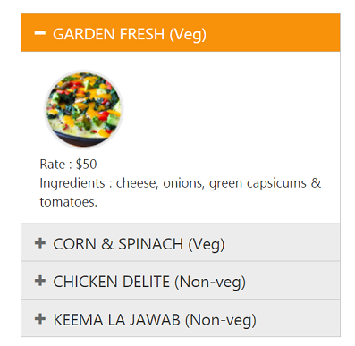

# Template Support

The Content template option provided here is used to specify the HTML elements inside the Accordion control. You can use this option to load any HTML elements and display it in the Accordion panels as per your requirement.

The following code example explains how to use content template option in the Accordion control.



    <ej-accordion id="basicAccordion" enable-multiple-open="true">
        <e-accordion-items>
            <e-accordion-item text="GARDEN FRESH (Veg)">
                <e-content-template>
                   

                    
                      

                        Rate    : $50
                         
                        Ingredients : cheese, onions, green capsicums & tomatoes.
                    

                

                </e-content-template>
            </e-accordion-item>
            <e-accordion-item text="CORN & SPINACH (Veg)">
                <e-content-template>
                    

                        
                        

                            Rate    : $70
                             
                            Ingredients : cheese, sweet corn & green capsicums.
                        

                    

                </e-content-template>
            </e-accordion-item>
            <e-accordion-item text="CHICKEN DELITE (Non-veg)">
                <e-content-template>
                    

                        
                        

                            Rate    : $100
                             
                            Ingredients : cheese, chicken chunks, onions & pineapple chunks.
                        

                    

                </e-content-template>
            </e-accordion-item>
            <e-accordion-item text="KEEMA LA JAWAB (Non-veg)">
                <e-content-template>
                    

                        
                        

                            Rate    : $95
                             
                            Ingredients : lamb keema, onions, garlic & tandoori seasoning.
                        

                    

                </e-content-template>
            </e-accordion-item>
        </e-accordion-items>
    </ej-accordion>



Output:

