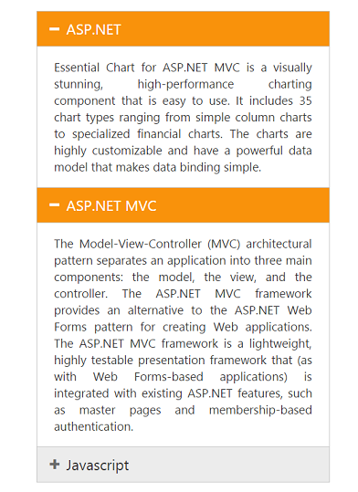

# View multiple contents

By default Accordion allows only one panel to be in expanded state. You can enable multiple panels in expand state by setting EnableMultipleOpen to true.

## Enabling multiple panel open

The following code explains you to enable multiple panel for Accordion.



// In the View page, render Accordion with corresponding data and set EnableMultipleOpen property as true.

<ej-accordion id="basicAccordion" enable-multiple-open="true">
	<e-accordion-items>
		<e-accordion-item text="ASP.NET">
			<e-content-template>
				

					Essential Chart for ASP.NET MVC is a visually stunning, high-performance charting component that is easy to use.
					It includes 35 chart types ranging from simple column charts to specialized financial charts.
					The charts are highly customizable and have a powerful data model that makes data binding simple.
				

			</e-content-template>
		</e-accordion-item>
		<e-accordion-item text="ASP.NET MVC">
			<e-content-template>
				

					The Model-View-Controller (MVC) architectural pattern separates an application into three main components:
					the model, the view, and the controller. The ASP.NET MVC framework provides an alternative to the ASP.NET Web Forms pattern for creating Web applications. The ASP.NET MVC framework is a lightweight, highly testable presentation framework that (as with Web Forms-based applications) is integrated with existing ASP.NET features, such as master pages and membership-based authentication.
				

			</e-content-template>
		</e-accordion-item>
		<e-accordion-item text="Javascript">
			<e-content-template>
				

					JavaScript (JS) is an interpreted computer programming language.
					It was originally implemented as part of web browsers so that client-side scripts could interact with the user, control the browser,
					communicate asynchronously, and alter the document content that was displayed. More recently, however,
					it has become common in both game development and the creation of desktop applications.
				

			</e-content-template>
		</e-accordion-item>
	</e-accordion-items>
</ej-accordion>



Following screenshot is the output for Accordion control on EnableMultipleOpen set to true.

