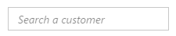
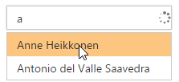
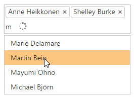
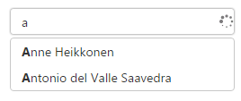
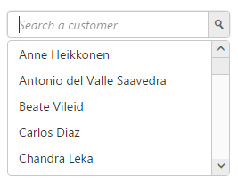

# Getting Started

This section allows you to learn and how to configure the AutoComplete control in your application. It also allows you to learn how to pass the required data to it.

## Create a Simple AutoComplete 

AutoComplete Textbox control basically renders with built-in features like keyboard navigation with animations and flexible API’s. You can easily create the AutoCompleteTextbox control by the following steps.

1. Refer the [Getting Started](https://help.syncfusion.com/aspnet-core/getting-started) page of the Introduction part to know more about the basic system requirements and the steps to configure the Syncfusion components in an ASP.NET Core application.
2. Once you have done all the basic configurations which is mentioned in the ASP.NET Core 1.0 getting started started page, Now you can create and deploy our Autocomplete Control.
3. Initialize the AutoComplete control in the view page by using the below code.

    

                <ej-autocomplete id="searchCustomer"  width="100%" watermark-text="Search a customer">
                
                </ej-autocomplete>

    

4. After Execute the above code the AutoComplete control appears as follows

    

## Populate Data to AutoComplete

In this section we have used remote data binding for AutoComplete data Population.

1. To get data from remote URL you can use our e-datamanager control. The query property is used to filter and get only the required data from corresponding url which is given in the e-datamanager URL.
2. You can map all the available Data fields to the AutoComplete TextBox as per your requirement. 

    

                <ej-autocomplete id="searchCustomer" query="ej.Query().from('Suppliers').select('SupplierID', 'ContactName')" width="100%" watermark-text="Search a customer">
                    <e-datamanager url="//mvc.syncfusion.com/Services/Northwnd.svc/" offline="false"></e-datamanager>
                    <e-autocomplete-fields text="ContactName" key="SupplierID" />
                </ej-autocomplete>

    

3. Run the above code now you can get AutoComplete Control with data source. Your output will be shown as below.

    

## Configure Visual Mode with filter option

By default AutoComplete allows you to select single value. We can select multiple values also by using MultiSelectMode property.

Two Types of Multiple Selections

1. Visual Mode     - Multiple Values are separated by delimiter character specified.
2. Delimiter Mode  - Multiple Values are separated by box model.
You can use available filter-type to show suggestions based on your filter. By default filter-type will be "StartsWith".



            <ej-autocomplete id="Visualmod" query="ej.Query().from('Suppliers').select('SupplierID', 'ContactName')" width="100%" watermark-text="Search a customer" multi-select-mode="@MultiSelectModeTypes.VisualMode" filter-type="StartsWith" >
                <e-datamanager url="//mvc.syncfusion.com/Services/Northwnd.svc/" offline="false"></e-datamanager>
                <e-autocomplete-fields text="ContactName" key="SupplierID" />
            </ej-autocomplete>
            


After execute the above code your output will be,

## Configure Highlight Search and Rounded corners

When you set the highlight-search property to 'true', the characters typed in textbox gets highlighted in the suggestion list. To display textbox reforms from sharp ends to rounded ends, you can enable the show-rounded-corner property.



        <ej-autocomplete id="Visualmod" query="ej.Query().from('Suppliers').select('SupplierID', 'ContactName')" width="100%" watermark-text="Search a customer" multi-select-mode="@MultiSelectModeTypes.VisualMode" filter-type="StartsWith"highlight-search="true" show-rounded-corner="true" >
                <e-datamanager url="//mvc.syncfusion.com/Services/Northwnd.svc/" offline="false"></e-datamanager>
                <e-autocomplete-fields text="ContactName" key="SupplierID" />
        </ej-autocomplete>
            


Run the above code and you will got output as given below,

## Configure Popup button

To enable Popup Button you have to set "show-popup-button" as "true". Now you can able to show suggestion list items either by clicking popup button or else by keyboard interaction.You can change the Popup icon as per your requirement by overridding through CSS.



     <ej-autocomplete id="Visualmod" query="ej.Query().from('Suppliers').select('SupplierID', 'ContactName')" width="100%" watermark-text="Search a customer" multi-select-mode="@MultiSelectModeTypes.VisualMode" filter-type="StartsWith"highlight-search="true" show-rounded-corner="true"  show-popup-button="true">
                <e-datamanager url="//mvc.syncfusion.com/Services/Northwnd.svc/" offline="false"></e-datamanager>
                <e-autocomplete-fields text="ContactName" key="SupplierID" />
     </ej-autocomplete>
            


Now the output will be as follows.

