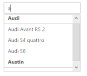

# Grouping

AutoComplete widget provides Grouping support for the suggestions list based on the category specified in the dataSource. By default AllowGrouping is set to ‘False’. To enable Grouping for your AutoComplete widget, set the value to ‘True’.

## Configuring Grouping for AutoComplete

The following steps explain you how to configure Grouping for an AutoComplete textbox.

1. In the Controller page, define the data list with Key, Text, and Category field for grouping.


   
		 public partial class AutocompleteController : Controller
    {
        public class CarsList

        {

            public int UniqueKey { get; set; }

            public string Text { get; set; }
            public string Category { get; set; }

        }
        public ActionResult Localdata()
        {
            List<CarsList> cars = new List<CarsList>();
            cars.Add(new CarsList { UniqueKey = 1, Text = "Audi S6", Category = "Audi" });

            cars.Add(new CarsList { UniqueKey = 2, Text = "Austin-Healey", Category = "Austin" });

            cars.Add(new CarsList { UniqueKey = 3, Text = "BMW 7", Category = "BMW" });

            cars.Add(new CarsList { UniqueKey = 4, Text = "Chevrolet Camaro", Category = "Chevrolet" });

            cars.Add(new CarsList { UniqueKey = 5, Text = "Mercedes-Benz", Category = "Mercedes" });

            cars.Add(new CarsList { UniqueKey = 6, Text = "Toyota 2000GT", Category = "Toyota" });

            cars.Add(new CarsList { UniqueKey = 7, Text = "Volvo P1800", Category = "Volvo" });

            cars.Add(new CarsList { UniqueKey = 8, Text = "Audi Avant RS 2", Category = "Audi" });

            cars.Add(new CarsList { UniqueKey = 9, Text = "Audi S4 quattro", Category = "Audi" });

            cars.Add(new CarsList { UniqueKey = 10, Text = "BMW M Roadster E85", Category = "BMW" });

            cars.Add(new CarsList { UniqueKey = 11, Text = "Mercedes-Benz Sprinter", Category = "Mercedes" });

            cars.Add(new CarsList { UniqueKey = 12, Text = "Corvette", Category = "Chevrolet" });

            cars.Add(new CarsList { UniqueKey = 13, Text = "Volvo P1800", Category = "Volvo" });

            ViewBag.datasource = cars;

            return View();
        }

    }


   

2. In the View page, define the AutoComplete control and then give the Category filed for GroupBy field property.



    <ej-autocomplete id="autocomplete" datasource="ViewBag.datasource">
        <e-autocomplete-fields text="Text" key="UniqueKey" group-by="Category" />
    </ej-autocomplete>


  

The following image is the output for AutoComplete control that provides Grouping.

AutoComplete popup panel with grouping
{:.caption}

