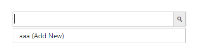
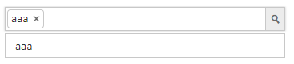
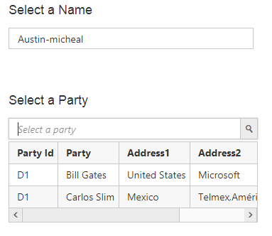

# How To

## Pass the selected items key value to code behind directly

The selected item key value of Autocomplete can be passed to server side by mapping the control ID as the mapping. Here, the selectData is set as ID of the autocomplete and through which the selected value can be manipulated in server side post.



@using (Html.BeginForm("AutocompleteFeatures", "Autocomplete"))
{
<ej-autocomplete id="selectData" filter-type="Contains" show-popup-button="true" enable-auto-fill="true" width="50%" watermark-text="Select value"> 
                <e-datamanager url="DataSource" adaptor="UrlAdaptor"></e-datamanager>
                <e-autocomplete-fields text="Title" key="Id" />
            </ej-autocomplete>
    <input class="button" id="submit" type="submit" value="Submit" />
}



[HttpPost]

        public ActionResult AutocompleteFeatures(string selectData)
        {
              //do something here
        }



## Add a new value to Autocomplete

You can add the newly typed value to the AutoComplete where us the newly typed value is not available in already existing data source. This can be achieved by setting property **allowAddNew** with **multiSelectMode** set as **visualMode**. The typed new value can be added by clicking the **Add New** shown in the suggestion list and this can be visually added to AutoComplete.To update the data source with the new value, you can process this **select** event.





The following screenshot exhibits the output before the solution. Click the **Add New** text shown to add this value to auto complete.

The following screenshot exhibits the output of the above code.

## URL,Web API adaptor server side filtering

When the dataSource of AutoComplete bound with Adaptors such as WebAPI/URL, then we need to perform the filtering and sorting operation in server side using LINQ or our [DataManager API operations](https://www.syncfusion.com/kb/4300/server-side-api-for-datamanager-operations) before returning data to the client side.

This change is applicable for all operations that needs to fetch altered data from Data source like filter, search etc.

The below code snippet will perform the sorting/filtering in server side before the data is passed to the Autocomplete.



       public ActionResult UrlDataSource([FromBody]DataManager dm)
        {
            IEnumerable DataSource = OrderRepository.GetAllRecords();
            DataOperations ds = new DataOperations();
            List<string> str = new List<string>();
            if (dm.Search != null && dm.Search.Count > 0)
            {
                DataSource = ds.PerformSearching(DataSource, dm.Search);
            }
             //Filtering 
            if (dm.Where != null && dm.Where.Count > 0)
            {
                DataSource = ds.PerformWhereFilter(DataSource, dm.Where, dm.Where[0].Operator);

            }
             //Sorting
            if (dm.Sorted != null && dm.Sorted.Count > 0)
            {
                DataSource = ds.PerformSorting(DataSource, dm.Sorted);
                // return the sorted value of Autocomplete from here
                if(dm.Where[0].Operator == "startswith")
                return Json(DataSource);
            }

            var count = DataSource.Cast<EditableOrder>().Count();
            DataSource = ds.PerformSkip(DataSource, dm.Skip);
            DataSource = ds.PerformTake(DataSource, dm.Take);

            return Json(new { result = DataSource, count = count });

        }



## Cascade between two Autocomplete

By default, we did not have in-built cascading support in Autocomplete. But, we can able to achieve this by using client-side events **change** and **select**. Refer to the below steps.

1.Based on the typed letter in the Autocomplete, perform the AJAX Post with the typed letter as filtering key words through the change event in Autocomplete1 component.
2.Upon selecting the value in Autocomplete1, the select event is triggered. Process the selected value which got in event and fetch the data from Data source.
3.Bind the newly fetched filtered data to the Autocomplete2 component.







 public JsonResult Suggestions(string search)
        {

            if (search == "")
            {
                return null;
            }
            else
            {
                var Data = setListSource();
                //filter data based on the search string value
                var search = from n in Data where n.text.ToLower().StartsWith(search.ToLower()) select n;
                return Json(search, JsonRequestBehavior.AllowGet);
            }
        }

  public JsonResult NewSuggestions(string id)
        {
            var Data = set_partySource();
            //filter data based on the selected key value
            var search1 = from n in Data where n.No.Contains(id) select n;
            return Json(search1, JsonRequestBehavior.AllowGet);
        }



The following screenshots exhibits the output of the above code.

**Expected output after cascading**

## Strongly Typed HTML Helper

The Autocomplete control supports strongly typed HTML helpers which uses lambda expression to refer models or view models passed to a view template. These helpers allow you to define the value of the AutocompleteFor from the model. The following steps explain how to use the strongly typed helpers to create AutocompleteFor.

Add a class named &quot;AutocompleteModel&quot; in the Models folder and replace the code with the following code.



public class AutocompleteModel
    {
        [Display(Name = "Auto Data")]
        public List<AutocompleteValue> AutoData { get; set; }
    }

    public class AutocompleteValue
    {
        public string Text { get; set; }
        public string Value { get; set; }

    }



In the controller, pass the model to the View.


using CoreApplication.Models;
using Syncfusion.JavaScript.Models;

namespace CoreApplication.Controllers
{
    public class HomeController : Controller
    {
        public IActionResult Index()
        {
            AutocompleteModel model = new AutocompleteModel();

            return View(model);

        }
   }
}



Then in the View invoke the strongly typed AutocompleteFor helper with the ej-for tag helper.



@model CoreApplication.Models.AutocompleteModel

<ej-autocomplete id="Autocomplete" ej-for="@Model.AutoData" datasource="ViewBag.datasource" filter-type="Contains" show-popup-button="true" enable-auto-fill="true" width="50%" watermark-text="Select value">
    <e-autocomplete-fields text="Text" key="Value" />
</ej-autocomplete>

