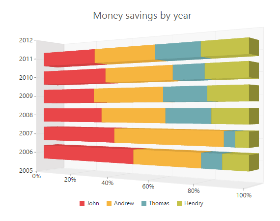
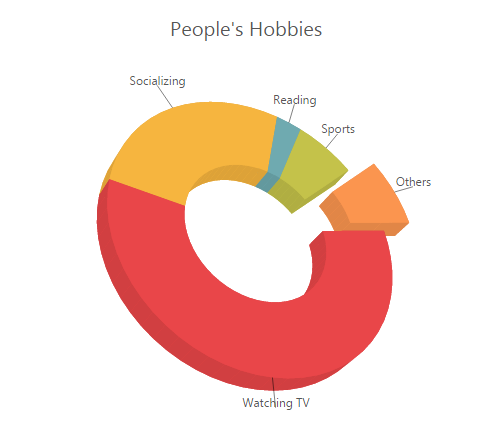
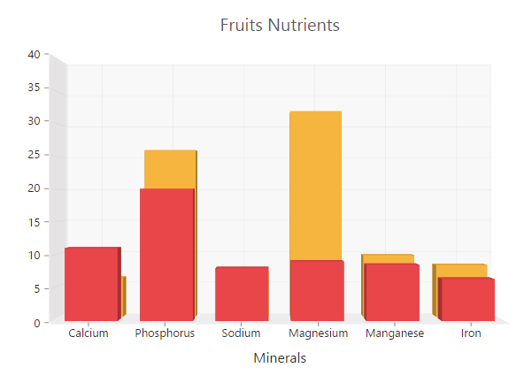
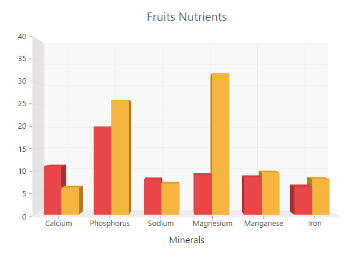
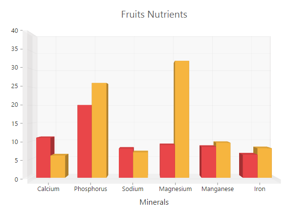
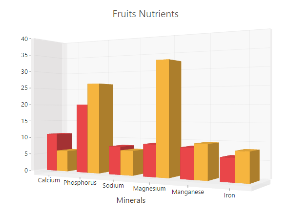
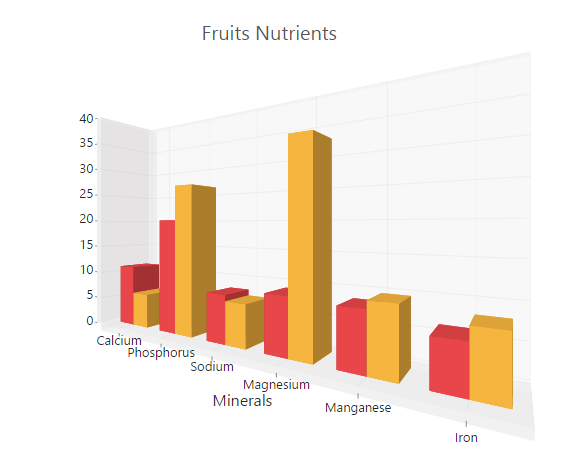

# 3D Chart

Essential 3D Chart for ASP.NET CORE allows you to view 8 chart types in 3D view such as Bar, StackingBar, StackingBar100, Column, Stacked Column, 100% Stacked Column, Pie, Doughnut.

## 3D Column Chart

For rendering a 3D Column Chart, specify the series **Type** as **Column** in the chart series and set **Enable3D** option as **true** in the chart.



<ej-chart id="container" enable3d="true">
    <e-chart-series>
        <e-series type="Column">
            <e-points>
             //..
            </e-points>
        </e-series>
    </e-chart-series>
</ej-chart>



## 3D Bar Chart

You can create a 3D Bar Chart by setting the series **Type** as **Bar** in the chart series and enable Enable3D option in the chart.



<ej-chart id="container" enable3d="true">
     <e-chart-series>
        <e-series type="Bar">
            <e-points>
             //..
            </e-points>
        </e-series>
    </e-chart-series>
</ej-chart>



## 3D Stacked Column Chart

You can create a 3D Stacked Column Chart by setting the series **Type** as **StackingColumn** in the chart series and enable Enable3D option in the chart.



<ej-chart id="container" enable3d="true">
    <e-chart-series>
        <e-series type="StackingColumn">
            <e-points>
             //..
            </e-points>
        </e-series>
        <e-series type="StackingColumn">
            <e-points>
             //..
            </e-points>
        </e-series>
    </e-chart-series>
</ej-chart>



## 3D 100% Stacked Column Chart

100% Stacking Column 3DChart is rendered by specifying the series **Type** as **StackingColumn100** in the chart series and enable Enable3D option in the chart.



<ej-chart id="container" enable3d="true">
    <e-chart-series>
        <e-series type="StackingColumn100">
            <e-points>
             //..
            </e-points>
        </e-series>
        <e-series type="StackingColumn100">
            <e-points>
             //..
            </e-points>
        </e-series>
    </e-chart-series>
</ej-chart>



## 3D Stacked Bar Chart

To create Stacking Bar 3DChart, set the series **Type** as **StackingBar** in the chart series and enable Eenable3D option in the chart.



<ej-chart id="container" enable3d="true">
    <e-chart-series>
        <e-series type="StackingBar">
            <e-points>
             //..
            </e-points>
        </e-series>
        <e-series type="StackingBar">
            <e-points>
             //..
            </e-points>
        </e-series>
    </e-chart-series>
</ej-chart>



## 3D 100% Stacked Bar Chart

You can create 100% Stacking Bar 3DChart by setting the series **Type** as **StackingBar100** in the chart series and enable Eenable3D option in chart.



<ej-chart id="container" enable3d="true">
    <e-chart-series>
        <e-series type="StackingBar100">
            <e-points>
             //..
            </e-points>
        </e-series>
        <e-series type="StackingBar100">
            <e-points>
             //..
            </e-points>
        </e-series>
    </e-chart-series>
</ej-chart>



## 3D Pie Chart

To render the Pie Chart in 3D view, enable the **Enbel3D** option in the chart and set the series **Type** as **Pie** in the chart series.



<ej-chart id="container" enable3d="true">
    <e-chart-series>
        <e-series type="Pie">
            <e-points>
             //..
            </e-points>
        </e-series>
    </e-chart-series>
</ej-chart>



## 3D Doughnut Chart

To render the Doughnut Chart in 3D view, enable the **Enbel3D** option in the chart and set the series **Type** as **Doughnut** in the chart series.



<ej-chart id="container" enable3d="true">
 <e-chart-series>
        <e-series type="Doughnut">
            <e-points>
             //..
            </e-points>
        </e-series>
    </e-chart-series>
</ej-chart>



## Configure 3D Chart

### 3D View

To render the EjChart in 3D view, set the **Enable3D** option as **true** in the chart.



<ej-chart id="container" enable3d="true">

//..

</ej-chart>



### Placing Bar / Column kind of series side-by-side
 
 The **SideBySideSeriesPlacement** defines the appearance of the different sets of data on the 3D Chart. When this property is enabled, the data is displayed side by side, otherwise it is displayed along the depth of the axis.
 
 

<ej-chart id="container" enable3d="true" side-by-side-series-placement="true">

//..

</ej-chart>



### Setting Axis Wall Size

In 3DChart, Cartesian axes lines are represented as walls and it defines the width of the 3D wall. 3D Pie and Doughnut Chart does not support **WallSize** because they don’t have axes.  



<ej-chart id="container" enable3d="true" wall-size="10">

//..

</ej-chart>



### 3D Depth

By using the **Depth** property, you can view the 3D Chart from the front view of the series to the background wall.



<ej-chart id="container" enable3d="true" depth="120">

//..

</ej-chart>



### Rotating and Tilting 3D Chart

To spin the 3D Chart on mouse dragging, enable **EnableRotation** option in the chart. The **Tilt** property specifies the angle of the slope of the 3D Chart. The positive and negative values are declared to the side where the slope is present. The **Rotation** option is used to rotate the 3D chart towards left or right side of the chart. The direction of the chart depends upon the positive and negative values of the angle.  



<ej-chart id="container" enable3d="true" tilt="10" rotation="40" enable-rotation="true">

//..

</ej-chart>



### PerspectiveAngle	

The **PerspectiveAngle** specifies the appearance of the height, width, depth and wall of the 3D Chart. When the PerspectiveAngle is decreased, the 3D object appears very close to the viewer. But when it is increased, the 3D object appears far away from the viewer. 



<ej-chart id="container" enable3d="true" perspective-angle="150">

//..

</ej-chart>



