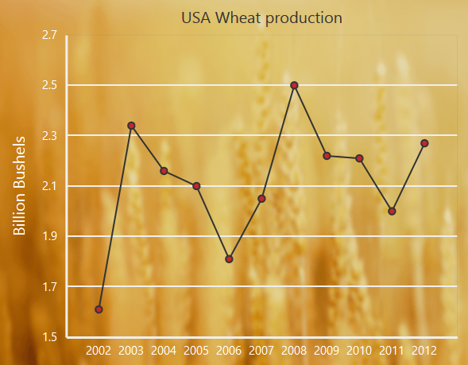

# Appearance

## Custom Color Palette

The Chart displays different series in different colors by default. You can customize the color of each series by providing a custom color palette of your choice by using the **Palette** property. 



    @{
        List<string> palatte = new List<string> { "grey", "skyblue", "yellow" };
    }
    <ej-chart id="container" palette="palatte">
    </ej-chart>



N> The Color palette is applied to the points in accumulation type series

## Built-in Themes

Following are the built-in themes available in the Chart

* Azure
* Azuredark
* Flatdark
* Flatlight
* GradientDark
* GradientLight
* Lime
* LimeDark
* Saffron
* SaffronDark

You can set your desired theme by using the **Theme** property. FlatLight is the default theme used in the Chart.



    <ej-chart id="container" theme="GradientLight">
    </ej-chart>



## Point level customization

Marker, DataLabel and Fill color of each point in a series can be customized individually by using the **Points** collection.



<ej-chart id="container">
        //..
    <e-series name="Silver"><e-marker visible="true"></e-marker>
            <e-points>
                <e-point x="USA" y="50" fill="#E27F2D"></e-point>
             </e-points>
        </e-series>
        //..
</ej-chart>



## Series border customization

To customize the series border color, width and dashArray, you can use **Series.Border** option. The series border styles can be applied only to the column, bar and area type of series.



<ej-chart id="container">
        //..
        <e-series name="Silver"><e-border color="blue" width="2" dash-array="5,3"></e-border>
        
        //..
        </e-series>
        //..
</ej-chart>



## Chart area customization

### Customize chart background

The Chart background can be customized by using the **Background** property of the Chart. To customize the chart border, use **Border** option of the chart. 



<ej-chart id="container" background="skyblue"><e-border color="#FF0000" width="2" opacity="0.35"></e-border>
//..
</ej-chart>

 

**Chart Margin**

The Chart **Margin** property is used to add the margin to the chart area at the Left, Right, Top and Bottom position.



<ej-chart id="container"><e-margin left="40" right="40" top="40" bottom="40"></e-margin>
//..
</ej-chart>

 

**Setting background image**

Background image can be added to the chart by using the **BackGroundImageUrl** property.



<ej-chart id="container" back-ground-image-url="images/chart/wheat.png">
//..
</ej-chart>

 

**Chart area background**

The Chart area background can be customized by using the **Background** property in the chart area. 



<ej-chart id="container">
//..
    <e-chart-area background="skyblue"></e-chart-area>
//..

</ej-chart>

 

### Customize chart area grid bands

You can provide different color for alternate grid rows and columns formed by the grid lines in the chart area by using the **AlternateGridBand** property of the axis. The properties **Odd** and **Even** are used to customize the grid bands at odd and even positions respectively. 



<ej-chart id="container">
//..
    <e-primary-y-axis><e-alternate-grid-band><e-even fill="#A7A9AB" opacity="0.1"></e-even></e-alternate-grid-band>
//..

</ej-chart>

 

### Animation

You can enable animation by using the **EnableAnimation** property of the series. This animates the chart series on two occasions – when the chart is loaded for the first time or whenever you change the series type by using the type property.



<ej-chart id="container">
//..
<e-chart-series>
    <e-series enable-animation="true"> </e-series>
</e-chart-series>
//..
</ej-chart>



However, you can force the chart to animate series by calling the animate method as illustrated in the following code example,



<ej-chart id="container">
//..
<e-chart-series>
    <e-series enable-animation="true"> </e-series>
</e-chart-series>
//..
</ej-chart>





//Dynamically animating Chart
function animateChart(){

    //Calling the animate method for dynamic animation
    $("#chartContainer").ejChart("animate");      

}



### Control the Speed of animation

To control the speed of animation, you can use the **AnimationDuration** property in the series. 



<ej-chart id="container">
//..
<e-chart-series>
    <e-series enable-animation="true" animation-duration="2000"> </e-series>
</e-chart-series>
//..
</ej-chart>

