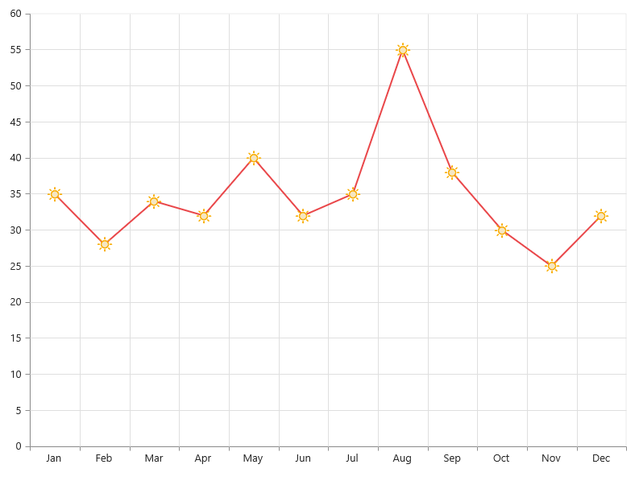
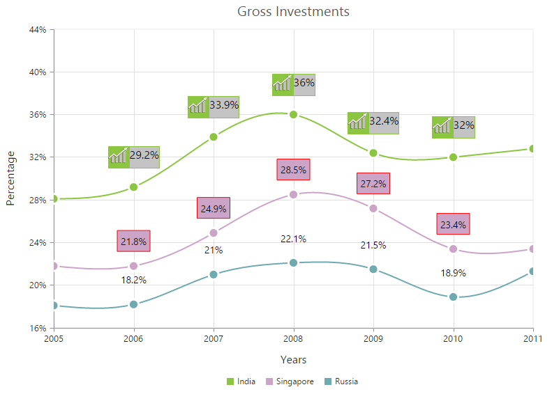

# Data Markers

Data markers are used to provide information about the data point to the user. You can add a shape and label to adorn each data point.

## Add Shapes

You can add shapes to any chart types but they are often used with line, area and spline series to indicate each data point. It is highlighted when you hover the mouse on the shape.

Shapes can be added to the chart by enabling the Visible option of the **Marker** property. There are different shapes you can add to the chart by using the **Shape** option such as Rectangle, Circle, Diamond etc.

The following code example explains on how to enable series marker and add shapes,



<ej-chart id="chartContainer">
    // ...
    <e-chart-series>
        <e-series>
            <e-marker visible="true" shape="Diamond"></e-marker>
        </e-series>
        <e-series>
            <e-marker visible="true" shape="Triangle"></e-marker>
        </e-series>
        <e-series>
            <e-marker visible="true" shape="Hexagon"></e-marker>
        </e-series>
    </e-chart-series>
    // ...
</ej-chart>



## Add image as marker

Apart from the shapes, you can also add images to mark the data point by using the **ImageUrl** option.

The following code example illustrates this,



<ej-chart id="chartContainer">
    // ...
    <e-chart-series>
        <e-series>
            <e-marker visible="true" shape="Image" image-url="sun_annotation.png">
                <e-Size height="20" width="20"></e-Size>
            </e-marker>
        </e-series>
    </e-chart-series>
    // ...
</ej-chart>



## Add labels

Data label can be added to a chart series by enabling the *Visible* property in the **DataLabel** option. The labels appear at the top of the data point, by default.

The following code example shows how to enable data label and set its horizontal and vertical text alignment. 



<ej-chart id="chartContainer">
    // ...
    <e-chart-series>
        <e-series>
            <e-marker><e-data-label visible="true" horizontal-text-alignment="Center" vertical-text-alignment="Far"></e-data-label>
            </e-marker>
        </e-series>
    </e-chart-series>
    // ...
</ej-chart>



Label content can be formatted by using the template option. Inside the template, you can add the placeholder text *"point.x"* and *"point.y"* to display corresponding data points x & y value.

You can adorn the labels with background shapes by setting *Shape* option.

The following code example shows how to add background shapes and set template to data label.



     

	
     

     

          
#point.y#%

     

<ej-chart id="chartContainer">
// ...
<e-chart-series>
    <e-series>
        <e-marker><e-data-label visible="true" template="template"></e-data-label>
        </e-marker>
    </e-series>
    <e-series>
        <e-marker>
            <e-data-label visible="true" shape="Rectangle"><e-border width="1" color="red"></e-border></e-data-label>
        </e-marker>
    </e-series>
    <e-series>
        <e-marker>
            <e-data-label visible="true"></e-data-label>
        </e-marker>
    </e-series>
</e-chart-series>
// ...
</ej-chart>



The appearance of the labels can be customized by using the *Font* and *Offset* options. The Offset option is used to move the labels vertically. Also, labels can be rotated by using the *Rotate* option.

The following code example shows how to rotate data label text and customize the font.



<ej-chart id="chartContainer">
    // ...
    <e-chart-series>
        <e-series>
            <e-marker><e-data-label visible="true" angle="300" offset="15"><e-font color="Black" font-size="13px"></e-font></e-data-label>
            </e-marker>
        </e-series>
    </e-chart-series>
    // ...
</ej-chart>



You can position the label to the top, center or bottom position of the segment by using the **TextPosition** option for the chart types such as Column, Bar, Stacked bar, Stacked column, 100% Stacked bar, 100% Stacked column, Candle and OHLC.

The following code example shows how to set textPosition to display data label in the middle of the column rectangle.



<ej-chart id="chartContainer">
    // ...
    <e-chart-series>
        <e-series>
            <e-marker><e-data-label visible="true" text-position="Middle"></e-data-label>
            </e-marker>
        </e-series>
    </e-chart-series>
    // ...
</ej-chart>



The label can be positioned inside or outside the perimeter of the series by using the **LabelPosition** option for the chart types such as Pie and Doughnut, .

The following code example shows how to set the LabelPosition,



<ej-chart id="chartContainer">
    // ...
    <e-chart-series>
        <e-series type="Doughnut" label-position="Outside">
            <e-points>
                <e-point x="India" y="24" text="India 24%"></e-point>
                <e-point x="Japan" y="25" text="Japan 25%"></e-point>
                <e-point x="Australia" y="20" text="Australia 20%"></e-point>
                <e-point x="USA" y="35" text="USA 35%"></e-point>
                <e-point x="China" y="23" text="China 23%"></e-point>
                <e-point x="Germany" y="27" text="Germany 27%"></e-point>
                <e-point x="France" y="22" text="France 22%"></e-point>
           </e-points>
           <e-marker><e-data-label visible="true" shape="Rectangle"><e-font color="white"></e-font></e-data-label></e-marker>
        </e-series>
    </e-chart-series>
    // ...
</ej-chart>

 

The following screenshot displays the labels when the LabelPosition is set as *Inside* position.

The following screenshot displays the labels when the LabelPosition is set as *OutsideExtended* position.

The label can be wrapped for pie, doughnut, funnel, and pyramid series by setting the enableWrap property. 

 

<ej-chart id="chartContainer">
    // ...
    <e-chart-series>
        <e-series>            
           <e-marker><e-data-label visible="true" enable-wrap="true" maximum-label-width="32"></e-data-label></e-marker>
        </e-series>
    </e-chart-series>
    // ...
</ej-chart>

 

## Connect Line

This feature is used to connect label and data point by using a line. It can be enabled only for Pie, Doughnut, Pyramid and Funnel chart types. **ConnectorLine** types can be set as *Bezier* or *Line* by using the **Type** option.

 The following code example illustrates this,



<ej-chart id="chartContainer">
    // ...
    <e-chart-series>
        <e-series label-position="OutsideExtended" type="Doughnut">
            <e-marker>
                <e-data-label>
                    <e-connector-line color="black" type="Bezier"></e-connector-line>
                </e-data-label>
            </e-marker>
        </e-series>
    </e-chart-series>
    // ...
</ej-chart>



## Smart labels

Overlapping of the labels can be avoided by enabling the **EnableSmartLabels** property. The default value is *True* for *Accumulation type series* and *False* for *other series types*.

The following code example shows how to enable smart labels,



<ej-chart id="chartContainer">
    // ...
    <e-chart-series>
        <e-series enable-smart-labels="true" start-angle="145" name="Expenses" type="Pie">
            <e-marker>
                <e-data-label>
                    <e-connector-line color="black" type="Bezier" height="60"></e-connector-line>
                    <e-font font-size="14px"></e-font>
                </e-data-label>
            </e-marker>
        </e-series>
    </e-chart-series>
    // ...
</ej-chart>



