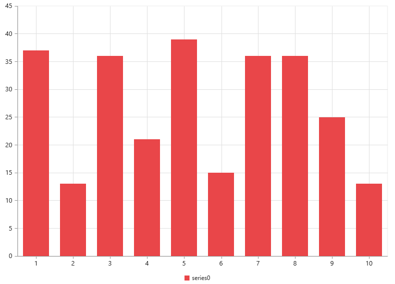
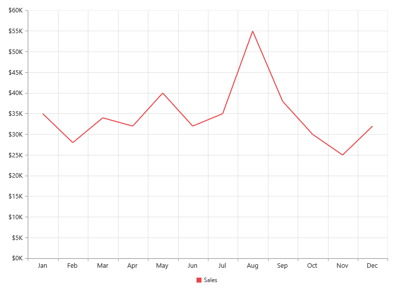

# Getting Started

This section explains you the steps required to populate the Chart with data, add data labels, tooltips and title to the Chart. This section covers only the minimal features that you need to know to get started with the Chart.

## Create your chart

In this tutorial, you will learn how to create a simple chart.The following screen shot displays the output after completing this tutorial.

Simple chart
{:.caption}

1. First, create a new ASP.Net core project. please refer [ASP.Net core 1.0-Getting Started](/aspnet-core/getting-started) documentation to create new project and add necessary DLL’s and script files.

2. Add the following code in the index.cshtml file to create the Chart control in View page.



<ej-chart id="chart"></ej-chart>



Now, the Chart is rendered with some auto-generated random values and with default Column chart type.

Initialize the chart by using the ej-chart tag. The chart is rendered to the size of its container, by default. You can also customize the chart dimension either by setting the width and height of the container element as in the above code example or by using the **Size** option of the Chart.

## Populate chart with data

Now, let’s see how to plot data source to the Chart. First, let us generate a data source containing following fields in controller– Month and Sales.



   public class HomeController : Controller
    {
        public IActionResult Index()
        {
            //// Create dataSource to chart
            List<ChartData> data = new List<ChartData>();
            data.Add(new ChartData("Jan", 35));
            data.Add(new ChartData("Feb", 28));
            data.Add(new ChartData("Mar", 34));
            data.Add(new ChartData("Apr", 32));
            data.Add(new ChartData("May", 40));
            data.Add(new ChartData("Jun", 32));
            data.Add(new ChartData("Jul", 35));
            data.Add(new ChartData("Aug", 55));
            data.Add(new ChartData("Sep", 38));
            data.Add(new ChartData("Oct", 30));
            data.Add(new ChartData("Nov", 25));
            data.Add(new ChartData("Dec", 32));
            ///...
            ViewBag.ChartData = data;
            return View();
        }
    }

    public class ChartData
    {
        public string Month;
        public double Sales;
        public ChartData(string month, double sales)
        {
            this.Month = month;
            this.Sales = sales;
        }
    }



Add a Series to the Chart using **Series** option and set the chart type as **Line** using **type** option. 



<ej-chart id="container">
        <e-chart-series>
            <e-series type="Line"></e-series>
        </e-chart-series>
</ej-chart>



You can also add multiple series tags based on your requirement.

Next, map the Month and Sales values in the data source to the Line series by setting XName and YName with the field names respectively, and then set the actual data using DataSource option.



<ej-chart id="container">
    <e-chart-series>
        <e-series datasource="ViewBag.ChartData" x-name="Month" y-name="Sales" type="Line"></e-series>
    </e-chart-series>
    <e-size height="400" width="600"></e-size>
</ej-chart>



Since the data is related to Sales, format the vertical axis labels by adding ‘$’ as a prefix and ‘K’ as a suffix to each label. This can be achieved by setting the “${value}K” to the **label-format** option of the axis. Here, {value} acts as a placeholder for each axis label, “$” and “K” are the actual prefix and suffix added to each axis label. 

The following code example illustrates this,



<ej-chart id="container">

     <e-primary-y-axis label-format="${value}k">
     </e-primary-y-axis>

</ej-chart>



## Add Data Labels

You can add data labels to improve the readability of the chart. This can be achieved by enabling the Visible option in the **data-label** option. Now, the data labels are rendered at the top of all the data points.

The following code example illustrates this,



<ej-chart id="container">
    <e-chart-series>
        <e-series>
            <e-marker>
                <e-data-label visible="true">
                </e-data-label>
            </e-marker>
        </e-series>
    </e-chart-series>
</ej-chart>



There are situations where the default label content is not sufficient to the user. In this case, you can use the **template** option to format the label content with some additional information.

 

<!DOCTYPE html>
<html>
<body>
      

         
#point.x#:$#point.y#K

      

</body>
</html>



The above HTML template is used as a template for each data label. Here, “point.x” and “point.y” are the placeholder text used to display the corresponding data point’s x & y value.

The following code example shows how to set the id of the above template to data-label template option,



<ej-chart id="container">
    <e-chart-series>
        <e-series>
            <e-marker>
                <e-data-label visible="true" template="dataLabelTemplate">
                </e-data-label>
            </e-marker>
        </e-series>
    </e-chart-series>
</ej-chart>



## Enable Legend

You can enable or disable the legend by using the Visible option in the **legend** option. It is enabled in the chart, by default.



<ej-chart id="container">
    <e-chart-series>
        <e-series name="Sales">
        </e-series>
    </e-chart-series>
    <e-legend visible="true"></e-legend>
</ej-chart>



## Enable Tooltip

The Tooltip is useful when you cannot display information by using the **data-label** due to the space constraints. You can enable tooltip by using the Visible option of the **chart-tooltip** option in the specific series.

The following code example illustrates this,



<ej-chart id="container">
    <e-chart-series>
        <e-series>
            <e-chart-tooltip visible="true"></e-chart-tooltip>
        </e-series>
    </e-chart-series>
</ej-chart>



## Add Chart Title

You need to add a title to the chart to provide quick information to the user about the data being plotted in the chart. You can add it by using the text option of the **title** option.



<ej-chart id="container">
    <e-title text="Sales Analysis"></e-title>
</ej-chart>



