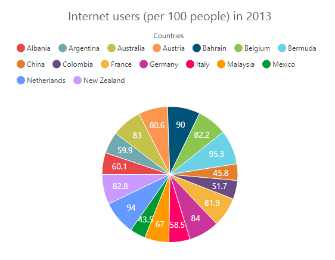
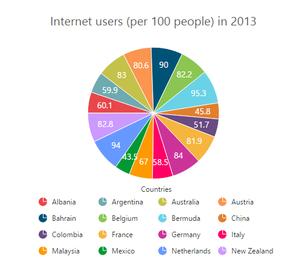
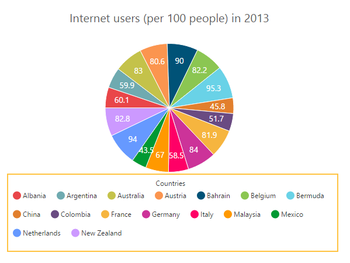

# Legend

The legend contains the list of Chart Series and Trendlines that appear in a chart. 

## Legend Visibility

By default, the legend is enabled in the chart. You can enable or disable it by using the *Visible* option of the **Legend**.



<ej-chart id="chartContainer">
    // ...
   <e-legend visible="true"></e-legend>
    // ...
</ej-chart>



## Legend title

To add the title to the legend, you have to specify the **Legend.Title.Text** option.



<ej-chart id="chartContainer">
    // ...
   <e-legend><e-title text="Countries"></e-title></e-legend>
    // ...
</ej-chart>



## Position and Align the Legend

By using the **Position** option, you can position the legend at *Left*, *Right*, *Top* or *Bottom* of the chart. The legend is positioned at the **Bottom** of the chart, by default.



<ej-chart id="chartContainer">
    // ...
   <e-legend position="Top"></e-legend>
    // ...
</ej-chart>



**Legend Alignment**

You can align the legend to the *Center*, *Far* or *Near* based on its position by using the **Alignment** option.



<ej-chart id="chartContainer">
    // ...
   <e-legend position="Top" alignment="Far"></e-legend>
    // ...
</ej-chart>



## Arrange legend items in the rows and columns

You can arrange the legend items horizontally and vertically by using the **RowCount** and **ColumnCount** options of the legend.

* When only the RowCount is specified, the legend items are arranged according to the RowCount and number of columns may vary based on the number of legend items.

* When only the ColumnCount is specified, the legend items are arranged according to the ColumnCount and number of rows may vary based on the number of legend items.

* When both the options are specified, then the one which has higher value is given preference. For example, when the RowCount is 4 and ColumnCount is 3, legend items are arranged in 4 rows.

* When both the options are specified and have the same value, the preference is given to the ColumnCount when it is positioned at the top/bottom position. The preference is given to the RowCount when it is positioned at the left/right position.
 



<ej-chart id="chartContainer">
    // ...
   <e-legend row-count="4" column-count="4"></e-legend>
    // ...
</ej-chart>



## Customization

### Legend shape

To change the legend icon shape, you have to specify the shape in the **Shape** property of the legend. When you want the legend icon to display the prototype of the series, you have to set the **SeriesType** as shape.



<ej-chart id="chartContainer">
    // ...
   <e-legend shape="SeriesType"></e-legend>
    // ...
</ej-chart>



### Legend items size and border

You can change the size of the legend items by using the *ItemStyle.Width* and *ItemStyle.Height* options. To change the legend item border, use **Border** option of the legend ItemStyle.



<ej-chart id="chartContainer">
    // ...
   <e-legend><e-item-style width="13" height="13"></e-item-style><e-border width="1" color="#FF0000"></e-border></e-legend>
    // ...
</ej-chart>



### Legend size

By default, legend takes 20% of the **Height** horizontally when it was placed on the top or bottom position and 20% of the **Width** vertically while placing on the left or right position of the chart. You can change this default legend size by using the **Size** option of the legend.  



<ej-chart id="chartContainer">
    // ...
   <e-legend><e-size height="100" width="550"></e-size></e-legend>
    // ...
</ej-chart>



### Legend Item Padding

You can control the spacing between the legend items by using the **ItemPadding** option of the legend.  The default value is 10. 



<ej-chart id="chartContainer">
    // ...
   <e-legend item-padding="15"></e-legend>
    // ...
</ej-chart>



### Legend border

You can customize the legend border by using the **Border** option in the legend. 



<ej-chart id="chartContainer">
    // ...
   <e-legend><e-border color="#FFC342" width="2"></e-border></e-legend>
    // ...
</ej-chart>



### Scrollbar for legend

You can enable or disable the legend scrollbar by using the **EnableScrollbar** option of the legend. When you disable the scrollbar option, the legend does not consider the default size and chart draws in the reaming space. The default value of EnableScrollbar option is **true**.  



<ej-chart id="chartContainer">
    // ...
   <e-legend enable-scrollbar="true"><e-size height="80" width="430"></e-size></e-legend>
    // ...
</ej-chart>



### Customize the legend text

To customize the legend item text and title you can use the **Legend.Font** and **Legend.Title** options. You can change the legend title alignment by using the TextAlignment option of the legend title.



<ej-chart id="chartContainer">
    // ...
    <e-legend>
        <e-font font-family="Segoe UI" font-style="Normal" font-weight="Bold" font-size="15px"></e-font>
        <e-title text-alignment="Center"></e-title>
        <e-font font-family="Segoe UI" font-style="Italic" font-weight="Bold" font-size="12px"></e-font>
    </e-legend>
    // ...
</ej-chart>



### LegendItems Text Overflow

**Trim**

You can trim the legend item text when its width exceeds the **Legend.TextWidth**, by specifying *TextOverflow* as **Trim**. The original text will be displayed on mouse hover.



<ej-chart id="chartContainer">
// ...
<e-legend visible="true" text-overflow="Trim" text-width="34">        
</e-legend>
// ...
</ej-chart>



**Wrap**

By specifying *TextOverflow* as **Wrap**, you can wrap the legend text by word.

**WrapAndTrim**

You can wrap and trim the legend text by specifying *TextOverflow* as **WrapAndTrim**. The original text will be displayed on mouse hover.

## Handle the legend item clicked

You can get the legend item details such as *Index*, *Bounds*, *Shape* and *Series* by subscribing the **LegendItemClick** event on the chart. When the legend item is clicked, it triggers the event and returns the Legend information. 



<ej-chart id="chartContainer" legend-item-click="onlegendclicked">
    // ...
    <e-legend visible="true">        
    </e-legend>
    // ...
</ej-chart>

function onlegendclicked(sender) {
//Get legend item details on legend item click.
var legendItem = sender.data;
}



## Series selection on legend item click

You can select a specific series or point while clicking on the corresponding legend item through disabling the **ToggleSeriesVisibility** option of the legend. The default value of toggleSeriesVisibility option is **true**. To customize the series selection refer to the series Selection.



<ej-chart id="chartContainer">
    // ...
    <e-legend toggle-series-visibility="false">        
    </e-legend>
    // ...
</ej-chart>
      


## Collapsing legend item

You can collapse the specific series/point legend item displaying in the chart, by setting the **VisibleOnLegend** as *Hidden* in the point or series.



<ej-chart id="chartContainer">
    // ...
    <e-chart-series>
        <e-series>
            <e-points>
                <e-point x="Albania" y="60.1"></e-point>
                <e-point x="New Zealand" y="82.8" visible-on-legend="Hidden"></e-point>
            </e-points>
            <e-empty-point-settings visible="true"></e-empty-point-settings>
        </e-series>
    </e-chart-series>
    <e-legend visible="true"></e-legend>
    // ...
</ej-chart>
      


