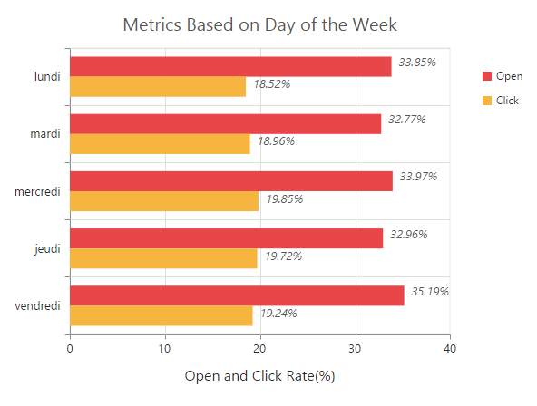

# Localization

EjChart supports localization for its axis labels and tooltip. To render the chart with specific culture you have to refer the corresponding **globalize** culture script and need to specify the culture name in **Locale** property of chart.   



<!--Refer french globalize culture script-->

<ej-chart id="chartContainer" locale="fr-FR">
</ej-chart>



