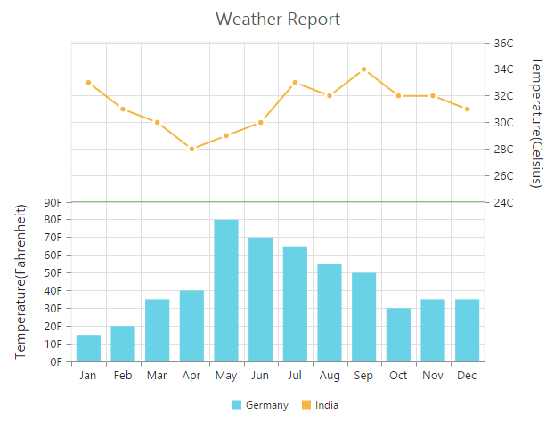

# Multiple panes

Chart area can be divided into multiple panes by using the **RowDefinitions** and **ColumnDefinitions** properties.

### Row definitions

To split the chart area vertically into a number of rows, use **RowDefinitions** property of the chart. 

* You can allocate space for each row by using the **Unit** option that determines whether the chart area should be split by **percentage** or **pixels** for the given **RowHeight** value of the row definitions.
 
* To associate a vertical axis to a row, specify the RowDefinitions' **Index** value to the **RowIndex** property of the chart axis.

* To customize each row’s horizontal line, use **LineColor** and **LineWidth** properties.



<ej-chart id="chartContainer">
    // ...
    <e-row-definitions>
        <e-row-definition unit="percentage" line-color="Gray" line-width="0" row-height="50"></e-row-definition>
        <e-row-definition unit="percentage" line-color="green" line-width="0" row-height="50"></e-row-definition>
    </e-row-definitions>
    <e-axes><e-axis name="yAxis1" row-index="1"></e-axis></e-axes>
    <e-chart-series>
        <e-series y-axis-name="yAxis1"></e-series>
    </e-chart-series>
    // ...
</ej-chart>



**Row span**

For spanning the vertical axis along multiple panes vertically, use **RowSpan** property of axis. 



<ej-chart id="chartContainer">
    // ...
    <e-row-definitions>
        //...
    </e-row-definitions>
    <e-axes>
        //...
    </e-axes>
    <e-primary-y-axis row-span="2"></e-primary-y-axis>
    <e-chart-series>
        //...
    </e-chart-series>
    // ...
</ej-chart>



## Column definitions

To split the chart area horizontally into a number of columns, use **ColumnDefinitions** property of the chart.

* You can allocate space for each column by using the **Unit** option that determines whether the chart area should be split by **percentage** or **pixels** for the given **ColumnWidth** value of the column definitions.
 
* To associate a horizontal axis to a column, specify the ColumnDefinitions' **Index** value to the **ColumnIndex** property of the chart axis.
 


 <ej-chart id="chartContainer">
    // ...
    <e-column-definitions>
        <e-column-definition unit="percentage" column-width="50"></e-column-definition>
        <e-column-definition unit="percentage" column-width="50"></e-column-definition>
    </e-column-definitions>
    <e-axes>
        <e-axis name="xAxis1" column-index="1">
        </e-axis>
    </e-axes>
    <e-chart-series>
        <e-series x-axis-name="xAxis1"></e-series>
    </e-chart-series>
    // ...
</ej-chart>



**Column span**

For spanning the horizontal axis along multiple panes horizontally, use **ColumnSpan** property of axis. 



  <ej-chart id="chartContainer">
    // ...
    <e-column-definitions>
        //...
    </e-column-definitions>
    <e-primary-x-axis name="xAxis1" column-span="2"></e-primary-x-axis>
    <e-axes>
        //...
    </e-axes>
    <e-chart-series>
        //...
    </e-chart-series>
    // ...
</ej-chart>



