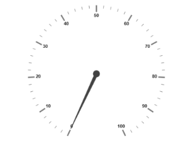
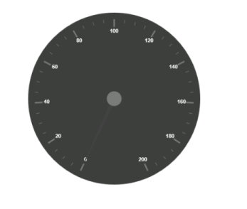
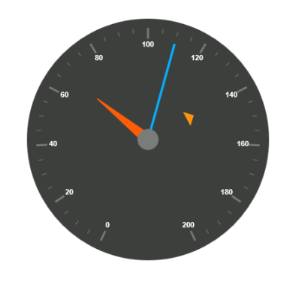
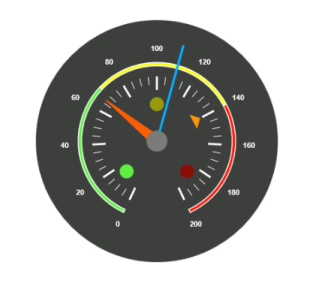

# Getting Started

* The ASP.NET Core 1.0 Circular Gauge provides support to display the Circular Gauge within your web page and allows you to customize it. This section encompasses the details on how to configure Circular Gauge. 
* You will learn how to provide data for a Circular Gauge and display that data in a suitable way. In addition, you will learn how to customize the default Circular Gauge appearance, according to your requirements. 
* As a result, you will get a Circular Gauge that shows you how the Automobile speedometer works with rpm (Rotation per Minute), kph (Kilometer per hour) and speed level indication (Safe, Caution and Danger). 

Analog Speedometer
{:.caption}

## Create a Circular Gauge

ASP.NET Core 1.0 Circular Gauge widget basically renders with animation and flexible APIs. You can easily create the Circular Gauge widget by using the following steps.

1. First, create a new ASP.Net core project. please refer [ASP.Net core 1.0-Getting Started](/aspnet-core/getting-started) documentation to create new project and add necessary DLL’s and script files.
2. Add the following code example to the corresponding view page to render CircularGauge.

   ~~~ cshtml

   <ej-circular-gauge id="circulargauge"></ej-circular-gauge>

   ~~~
   {:.prettyprint }

3. Add the following code example in the controller page.



public ActionResult Default()
{

	return View();

}



Run the above code example to get a default CircularGauge with default values.

## Set Height and Width

Pointers have different height and width so you can set the height and width of the gauge according to your requirements.Set the basic values of the gauge such as height and width of the canvas element values that are to be rendered.



<ej-circular-gauge id="circulargauge" 
                   height="500" 
                   width="500">
</ej-circular-gauge>



Run the above code example and you will see the following output.

## Set Background Color

The speedometer must have some dark color as background so that its value is clearly visible and you can vary the speed of the pointer by setting ReadOnly as False for user interaction.



<ej-circular-gauge id="circulargauge" 
                   height="500" 
                   width="500" 
                   background-color="#3D3F3D" 
                   read-only="false">
</ej-circular-gauge>



Run the above code example and you will see the following output.

## Provide Scale Values

* The pointer cap can be customized with the following options. Cap radius, cap border color, cap background color, pointer cap border width are some of the properties that are customizable.
* The speed limit in the gauge has maximum value of 200 kph. So you can set maximum value for the gauge as 200.
* Major Ticks have the interval value of 20 and minor ticks have the interval value of 5. Show ranges and show indicators are used to display the ranges and indicators in their respective positions.



<ej-circular-gauge id="circulargauge">

    <e-circular-scale-collections>
        <e-circular-scales 
                           show-ranges="true" 
                           show-indicators="true" 
                           maximum="200" 
                           major-interval-value="20" 
                           minor-interval-value="5">
            <e-pointer-cap 
                           radius="15" 
                           border-width="0" 
                           background-color="#797C79" 
                           border-color="#797C79">
            </e-pointer-cap>

        </e-circular-scales>
    </e-circular-scale-collections>
</ej-circular-gauge>



Run the above code example and you will see the following output.

## Add Label Customization

To display the value around the scales, labels are used. By customizing the label color it displays as specified.



<ej-circular-gauge id="circulargauge">

        <e-circular-scale-collections>
            <e-circular-scales>
                <e-label-collections>
                    <e-labels color="white"></e-labels>
                </e-label-collections>
             </e-circular-scales>
        </e-circular-scale-collections>

</ej-circular-gauge>



Run the above code example and you will see the following output.

## Add Pointers

Here, you have three pointers that denote the kilometer value, rotation per minute value and torque value.The torque value pointer needs not be similar to the other two pointers. You can set torque pointer as marker pointer. And you can set other attributes for pointer such as background color, border color, length, width and distance from scale.



<ej-circular-gauge id="circulargauge">
        <e-circular-scale-collections>
            <e-circular-scales>
                   <e-pointer-collections>
                       <e-pointers value="140" distance-from-scale="60" show-back-needle="false" length="20" type="Marker" 
                                               marker-type="Triangle" width="10" background-color="#FF940A">
                           <e-border color="#FF940A"></e-border>
                       </e-pointers>
                       <e-pointers value="110" show-back-needle="false" length="150" needle-type="Rectangle"
                                                width="2" background-color="#05AFFF">
                           <e-border color="#05AFFF"></e-border>
                       </e-pointers>
                       <e-pointers value="67" show-back-needle="false" length="100" width="15" background-color="#FC5D07">
                           <e-border color="#FC5D07"></e-border>
                       </e-pointers>
                   </e-pointer-collections> 
            </e-circular-scales>
        </e-circular-scale-collections>
</ej-circular-gauge>



Run the above code example and you will see the following output.

## Add Tick Details

* You can set Major ticks with their width and height equal to Minor ticks. 
* You can set Color according to your preference for better visibility in dark backgrounds.
* To display and customize the tick value add the following code example. 



<ej-circular-gauge id="circulargauge">
        <e-circular-scale-collections>
            <e-circular-scales>                
                <e-tick-collections>
                    <e-ticks distance-from-scale="70" height="20" width="3" color="#FFFFFF" type="Major">
                    </e-ticks>
                    <e-ticks distance-from-scale="70" height="12" width="1" color="#FFFFFF" type="Minor">
                    </e-ticks>
                </e-tick-collections>
            </e-circular-scales>
        </e-circular-scale-collections>
</ej-circular-gauge>



Run the above code example and you will see the following output.

## Add Range Values

* Ranges denote the property of the scale value in the speedometer. The color values of the ranges denote speed variation. Set ShowRanges as True for showing the ranges in the Circular Gauge.
* For Low speed, you can mention it as safe zone; for moderate speed, you can call it as caution zone and for high speed, you can mark it as high speed.
* You can customize the range with properties such as start value, end value, start width, end width,  background color , border color, etc.,



<ej-circular-gauge id="circulargauge">
        <e-circular-scale-collections>
            <e-circular-scales show-ranges="true">
                <e-circular-range-collections>
                    <e-circular-ranges start-value="0" end-value="70" distance-from-scale="30" 
                                        background-color="#5DF243">
                        <e-border color="#FFFFFF"></e-border>
                    </e-circular-ranges>
                    <e-circular-ranges start-value="70" end-value="140" distance-from-scale="30" 
                                        background-color="#F6FF0A">
                        <e-border color="#FFFFFF"></e-border>
                    </e-circular-ranges>
                    <e-circular-ranges start-value="140" end-value="200" distance-from-scale="30" 
                                        background-color="#FF1807">
                        <e-border color="#FFFFFF"></e-border>
                    </e-circular-ranges>
                </e-circular-range-collections>
            </e-circular-scales>
        </e-circular-scale-collections>
</ej-circular-gauge>



Run the above code example and you will see the following output.

## Add Indicator Details

* Indicators denote whether the pointers values are in their respective zones or not. Positioning the indicator on the respective range value gives you the required changes.
* By using Position property, you can set the location of the indicator. StateRanges defines how the indicator should behave when the pointer is in certain values. 



<ej-circular-gauge id="circulargauge">
        <e-circular-scale-collections>
            <e-circular-scales show-ranges="true" show-indicators="true">
                
                <e-circular-indicator-collections>
                    <e-circular-indicators height="10" width="10" type="Circle">
                        <e-state-ranges background-color="#5DF243" start-value="0" end-value="70" border-color="#5DF243"
                                        text="" text-color="#ffffff">
                        </e-state-ranges>
                        <e-position x="210" y="300"></e-position>
                    </e-circular-indicators>
                    <e-circular-indicators height="10" width="10" type="Circle">
                        <e-state-ranges background-color="#145608" start-value="70" end-value="200" border-color="#145608" 
                                        text="" text-color="#ffffff">
                        </e-state-ranges>
                        <e-position x="255" y="200"></e-position>
                    </e-circular-indicators>
                    <e-circular-indicators height="10" width="10" type="Circle">
                        <e-state-ranges background-color="#969B0C" start-value="70" end-value="140" border-color="#969B0C" 
                                        text="" text-color="#ffffff">
                        </e-state-ranges>
                        <e-position x="300" y="300"></e-position>
                    </e-circular-indicators>
                </e-circular-indicator-collections>

            </e-circular-scales>
        </e-circular-scale-collections>
</ej-circular-gauge>



Run the above code example and you will see the following output.

## Add Custom Label Details

Custom labels are used to specify the texts that need to be displayed in the gauge. You can customize it through various properties.To display the three range description, custom texts are used here.



<ej-circular-gauge id="circulargauge">
        <e-circular-scale-collections>
            <e-circular-scales show-ranges="true" show-indicators="true">
                
                <e-custom-label-collections>
                    <e-circular-custom-labels color="#5DF243" value="Safe">
                        <e-custom-font font-family="Arial" size="12px" font-style="Bold"></e-custom-font>
                        <e-custom-position x="200" y="280"></e-custom-position>
                    </e-circular-custom-labels>
                    <e-circular-custom-labels color="#F6FF0A" value="Caution">
                        <e-custom-font font-family="Arial" size="12px" font-style="Bold"></e-custom-font>
                        <e-custom-position x="253" y="212"></e-custom-position>
                    </e-circular-custom-labels>
                    <e-circular-custom-labels color="#FF1807" value="Danger">
                        <e-custom-font font-family="Arial" size="12px" font-style="Bold"></e-custom-font>
                        <e-custom-position x="290" y="280"></e-custom-position>
                    </e-circular-custom-labels>
                </e-custom-label-collections>

            </e-circular-scales>
        </e-circular-scale-collections>
</ej-circular-gauge>


Run the above code example and you will see the following output.

