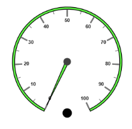

# Indicators

Indicators simply indicates the current status of the pointer. Indicators are in several formats such as in shape format, textual format and image format.

## Adding Indicator Collection 

Indicators collection is directly added to the scale object. Refer the following code to add indicator collection in a Gauge control.



<ej-circular-gauge id="circulargauge" >
<e-circular-scale-collections>
<e-circular-scales  show-indicators="true">
<e-circular-indicator-collections>
<e-circular-indicators height="10" width="10" type="@IndicatorType.Circle">
<e-position x="180" y="300"></e-position>
</e-circular-indicators>
</e-circular-indicator-collections>
</e-circular-scales>
</e-circular-scale-collections>
</ej-circular-gauge>



Execute the above code to render the following output.

Circular Gauge with indicator collection.
{:.caption}

## Basic Customization

* You can enable indicators by setting `show-indicators` to ‘true’. The height and width property for the indicators are used to specify the area allocated to the indicator for the width and height respectively. You can use the `e-position` collection to position the indicators along x and y axis. 
* Indicators are of several types such as, circle, rectangle, rounded rectangle, text and image. By using the type property you can avail those shapes. For image type `image-url` property is used. 



<ej-circular-gauge id="circulargauge" >
<e-circular-scale-collections>
<e-circular-scales  show-indicators="true" minor-interval-value="5" background-color="#5DF243"
show-scale-bar="true" radius="120" size="5">
<e-border color="black" width="1.5"></e-border>
<e-pointer-collections>
<e-pointers  background-color="#5DF243" >
<e-border color="black" width="1.5"></e-border>
</e-pointers>
</e-pointer-collections>
<e-circular-indicator-collections>
<e-circular-indicators height="10" width="10" type="@IndicatorType.Circle">
<e-position x="180" y="300"></e-position>
</e-circular-indicators>
</e-circular-indicator-collections>
</e-circular-scales>
</e-circular-scale-collections>
</ej-circular-gauge>



Execute the above code to render the following output.

Circular Gauge with customized indicator with basic properties
{:.caption}

## State Ranges

* State ranges are used to specify the indicator behavior in the specified region. Use startValue and endValue to set the range bound for the pointer. Whenever the pointer cross the specified region, the indicator attributes are applied for ranges. 
* The backgroundColor and borderColor sets the appearance behavior for the indicators. For text type indicators you can give value for text. And text can be changed whenever the pointer crosses its state range area. There are many basic font options available for the text in the state range such as size, fontStyle and fontFamily.



<ej-circular-gauge id="circulargauge" >
<e-circular-scale-collections>
<e-circular-scales  show-indicators="true" minor-interval-value="5" background-color="#5DF243"
show-scale-bar="true" radius="120" size="5">
<e-border color="black" width="1.5"></e-border>
<e-pointer-collections>
<e-pointers  background-color="#5DF243" >
<e-border color="black" width="1.5"></e-border>
</e-pointers>
</e-pointer-collections>
<e-circular-indicator-collections>
<e-circular-indicators height="10" width="10" type="@IndicatorType.Circle">
<e-position x="180" y="300"></e-position>
<e-state-ranges start-value="0" end-value="100" background-color="#5DF243" border-color="Black" 
text="" text-color="Black">
</e-state-ranges>
</e-circular-indicators>
</e-circular-indicator-collections>
</e-circular-scales>
</e-circular-scale-collections>
</ej-circular-gauge>



Execute the above code to render the following output.

Circular Gauge with customized indicator
{:.caption}

## Multiple Indicators

You can use multiple indicators for a single Gauge. Each indicator have a list of state ranges. Refer the following code example for multiple Indicators. 



<ej-circular-gauge id="circulargauge" >
<e-circular-scale-collections>
<e-circular-scales  show-indicators="true" show-ranges="true" 
minor-interval-value="5" background-color="#5DF243"
show-scale-bar="true" radius="120" size="5">
<e-border color="black" width="1.5"></e-border>
<e-pointer-collections>
<e-pointers  length="110" value="70">
</e-pointers>
</e-pointer-collections>
<e-circular-range-collections>
<e-circular-ranges placement="@RangePlacement.Far" background-color="green" distance-from-scale="-30"
start-value="0" end-value="50">
</e-circular-ranges>
<e-circular-ranges  placement="@RangePlacement.Far" background-color="red" distance-from-scale="-30"
start-value="50" end-value="100" >
</e-circular-ranges>
</e-circular-range-collections>  
<e-circular-indicator-collections>
<e-circular-indicators height="10" width="10" type="@IndicatorType.Circle">
<e-position x="165" y="300"></e-position>
<e-state-ranges start-value="0" end-value="50" background-color="#24F92F" border-color="Black" >
</e-state-ranges>
<e-state-ranges start-value="50" end-value="100" background-color="#322C04" border-color="Black" >
</e-state-ranges>
</e-circular-indicators>
<e-circular-indicators height="10" width="10" type="@IndicatorType.Circle">
<e-position x="215" y="300"></e-position>
<e-state-ranges start-value="0" end-value="50" background-color="#60000" border-color="Black" >
</e-state-ranges>
<e-state-ranges start-value="50" end-value="100" background-color="#FF42FA" border-color="Black" >
</e-state-ranges>
</e-circular-indicators>
</e-circular-indicator-collections>
</e-circular-scales>
</e-circular-scale-collections>
</ej-circular-gauge>



Execute the above code to render the following output.

Circular Gauge with multiple indicators
{:.caption}

