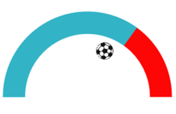
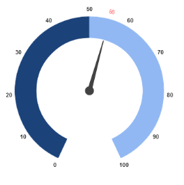

# Pointers

Pointer value points out the actual value set in the Circular Gauge. You can customize the pointers to improve the appearance of Gauge.

## Adding Pointer Collection

Pointer collection is directly added to the scale object. To add pointer collection in a Gauge control refer the following code example.  



<ej-circular-gauge id="circulargauge" >
<e-circular-scale-collections>
<e-circular-scales >
// adding the pointers 
<e-pointer-collections>
<e-pointers value="30" ></e-pointers>
</e-pointer-collections>
</e-circular-scales>
</e-circular-scale-collections>
</ej-circular-gauge>


Execute the above code to render the following output.

Circular Gauge with  pointer collection
{:.caption}

## Adding Pointer Value

Pointer value is the important element in the Circular Gauge that indicates the Gauge value. Real purpose of the Circular Gauge is based on the pointer value. You can set the pointer value either directly during rendering the control or it can be achieved by public method too.



<ej-circular-gauge id="circulargauge" >
<e-circular-scale-collections>
<e-circular-scales show-ranges="true" show-scale-bar="true" radius="150" size="2" major-interval-value="10" minor-interval-value="2">
<e-circular-range-collections>
<e-circular-ranges start-value="20" end-value="80" background-color="green">
</e-circular-ranges>
</e-circular-range-collections>
// adding the pointers 
<e-pointer-collections>
<e-pointers value="30" ></e-pointers>
</e-pointer-collections>
</e-circular-scales>
</e-circular-scale-collections>
</ej-circular-gauge>



Execute the above code to render the following output.

Circular Gauge with customized pointer value
{:.caption}

## Pointer Styles

### Colors and Border

* The Pointers border is modified with the object called `e-border` as in scales. It has two border property called color and width which are used to customize the border color of the pointer and border width of the pointer. 
* You can set the background color to improve the look of the Circular Gauge and you can customize the background color of the scale using backgroundColor.



<ej-circular-gauge id="circulargauge" >
<e-circular-scale-collections>
<e-circular-scales  show-scale-bar="true" radius="110" >
<e-pointer-collections>
<e-pointers value="45" length="80" width="16" background-color="yellow" opacity="0.6">
<e-border color="green" width="2"></e-border>
</e-pointers>
</e-pointer-collections>
</e-circular-scales>
</e-circular-scale-collections>
</ej-circular-gauge>



Execute the above code to render the following output.

Circular Gauge with  pointer collection
{:.caption}

## Appearance

* Based on the value, the pointer point out the label value. You can set the pointer length and width using length and width property respectively. 
* And you can also adjust the opacity of the pointer using the property opacity which holds the value between 0 and 1. You can add the gradient effects to the pointer using gradient object.



<ej-circular-gauge id="circulargauge" >
<e-circular-scale-collections>
<e-circular-scales  show-scale-bar="true" radius="110" background-color="yellow" >
<e-border color="red" width="2"></e-border>
<e-pointer-collections>
<e-pointers value="45" length="80" width="16" background-color="yellow" opacity="0.6">
<e-border color="red" width="2"></e-border>
</e-pointers>
</e-pointer-collections>
</e-circular-scales>
</e-circular-scale-collections>
</ej-circular-gauge>



Execute the above code to render the following output.

Circular Gauge with customized pointer styles
{:.caption}

### Position the pointer

* Pointer can be positioned with the help of two properties such as `distance-from-scale` and `placement`. distanceFromScale property defines the distance between the scale and pointer.  Placement property is used to locate the pointer with respect to scale either inside the scale or outside the scale or along the scale. 
* It is an enumerable data type. Both the property is applied only if pointer type is marker. For needle type marker, it renders with default position that is unchangeable.



<ej-circular-gauge id="circulargauge" >
<e-circular-scale-collections>
<e-circular-scales  show-scale-bar="true" size="10" radius="110" background-color="#DCEBF9" >
<e-border color="blue" width="2"></e-border>
<e-pointer-collections>
<e-pointers value="40" length="20" width="20" background-color="#DCEBF9" opacity="0.6" distance-from-scale="10" placement="@PointerPlacement.Near" type="@PointerType.Marker" marker-type="@MarkerType.Triangle">
<e-border color="blue" width="2"></e-border>
</e-pointers>
</e-pointer-collections>
</e-circular-scales>
</e-circular-scale-collections>
</ej-circular-gauge>


Execute the above code to render the following output.

Circular Gauge with customized pointer type as marker
{:.caption}

### Types

* Circular gauge pointer has two types such as,
1. Needle
2. Marker
* Needle type pointers are the default pointers that cannot be positioned and that is located at the center of the gauge. There are four different shapes of needle pointers such as 
1. Rectangle
2. Triangle
3. Trapezoid 
4. Arrow
* For marker pointer, the available dimensions are 
1. Rectangle
2. Triangle
3. Ellipse
4. Diamond
5. Pentagon
6. Circle 
7. Slider
8. Pointer
9. Wedge
10. Trapezoid
11. Rounded Rectangle

### Pointer Image

In ASP.NET Core Circular Gauge, it is possible to replace the pointer with some images. You can fix an image instead of rendering the pointer.

### ImageUrl

To implement the pointer image we need to give the API called `image-url`. It is a string data type. Image type pointer is applicable for both marker and needle type pointers and it is possible to combine the normal marker pointer type with an image type. The three possibilities are

1. Needle Image
2. Marker Image
3. Marker pointer with Image

### Needle Image 

In this type, needle pointer is completely replaced by image. You can implement it with the help of the following example.

  


<ej-circular-gauge id="circulargauge">
 <e-frame frame-type="@Frame.HalfCircle"></e-frame>
<e-circular-scale-collections>
<e-circular-scales  show-scale-bar="false" show-ranges="true" show-labels="false" start-angle="180" 
sweep-angle="180" radius="130">
<e-border color="blue" width="2"></e-border>
<e-pointer-collections>
 <e-pointers value="40" width="100" length="30" type="@PointerType.Needle" 
 needle-type="@NeedleType.Image" image-url="nib.png">
</e-pointers>
</e-pointer-collections>
<e-tick-collections>
<e-ticks height="0" width="0"></e-ticks>
</e-tick-collections>
<e-circular-range-collections>
<e-circular-ranges size="40" distance-from-scale="-30" start-value="0" end-value="70">
</e-circular-ranges>
<e-circular-ranges size="40" distance-from-scale="30" start-value="70" end-value="100" 
background-color="#fc0606">
<e-border color="#fc0606"></e-border>
</e-circular-ranges>
</e-circular-range-collections>             
</e-circular-scales>
</e-circular-scale-collections>
</ej-circular-gauge>



Semi-circular Gauge with needle pointer as image
{:.caption}

### Marker Image 

In this type, the marker pointer is completely replaced by the image. You can implement it with the help of the following example.



<ej-circular-gauge id="circulargauge">
 <e-frame frame-type="@Frame.HalfCircle"></e-frame>
<e-circular-scale-collections>
<e-circular-scales  show-scale-bar="false" show-ranges="true" show-labels="false" start-angle="180" 
sweep-angle="180" radius="130">
<e-pointer-collections>
 <e-pointers value="40" width="100" length="30" type="@PointerType.Marker" 
 marker-type="@MarkerType.Rectangle" image-url="ball.png">
</e-pointers>
</e-pointer-collections>
<e-tick-collections>
<e-ticks height="0" width="0"></e-ticks>
</e-tick-collections>
<e-circular-range-collections>
<e-circular-ranges size="40" distance-from-scale="-30" start-value="0" end-value="70">
</e-circular-ranges>
<e-circular-ranges size="40" distance-from-scale="30" start-value="70" end-value="100" 
background-color="#fc0606">
<e-border color="#fc0606"></e-border>
</e-circular-ranges>
</e-circular-range-collections>             
</e-circular-scales>
</e-circular-scale-collections>
</ej-circular-gauge>



Semi-circular Gauge with marker pointer as image
{:.caption}

### Marker pointer with Image 

In this type, marker pointer is drawn first and then the image is loaded. You can implement it with the help of following example.

 


<ej-circular-gauge id="circulargauge">
 <e-frame frame-type="@Frame.HalfCircle"></e-frame>
<e-circular-scale-collections>
<e-circular-scales  show-scale-bar="false" show-ranges="true" show-labels="false" start-angle="180" 
sweep-angle="180" radius="130">
<e-pointer-collections>
 <e-pointers value="40" width="100" length="30" type="@PointerType.Marker" 
 marker-type="@MarkerType.Rectangle" image-url="ball.png">
 <e-border color="black" width="3"></e-border>
</e-pointers>
</e-pointer-collections>
<e-tick-collections>
<e-ticks height="0" width="0"></e-ticks>
</e-tick-collections>
<e-circular-range-collections>
<e-circular-ranges size="40" distance-from-scale="-30" start-value="0" end-value="70">
</e-circular-ranges>
<e-circular-ranges size="40" distance-from-scale="30" start-value="70" end-value="100" 
background-color="#fc0606">
<e-border color="#fc0606"></e-border>
</e-circular-ranges>
</e-circular-range-collections>             
</e-circular-scales>
</e-circular-scale-collections>
</ej-circular-gauge>



Semi-circular Gauge with marker pointer with image
{:.caption}

### Multiple Pointers

Circular Gauge can have multiple pointers on it. You can use any combination and any number of pointers in a Gauge. That is, a Gauge can contain any number of marker pointer and any number of needle pointers. Refer the following code example containing two pointers.



<ej-circular-gauge id="circulargauge">
<e-circular-scale-collections>
<e-circular-scales  show-scale-bar="true" radius="110" size="10" background-color="#DCEBF9">
<e-border color="green" width="2"></e-border>
<e-pointer-collections>
 <e-pointers value="40" width="16" length="80" opacity="0.6" background-color="#DCEBF9">
 <e-border color="green" width="2"></e-border>
</e-pointers>
// second pointer 
<e-pointers value="60" width="20" length="20" opacity="0.6" type="@PointerType.Marker"
placement="@PointerPlacement.Near" marker-type="@MarkerType.Triangle" background-color="#DCEBF9">
 <e-border color="green" width="2"></e-border>
</e-pointers>
</e-pointer-collections>
</e-circular-scales>
</e-circular-scale-collections>
</ej-circular-gauge>



Execute the above code to render the following output.

Circular Gauge with multiple pointers
{:.caption}

## Pointer Value

* Gauge Pointer value is used to display the current value of the pointer in the Circular Gauge control.
* You can position the Circular Gauge pointer value with the gauge as center by using the API called `distance`. You can Disable/ Enable these pointers value by using the API `show-value`.

 


<ej-circular-gauge id="circulargauge" radius="100" value="55" background-color="transparent">
<e-circular-scale-collections>
<e-circular-scales show-ranges="true" >
<e-pointer-collections>
<e-pointers>
<e-pointer-value-text show-value="true" distance="10" color="#8c8c8c"></e-pointer-value-text>
</e-pointers>
</e-pointer-collections>
<e-tick-collections>
<e-ticks height="0" width="0"></e-ticks>
</e-tick-collections>
<e-circular-range-collections>
<e-circular-ranges size="40"  start-value="0" end-value="50" background-color="#1B4279">
<e-border color="#1B4279"></e-border>
</e-circular-ranges>
<e-circular-ranges size="40" start-value="50" end-value="100" background-color="#91B8F3">
<e-border color="#91B8F3"></e-border>
</e-circular-ranges>
</e-circular-range-collections>             
</e-circular-scales>
</e-circular-scale-collections>
</ej-circular-gauge>



Run the above code to render the output as follows.

Circular Gauge with pointer value text.
{:.caption}

## Appearance

Appearance of the Circular Gauge pointer value text is adjusted by using four properties. Such as color, angle, autoAngle and opacity.

* Color property is used to set the color of the pointer value text.
* Angle property is used to set the angle in which the text is displayed.
* Auto Angle is used to display the text in certain angle based on pointer position angle.
* Opacity is used to customize the brightness of the text.



<ej-circular-gauge id="circulargauge" radius="100" value="55" background-color="transparent">
<e-circular-scale-collections>
<e-circular-scales show-ranges="true" >
<e-pointer-collections>
<e-pointers>
<e-pointer-value-text show-value="true" distance="10" color="Red" opacity="1" auto-angle="false">
</e-pointer-value-text>
</e-pointers>
</e-pointer-collections>
<e-tick-collections>
<e-ticks height="0" width="0"></e-ticks>
</e-tick-collections>
<e-circular-range-collections>
<e-circular-ranges size="40"  start-value="0" end-value="50" background-color="#1B4279">
<e-border color="#1B4279"></e-border>
</e-circular-ranges>
<e-circular-ranges size="40" start-value="50" end-value="100" background-color="#91B8F3">
<e-border color="#91B8F3"></e-border>
</e-circular-ranges>
</e-circular-range-collections>             
</e-circular-scales>
</e-circular-scale-collections>
</ej-circular-gauge>


 
Run the above code to render the output as follows.

Circular Gauge with customized pointer value text.
{:.caption}

## Font Options

Similar to other collection, font option is also available in this pointer value text such as size, fontFamily and fontStyle.



<ej-circular-gauge id="circulargauge" radius="100" value="55" background-color="transparent">
<e-circular-scale-collections>
<e-circular-scales show-ranges="true" >
<e-pointer-collections>
<e-pointers>
<e-pointer-value-text show-value="true" distance="10" color="Red" opacity="1" auto-angle="false">
<e-font size="15px" font-family="Arial" font-style="normal"></e-font>
</e-pointer-value-text>
</e-pointers>
</e-pointer-collections>
<e-tick-collections>
<e-ticks height="0" width="0"></e-ticks>
</e-tick-collections>
<e-circular-range-collections>
<e-circular-ranges size="40"  start-value="0" end-value="50" background-color="#1B4279">
<e-border color="#1B4279"></e-border>
</e-circular-ranges>
<e-circular-ranges size="40" start-value="50" end-value="100" background-color="#91B8F3">
<e-border color="#91B8F3"></e-border>
</e-circular-ranges>
</e-circular-range-collections>             
</e-circular-scales>
</e-circular-scale-collections>
</ej-circular-gauge>


Run the above code to render the output as follows.

Circular Gauge with customized font option in pointer value text.
{:.caption}

