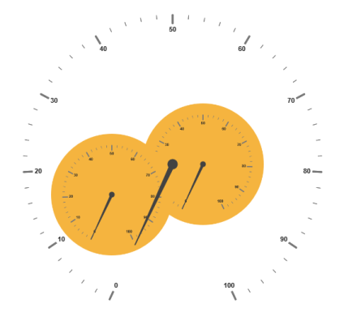

# Sub Gauges

A Circular Gauge containing another circular gauge is said to be Sub Gauges. In order to make  a sample like watch that has second gauge, minute gauge and hour gauge, sub gauges are used.

## Adding SubGauges

Sub gauge collection is directly added to the scale object. Refer the following code example to add custom sub gauge collection in a Gauge control



<ej-circular-gauge id="circulargauge" value="50">
<e-circular-scale-collections>
<e-circular-scales show-labels="true" radius="190">
<e-sub-gauge-collections>
<e-sub-gauges control-id="subgauge1" height="100" width="200" >
<e-position x="100" y="200"></e-position>
</e-sub-gauges>
</e-sub-gauge-collections>
</e-circular-scales>
</e-circular-scale-collections>
</ej-circular-gauge>

<ej-circular-gauge id="subgauge1" value="50" background-color="blue">
<e-circular-scale-collections>
<e-circular-scales radius="110">
</e-circular-scales>
</e-circular-scale-collections>
</ej-circular-gauge>



### Basic Customization

Basic attributes such as height and width property are used to set height and width of the sub gauge. You can easily position the gauge in another gauge using the position object and by giving the X and Y Coordinates value. `control-id` attribute is used to specify the sub gauge ID.



<ej-circular-gauge id="subgauge1" value="50" background-color="blue" radius="110">
<e-circular-scale-collections>
<e-circular-scales radius="110">
</e-circular-scales>
</e-circular-scale-collections>
</ej-circular-gauge>

<ej-circular-gauge id="circulargauge" value="50" height="500" width="500">
<e-circular-scale-collections>
<e-circular-scales show-labels="true" radius="190">
<e-sub-gauge-collections>
<e-sub-gauges control-id="subgauge1" height="250" width="250" >
<e-position x="150" y="100"></e-position>
</e-sub-gauges>
</e-sub-gauge-collections>
</e-circular-scales>
</e-circular-scale-collections>
</ej-circular-gauge>



Execute the above code to render the following output.

Circular Gauge with sub gauge
{:.caption}

## Multiple SubGauges

You can set multiple sub gauges in a single Circular Gauge by adding an array of sub gauge objects. Refer the following code example for multiple sub gauges functionality.



<ej-circular-gauge id="subgauge1" background-color="#f5b4f" >
<e-circular-scale-collections>
<e-circular-scales radius="150">
</e-circular-scales>
</e-circular-scale-collections>
</ej-circular-gauge>

<ej-circular-gauge id="subgauge2" background-color="#f5b4f" >
<e-circular-scale-collections>
<e-circular-scales radius="150">
</e-circular-scales>
</e-circular-scale-collections>
</ej-circular-gauge>

<ej-circular-gauge id="circulargauge" value="50" height="500" width="500">
<e-circular-scale-collections>
<e-circular-scales show-labels="true" radius="250">
<e-sub-gauge-collections>
<e-sub-gauges control-id="subgauge1" height="200" width="200" >
<e-position x="200" y="150"></e-position>
</e-sub-gauges>
<e-sub-gauges control-id="subgauge2" height="200" width="200" >
<e-position x="50" y="200"></e-position>
</e-sub-gauges>
</e-sub-gauge-collections>
</e-circular-scales>
</e-circular-scale-collections>
</ej-circular-gauge>



Execute the above code to render the following output.

Circular Gauge with multiple sub gauges
{:.caption}

