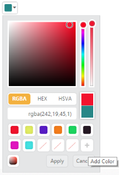
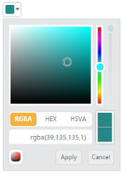

# Behavior Settings

## ShowPreview

The ColorPicker control provides live preview support for current cursor selection color and selected color. ShowPreview property allows you to preview the selected color in the picker or from the palette.

The ShowPreview property is Boolean type and its default value is true.

1. In the CSHTML page, configure the ColorPicker widget as follows.



@*In the CSHTML page, add the Html helpers to render ColorPicker widget*@

<ej-color-picker id="colorPicker" value="#278787" show-preview="true"></ej-color-picker>



The following screenshot displays the output of the above code example.

ColorPicker with Show Preview option
{:.caption}

## showRecentColors

The ColorPicker control allows you to store the color values in custom list by using ShowRecentColors property. The ColorPicker keeps up to 11 colors in a custom list.  By clicking the add button, the selected color from picker or palette gets added in the recent color list.  

The ShowRecentColors property is Boolean type and its default value is false.

1. In the CSHTML page, configure the ColorPicker widget as follows.



@*In the CSHTML page, add the Html helpers to render ColorPicker widget*@

    <ej-color-picker id="colorPicker" value="#278787" show-recent-colors="true"></ej-color-picker>



The following screenshot displays the output of the above code example.

ColorPicker with Recent Color Swatches
{:.caption}

## EnableOpacity

The ColorPicker control allows you to enable or disable the opacity slider. You can achieve this by using the EnableOpacity property. 

The EnableOpacity property is Boolean type and its default value is true.

1. In the CSHTML page, configure the ColorPicker widget as follows.



@*In the CSHTML page, add the Html helpers to render ColorPicker widget*@

    <ej-color-picker id="colorPicker" value="#278787" enable-opacity="false"></ej-color-picker>


The following screenshot displays the output of the above code example.

ColorPicker with Opacity Slider as disabled state
{:.caption}

## Columns

The palette model consists of color values in the rows and columns order. Palette only consists of predefined colors and allows you to select anyone color from it. The Columns property allows you to modify the number of columns in palette model. 

The Columns property is Number type and its default value is 10.

1. In the CSHTML page, configure the ColorPicker widget as follows.



@*In the CSHTML page, add the Html helpers to render ColorPicker widget*@

  <ej-color-picker id="colorPicker" value="#278787" columns="9"></ej-color-picker>


The following screenshot displays the output of the above code example.

ColorPicker with Columns
{:.caption}
