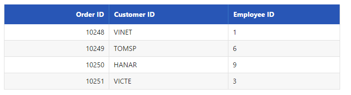
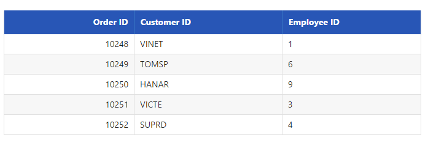
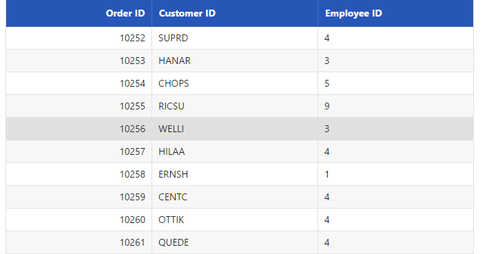
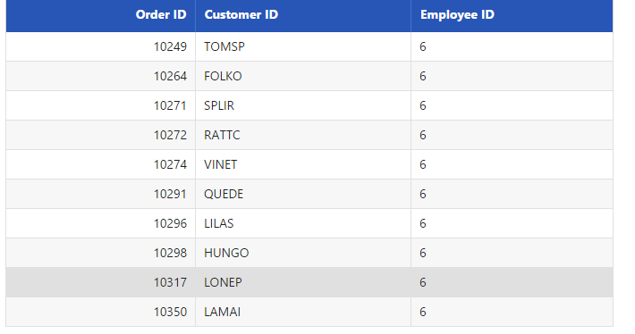
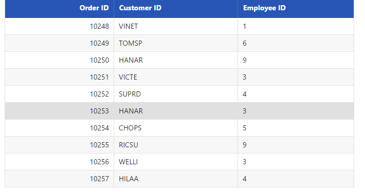
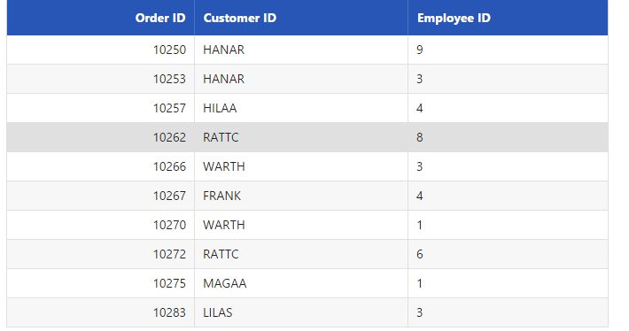
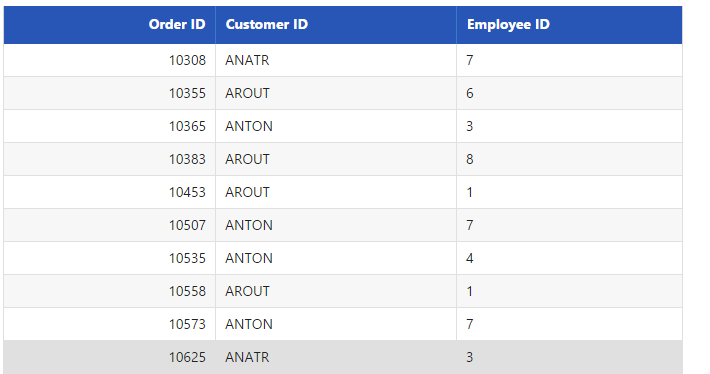
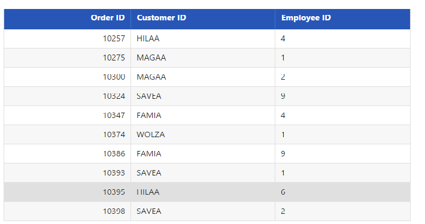
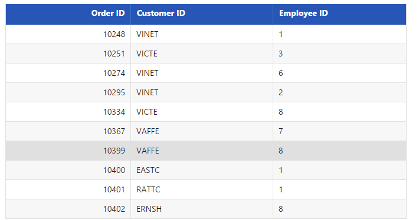

# Filtering

Filtering is a basic technique in **DataManager** query. The “where” query is used to filter some particular or related records from the data source to review details of records. 

## Filter Operators

Filter operators are generally used to specify the filter type. The various filter operators corresponding to the type of the column is listed in the following table.

<table>
<tr>
<th>
Column type</th><th>
Filter operators</th></tr>
<tr>
<td>
Number</td><td>
ej.FilterOperators.greaterThan ej.FilterOperators.greaterThanOrEqual ej.FilterOperators.lessThan ej.FilterOperators.lessThanOrEqual ej.FilterOperators.equal</td></tr>
<tr>
<td>
String</td><td>
ej.FilterOperators.startsWith ej.FilterOperators.endsWith ej.FilterOperators.contains ej.FilterOperators.equal ej.FilterOperators.notEqual</td></tr>
<tr>
<td>
Boolean</td><td>
ej.FilterOperators.equal ej.FilterOperators.notEqual</td></tr>
<tr>
<td>
Date</td><td>
ej.FilterOperators.greaterThan ej.FilterOperators.greaterThanOrEqual ej.FilterOperators.lessThan ej.FilterOperators.lessThanOrEqual ej.FilterOperators.equal</td></tr>
</table>

## lessThan

This operator is used to get the records with values less than that of the filter value.





    /*ej-Tag Helper code to render DataManager*/
    <ej-grid query="new ej.Query().page(1,10).where('OrderID', 'lessThan', 10252, false)" id="FlatGrid" dataamanager-id="myData" action-complete="onComplete">
        <e-datamanager url="http://mvc.syncfusion.com/Services/Northwnd.svc/Orders"></e-datamanager>
        <e-columns>
            <e-column field="OrderID" header-text="Order ID" text-align="Right" width="70"></e-column>
            <e-column field="CustomerID" header-text="Customer ID" width="80"></e-column>
            <e-column field="EmployeeID" header-text="Employee ID" text-align="Left" width="75"></e-column>
        </e-columns>
    </ej-grid>





    /*Razor code to render DataManager*/
    @{Html.EJ().DataManager("FlatData").URL("http://mvc.syncfusion.com/Services/Northwnd.svc/Orders").Render();}
    @{Html.EJ().Grid<object>("myGrid")
        .DataManagerID("FlatData")
        .Query("new ej.Query().page(1,10).where('OrderID', 'lessThan', 10252, false)")
        .Columns(col =>
        {
            col.Field("OrderID").HeaderText("Order ID").IsPrimaryKey(true).TextAlign(TextAlign.Right).Width(75).Add();
            col.Field("CustomerID").HeaderText("Customer ID").Width(80).Add();
            col.Field("EmployeeID").HeaderText("Employee ID").TextAlign(TextAlign.Right).Width(75).Add();
        }).Render();
    }





Result of the above code example is illustrated as follows.

 

## greaterThan

This operator is used to get the records with values greater than that of the filter value.





    /*ej-Tag Helper code to render DataManager*/
    <ej-grid query="new ej.Query().page(1,10).where('OrderID', 'greaterThan', 10252, false)" id="FlatGrid" dataamanager-id="myData" action-complete="onComplete">
        <e-datamanager url="http://mvc.syncfusion.com/Services/Northwnd.svc/Orders"></e-datamanager>
        <e-columns>
            <e-column field="OrderID" header-text="Order ID" text-align="Right" width="70"></e-column>
            <e-column field="CustomerID" header-text="Customer ID" width="80"></e-column>
            <e-column field="EmployeeID" header-text="Employee ID" text-align="Left" width="75"></e-column>
        </e-columns>
    </ej-grid>





    /*Razor code to render DataManager*/
    @{Html.EJ().DataManager("FlatData").URL("http://mvc.syncfusion.com/Services/Northwnd.svc/Orders").Render();}
    @{Html.EJ().Grid<object>("myGrid")
        .DataManagerID("FlatData")
        .Query("new ej.Query().page(1,10).where('OrderID', 'greaterThan', 10252, false)")
        .Columns(col =>
        {
            col.Field("OrderID").HeaderText("Order ID").IsPrimaryKey(true).TextAlign(TextAlign.Right).Width(75).Add();
            col.Field("CustomerID").HeaderText("Customer ID").Width(80).Add();
            col.Field("EmployeeID").HeaderText("Employee ID").TextAlign(TextAlign.Right).Width(75).Add();
        }).Render();
    }





Result of the above code example is illustrated as follows.

 

## lessThanOrEqual

This operator is used to get the records with values less than or equal to the filter value.





    /*ej-Tag Helper code to render DataManager*/
    <ej-grid query="new ej.Query().page(1,10).where('OrderID', 'lessThanOrEqual', 10252, false)" id="FlatGrid" dataamanager-id="myData" action-complete="onComplete">
        <e-datamanager url="http://mvc.syncfusion.com/Services/Northwnd.svc/Orders"></e-datamanager>
        <e-columns>
            <e-column field="OrderID" header-text="Order ID" text-align="Right" width="70"></e-column>
            <e-column field="CustomerID" header-text="Customer ID" width="80"></e-column>
            <e-column field="EmployeeID" header-text="Employee ID" text-align="Left" width="75"></e-column>
        </e-columns>
    </ej-grid>





    /*Razor code to render DataManager*/
    @{Html.EJ().DataManager("FlatData").URL("http://mvc.syncfusion.com/Services/Northwnd.svc/Orders").Render();}
    @{Html.EJ().Grid<object>("myGrid")
        .DataManagerID("FlatData")
        .Query("new ej.Query().page(1,10).where('OrderID', 'lessThanOrEqual', 10252, false)")
        .Columns(col =>
        {
            col.Field("OrderID").HeaderText("Order ID").IsPrimaryKey(true).TextAlign(TextAlign.Right).Width(75).Add();
            col.Field("CustomerID").HeaderText("Customer ID").Width(80).Add();
            col.Field("EmployeeID").HeaderText("Employee ID").TextAlign(TextAlign.Right).Width(75).Add();
        }).Render();
    }





Result of the above code example is illustrated as follows.

 

## greaterThanOrEqual

This operator is used to get the records with values greater than or equal to the filter value.





    /*ej-Tag Helper code to render DataManager*/
    <ej-grid query="new ej.Query().page(1,10).where('OrderID', 'greaterThanOrEqual', 10252, false)" id="FlatGrid" dataamanager-id="myData" action-complete="onComplete">
        <e-datamanager url="http://mvc.syncfusion.com/Services/Northwnd.svc/Orders"></e-datamanager>
        <e-columns>
            <e-column field="OrderID" header-text="Order ID" text-align="Right" width="70"></e-column>
            <e-column field="CustomerID" header-text="Customer ID" width="80"></e-column>
            <e-column field="EmployeeID" header-text="Employee ID" text-align="Left" width="75"></e-column>
        </e-columns>
    </ej-grid>





    /*Razor code to render DataManager*/
    @{Html.EJ().DataManager("FlatData").URL("http://mvc.syncfusion.com/Services/Northwnd.svc/Orders").Render();}
    @{Html.EJ().Grid<object>("myGrid")
        .DataManagerID("FlatData")
        .Query("new ej.Query().page(1,10).where('OrderID', 'greaterThanOrEqual', 10252, false)")
        .Columns(col =>
        {
            col.Field("OrderID").HeaderText("Order ID").IsPrimaryKey(true).TextAlign(TextAlign.Right).Width(75).Add();
            col.Field("CustomerID").HeaderText("Customer ID").Width(80).Add();
            col.Field("EmployeeID").HeaderText("Employee ID").TextAlign(TextAlign.Right).Width(75).Add();
        }).Render();
    }





Result of the above code example is illustrated as follows.

 

## equal

This operator is used to get the records with values equal to that of the filter value.





    /*ej-Tag Helper code to render DataManager*/
    <ej-grid query="new ej.Query().page(1,10).where('EmployeeID', 'equal', 6, false)" id="FlatGrid" dataamanager-id="myData" action-complete="onComplete">
        <e-datamanager url="http://mvc.syncfusion.com/Services/Northwnd.svc/Orders"></e-datamanager>
        <e-columns>
            <e-column field="OrderID" header-text="Order ID" text-align="Right" width="70"></e-column>
            <e-column field="CustomerID" header-text="Customer ID" width="80"></e-column>
            <e-column field="EmployeeID" header-text="Employee ID" text-align="Left" width="75"></e-column>
        </e-columns>
    </ej-grid>





    /*Razor code to render DataManager*/
    @{Html.EJ().DataManager("FlatData").URL("http://mvc.syncfusion.com/Services/Northwnd.svc/Orders").Render();}
    @{Html.EJ().Grid<object>("myGrid")
        .DataManagerID("FlatData")
        .Query("new ej.Query().page(1,10).where('EmployeeID', 'equal', 6, false)")
        .Columns(col =>
        {
            col.Field("OrderID").HeaderText("Order ID").IsPrimaryKey(true).TextAlign(TextAlign.Right).Width(75).Add();
            col.Field("CustomerID").HeaderText("Customer ID").Width(80).Add();
            col.Field("EmployeeID").HeaderText("Employee ID").TextAlign(TextAlign.Right).Width(75).Add();
        }).Render();
    }





Result of the above code example is illustrated as follows.

 

## notEqual

This operator is used to get the records with values not equal to that of the filter value specified.





    /*ej-Tag Helper code to render DataManager*/
    <ej-grid query="new ej.Query().page(1,10).where('ShipCountry', 'notEqual', 'Rio de Janeiro', false)" id="FlatGrid" dataamanager-id="myData" action-complete="onComplete">
        <e-datamanager url="http://mvc.syncfusion.com/Services/Northwnd.svc/Orders"></e-datamanager>
        <e-columns>
            <e-column field="OrderID" header-text="Order ID" text-align="Right" width="70"></e-column>
            <e-column field="CustomerID" header-text="Customer ID" width="80"></e-column>
            <e-column field="EmployeeID" header-text="Employee ID" text-align="Left" width="75"></e-column>
        </e-columns>
    </ej-grid>





    /*Razor code to render DataManager*/
    @{Html.EJ().DataManager("FlatData").URL("http://mvc.syncfusion.com/Services/Northwnd.svc/Orders").Render();}
    @{Html.EJ().Grid<object>("myGrid")
        .DataManagerID("FlatData")
        .Query("new ej.Query().page(1,10).where('ShipCountry', 'notEqual', 'Rio de Janeiro', false)")
        .Columns(col =>
        {
            col.Field("OrderID").HeaderText("Order ID").IsPrimaryKey(true).TextAlign(TextAlign.Right).Width(75).Add();
            col.Field("CustomerID").HeaderText("Customer ID").Width(80).Add();
            col.Field("EmployeeID").HeaderText("Employee ID").TextAlign(TextAlign.Right).Width(75).Add();
        }).Render();
    }





Result of the above code example is illustrated as follows.

 

## contains

This operator is used to get the records that contains the filter value.





    /*ej-Tag Helper code to render DataManager*/
    <ej-grid query="new ej.Query().page(1,10).where('CustomerID', 'contains', 'A', false)" id="FlatGrid" dataamanager-id="myData" action-complete="onComplete">
        <e-datamanager url="http://mvc.syncfusion.com/Services/Northwnd.svc/Orders"></e-datamanager>
        <e-columns>
            <e-column field="OrderID" header-text="Order ID" text-align="Right" width="70"></e-column>
            <e-column field="CustomerID" header-text="Customer ID" width="80"></e-column>
            <e-column field="EmployeeID" header-text="Employee ID" text-align="Left" width="75"></e-column>
        </e-columns>
    </ej-grid>





    /*Razor code to render DataManager*/
    @{Html.EJ().DataManager("FlatData").URL("http://mvc.syncfusion.com/Services/Northwnd.svc/Orders").Render();}
    @{Html.EJ().Grid<object>("myGrid")
        .DataManagerID("FlatData")
        .Query("new ej.Query().page(1,10).where('CustomerID', 'contains', 'A', false)")
        .Columns(col =>
        {
            col.Field("OrderID").HeaderText("Order ID").IsPrimaryKey(true).TextAlign(TextAlign.Right).Width(75).Add();
            col.Field("CustomerID").HeaderText("Customer ID").Width(80).Add();
            col.Field("EmployeeID").HeaderText("Employee ID").TextAlign(TextAlign.Right).Width(75).Add();
        }).Render();
    }





Result of the above code example is illustrated as follows.

 

## startswith

This operator is used to get the records that starts with the filter value specified.





    /*ej-Tag Helper code to render DataManager*/
    <ej-grid query="new ej.Query().page(1,10).where('CustomerID', 'startswith', 'A', false)" id="FlatGrid" dataamanager-id="myData" action-complete="onComplete">
        <e-datamanager url="http://mvc.syncfusion.com/Services/Northwnd.svc/Orders"></e-datamanager>
        <e-columns>
            <e-column field="OrderID" header-text="Order ID" text-align="Right" width="70"></e-column>
            <e-column field="CustomerID" header-text="Customer ID" width="80"></e-column>
            <e-column field="EmployeeID" header-text="Employee ID" text-align="Left" width="75"></e-column>
        </e-columns>
    </ej-grid>





    /*Razor code to render DataManager*/
    @{Html.EJ().DataManager("FlatData").URL("http://mvc.syncfusion.com/Services/Northwnd.svc/Orders").Render();}
    @{Html.EJ().Grid<object>("myGrid")
        .DataManagerID("FlatData")
        .Query("new ej.Query().page(1,10).where('CustomerID', 'startswith', 'A', false)")
        .Columns(col =>
        {
            col.Field("OrderID").HeaderText("Order ID").IsPrimaryKey(true).TextAlign(TextAlign.Right).Width(75).Add();
            col.Field("CustomerID").HeaderText("Customer ID").Width(80).Add();
            col.Field("EmployeeID").HeaderText("Employee ID").TextAlign(TextAlign.Right).Width(75).Add();
        }).Render();
    }





Result of the above code example is illustrated as follows.

 

## endswith

This operator is used to get the records that ends with the filter value specified.





    /*ej-Tag Helper code to render DataManager*/
    <ej-grid query="new ej.Query().page(1,10).where('CustomerID', 'endswith', 'A', false)" id="FlatGrid" dataamanager-id="myData" action-complete="onComplete">
        <e-datamanager url="http://mvc.syncfusion.com/Services/Northwnd.svc/Orders"></e-datamanager>
        <e-columns>
            <e-column field="OrderID" header-text="Order ID" text-align="Right" width="70"></e-column>
            <e-column field="CustomerID" header-text="Customer ID" width="80"></e-column>
            <e-column field="EmployeeID" header-text="Employee ID" text-align="Left" width="75"></e-column>
        </e-columns>
    </ej-grid>





    /*Razor code to render DataManager*/
    @{Html.EJ().DataManager("FlatData").URL("http://mvc.syncfusion.com/Services/Northwnd.svc/Orders").Render();}
    @{Html.EJ().Grid<object>("myGrid")
        .DataManagerID("FlatData")
        .Query("new ej.Query().page(1,10).where('CustomerID', 'endswith', 'A', false)")
        .Columns(col =>
        {
            col.Field("OrderID").HeaderText("Order ID").IsPrimaryKey(true).TextAlign(TextAlign.Right).Width(75).Add();
            col.Field("CustomerID").HeaderText("Customer ID").Width(80).Add();
            col.Field("EmployeeID").HeaderText("Employee ID").TextAlign(TextAlign.Right).Width(75).Add();
        }).Render();
    }





Result of the above code example is illustrated as follows.

 

## and predicate

The `and` predicate is used to add n-number of predicates with “and” condition and filter the data.





    /*ej-Tag Helper code to render DataManager*/
    <ej-grid query="new ej.Query().page(1,10).where(ej.Predicate('OrderID', ej.FilterOperators.greaterThan, 10399, true).and('CustomerID', ej.FilterOperators.startsWith, 'V', true))" id="FlatGrid" dataamanager-id="myData" action-complete="onComplete">
        <e-datamanager url="http://mvc.syncfusion.com/Services/Northwnd.svc/Orders"></e-datamanager>
        <e-columns>
            <e-column field="OrderID" header-text="Order ID" text-align="Right" width="70"></e-column>
            <e-column field="CustomerID" header-text="Customer ID" width="80"></e-column>
            <e-column field="EmployeeID" header-text="Employee ID" text-align="Left" width="75"></e-column>
        </e-columns>
    </ej-grid>





    /*Razor code to render DataManager*/
    @{Html.EJ().DataManager("FlatData").URL("http://mvc.syncfusion.com/Services/Northwnd.svc/Orders").Render();}
    @{Html.EJ().Grid<object>("myGrid")
        .DataManagerID("FlatData")
        .Query("new ej.Query().page(1,10).where(ej.Predicate('OrderID', ej.FilterOperators.greaterThan, 10399, true).and('CustomerID', ej.FilterOperators.startsWith, 'V', true))")
        .Columns(col =>
        {
            col.Field("OrderID").HeaderText("Order ID").IsPrimaryKey(true).TextAlign(TextAlign.Right).Width(75).Add();
            col.Field("CustomerID").HeaderText("Customer ID").Width(80).Add();
            col.Field("EmployeeID").HeaderText("Employee ID").TextAlign(TextAlign.Right).Width(75).Add();
        }).Render();
    }





Result of the above code example is illustrated as follows.

 

## or predicate

Using this method you can add n-number of predicates with `or` condition and filter the data.





    /*ej-Tag Helper code to render DataManager*/
    <ej-grid query="new ej.Query().page(1,10).where(ej.Predicate('OrderID', ej.FilterOperators.greaterThan, 10399, true).or('CustomerID', ej.FilterOperators.startsWith, 'V', true))" id="FlatGrid" dataamanager-id="myData" action-complete="onComplete">
        <e-datamanager url="http://mvc.syncfusion.com/Services/Northwnd.svc/Orders"></e-datamanager>
        <e-columns>
            <e-column field="OrderID" header-text="Order ID" text-align="Right" width="70"></e-column>
            <e-column field="CustomerID" header-text="Customer ID" width="80"></e-column>
            <e-column field="EmployeeID" header-text="Employee ID" text-align="Left" width="75"></e-column>
        </e-columns>
    </ej-grid>





    /*Razor code to render DataManager*/
    @{Html.EJ().DataManager("FlatData").URL("http://mvc.syncfusion.com/Services/Northwnd.svc/Orders").Render();}
    @{Html.EJ().Grid<object>("myGrid")
        .DataManagerID("FlatData")
        .Query("new ej.Query().page(1,10).where(ej.Predicate('OrderID', ej.FilterOperators.greaterThan, 10399, true).or('CustomerID', ej.FilterOperators.startsWith, 'V', true))")
        .Columns(col =>
        {
            col.Field("OrderID").HeaderText("Order ID").IsPrimaryKey(true).TextAlign(TextAlign.Right).Width(75).Add();
            col.Field("CustomerID").HeaderText("Customer ID").Width(80).Add();
            col.Field("EmployeeID").HeaderText("Employee ID").TextAlign(TextAlign.Right).Width(75).Add();
        }).Render();
    }





Result of the above code example is illustrated as follows.

 