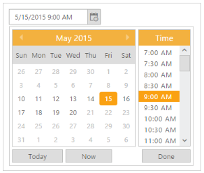

# Getting Started with ASP.NET Core DateTimePicker

This section explains the essential steps required to render a DateTimePicker control in an ASP.net Core application.

## Create your first DateTimePicker

The DateTimePicker provides support to display the calendar within your web page and allows you to pick date and time from the calendar. Refer the following guidelines to customize date and time pickers for a real time appointment booking scenario that helps you to book an appointment, within a limited number of days. The following screenshot illustrates the functionality of DatePicker with date range.

    
DateTimePicker
{:.caption}

In the above screenshot, you can select a date and time, within a week ranging from the current date. This helps you to avoid booking an appointment beyond the current date and mentioned date range.

## Create a DateTimePicker 

The DateTimePicker widget basically renders built-in features like Month and Time Navigation, with animations and flexible APIs. You can easily create the DateTimePicker widget using simple DateTimePicker element as follows.

1. Create a ASP.net core Project and add necessary assemblies and scripts.
2. [Getting Started](https://help.syncfusion.com/aspnet-core/gettingstarted/getting-started-1-1-0) section explains about basic system requirements and the steps to configure the Syncfusion Components in an ASP.net core application.
3. After successfully adding the necessary dependencies in your solution, make sure to build the solution, so that the necessary assembly files are compiled properly before using it in your project.
4. Add the following code to the corresponding view page to render DateTimePicker.

   

   /*ej-Tag Helper code to render DateTimePicker*/
       
	@*Add the following code example to the corresponding CSHTML page to render DateTimePicker widget*@

	<ej-date-time-picker id="Datetime" width="175px" value='DateTime.Parse("05/15/2015 09:00 AM")'></ej-date-time-picker>

   

   

/*Razor code to render DateTimePicker*/

     @{Html.EJ().DateTimePicker("Datetime").Width("175px").Value("05/15/2015 09:00 AM").Render(); }



N> To render the DateTimePicker Control you can use either Razor or Tag helper code as given in the above code snippet.
  
Execute the above code to render the following output.

DateTimePicker
{:.caption}

## Set the Min/Max Date and Time Intervals

In a real-time appointment booking scenario, the booking is open only for a limited number of days. You can select the date from the given range. This is achieved using the properties MinDateTime and MaxDateTime. Only the dates ranging between MinDateTime and MaxDateTime are enabled in the datepicker. Using the Interval property, you can set the interval.  

    

/*ej-Tag Helper code to render DateTimePicker*/
       
	 @*Add the following code example to the corresponding CSHTML page to render DateTimePicker widget with customized Min time and Max time*@

    <ej-date-time-picker id="DateTime" min-date-time='DateTime.Parse("5/10/2015 09:00 AM")' max-date-time='DateTime.Parse("5/20/2015 06:00 PM")' interval="30" width="175px" value='DateTime.Parse("5/15/2015 09:00 AM")'></ej-date-time-picker>
    
    

    

/*Razor code to render DateTimePicker*/

     @{Html.EJ().DateTimePicker("DateTime4").MinDateTime("5/10/2015 09:00 AM").MaxDateTime("5/20/2015 06:00 PM").Interval(30).Width("175px").Value("5/15/2015 09:00 AM").Render(); }

    
  

DateTimePicker with Min/Max Date and Time Interval
{:.caption}
