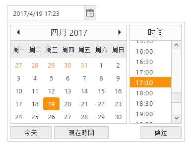

# Localization

You can globalize your DateTimePicker control. People of different culture can make use of it. All culture files are supported by Syncfusion components

Essential ASP.NET MVC DateTimePicker has been provided with built-in localization support, so that it can adapt based on culture specific locale defined for it. 

More than 350 culture specific files are available to localize the datetime. To know more about EJ globalize support, please refer the below link      
 [http://help.syncfusion.com/js/localization](http://help.syncfusion.com/js/localization) 

N> Seven culture-specific script files are available in the below specified location. For all other culture files, please download from the [GitHub](https://github.com/syncfusion/ej-global/tree/master/i18n) location.

<table>
<tr>
<td>

    (installed location)\Syncfusion\Essential Studio\{{ site.releaseversion }}\JavaScript\assets\scripts\i18n

    For example, If you have installed the Essential Studio package within C:\Program Files (x86), then navigate to the below location, 
    C:\Program Files (x86)\Syncfusion\Essential Studio\{{ site.releaseversion }}\JavaScript\assets\scripts\i18n

</td></tr>
</table>
To translate our control content from default English to any of the culture, say For example - Spanish language, then you need to refer the ej.culture.es-ES.min.js file in your application,

The **en-US** locale is currently being used as default culture in DateTimePicker. You can set any other culture to DateTimePicker using **locale** property. Below code example shows Spanish cultured DateTimePicker.

Refer the below Spanish culture file in head section of HTML page after the reference of **ej.web.all.min.js** file.

 
   
           
                
 

   1. Add the following code in your CSHTML page to render DateTimePicker widget.

 

 /*ej-Tag Helper code to render DateTimePicker*/
	 
	    @*Add the following code example to the corresponding CSHTML page to render DateTimePicker widget with customized localization*@

		<ej-date-time-picker id="dateTime" value="@DateTime.Now" locale="zh-CN" width="180px" create="onOpen"></ej-date-time-picker>

        





/*Razor code to render DateTimePicker*/

     @{ Html.EJ().DateTimePicker("dateTime").Value(DateTime.Now).Locale("zh-CN").Width("180px").ClientSideEvents(e => e.Create("onOpen")).Render();}



N> To render the DateTimePicker Control you can use either Razor or Tag helper code as given in the above code snippet.
   
   
2. The following screenshot displays the output for the above code.

	

    Showcase for DateTimePicker with Spanish culture
    {:.caption}

