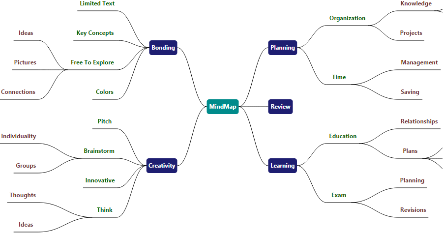

# Exporting

Diagram provides support to export its content as image/svg files.
The client side method `exportDiagram` helps to export the Diagram. The following code illustrates how to export the Diagram as image.



var diagram = $("#diagram").ejDiagram("instance");
//Exports the Diagram as an image of JPEG format
diagram.exportDiagram();



## Exporting options

Diagram provides support to export the desired region of the Diagram to desired formats.

### FileName

FileName is the name of the file to be downloaded. By default, the file name is set as "Diagram".

### Format

Format is to specify the type/format of the exported file. By default, Diagram is exported as .jpg format. You can export Diagram to the following formats.

* JPG
* PNG
* BMP
* SVG

For more information about the exportable formats, refer to [File Formats](/js/api/global#fileformats "File Formats").

### Margin

Margin specifies the amount of space that has to be left around the Diagram.



	var diagram = $("#diagram").ejDiagram("instance");
	var options = {
		//Name of the file to be downloaded
		fileName: "diagram",
		//Margin to the exported file/data
		margin: {
			left: 30,
			right: 30,
			top: 30,
			bottom: 30
		}
	};
	diagram.exportDiagram(options);



### Mode

Mode specifies whether the Diagram is to be exported as files or as data(ImageURL/SVG). The exporting options are as follows.

* Exports and downloads Diagram as image
* Exports Diagram as data of formats ImageURL/SVG

For more information about the exporting modes, refer to [Exporting Modes](/js/api/global#exportmodes "Exporting Modes").

The following code example illustrates how to export the Diagram as raw data.



	var diagram = $("#diagram").ejDiagram("instance");
	var options = {
		fileName: "diagram",
		//Specifies whether to export as files/data
		mode: "data"
	};
	diagram.exportDiagram(options);



N> In IE-9, Diagrams cannot be exported as downloadable files. Instead, Diagram provides the exported data (DataURL/SVG) that enables to export it from application.

### Region

You can export any particular region of the Diagram and the region is categorized as follows.

* Region that fits all nodes and connectors that are added to model
* Region that fits all pages (single or multiple pages based on page settings)

For more information about region, refer to [Regions](/js/api/global#region "Regions").

The following code example illustrates how to export the region occupied by the Diagram elements.



	var diagram = $("#diagram").ejDiagram("instance");
	var options = {
		//Specifies the exporting region
		mode: "content"
	};
	diagram.exportDiagram(options);



The following code example illustrates how to export any specific region of the Diagram.



	var diagram = $("#diagram").ejDiagram("instance");
	var options = {
		fileName: "diagram",
		//Specifies whether to export as files/data
		mode: "download",
		//Format of the exported file
		format: "jpg",
		// Defines the custom bounds that has to be exported
		bounds: {
			x: 1000,
			y: 1000,
			width: 500,
			height: 500
		},
	};
	diagram.exportDiagram(options);

