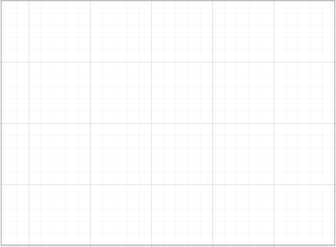
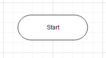
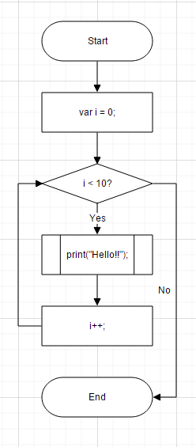

# Getting Started with ASP.NET Core Diagram

This section explains briefly you on how to create a Diagram in your ASP.NET CORE Application. Getting started with your ASP.NET CORE Diagram is very easy.  You can start by creating a simple flow Chart.

## Flow Diagram

### Initialize Diagram

1\. Create an ASP.NET CORE Application and add necessary packages and Scripts by referring [ASP.NET Core-Getting Started](https://help.syncfusion.com/aspnet-core/gettingstarted/getting-started-1-1-0) Documentation.

2\. Add a placeholder `div` element to initialize diagram control



    <ej-diagram id="diagram" width="1000px" height="600px" enable-context-menu="false"></ej-diagram>



3\. This creates an empty diagram

### Create and add Node

Let us create and add a `node` with specific position, size, label and shape.



    <ej-diagram id="diagram" width="1000px" height="600px" enable-context-menu="false">
      <e-nodes>
        <e-flow-shape name="Start" width="150" height="60" offset-X="300" offset-Y="60" shape="@FlowShapes.Terminator">
          <e-labels>
            <e-diagram-label name="flow-label" text="Start"></e-diagram-label>
          </e-labels>                  
        </e-flow-shape>              
      </e-nodes>
    </ej-diagram>



N> `Labels` property is an array, which indicates that more than one label can be added to a node.

Added node will be displayed in diagram as shown below.

### Connect nodes

* Create another `node` with another set of data.


    
    <e-nodes>
      <e-flow-shape name="Start" width="150" height="60" offset-X="300" offset-Y="60"  shape="@FlowShapes.Terminator">
        <e-labels>
          <e-diagram-label name="flow-label" text="Start"></e-diagram-label>
        </e-labels>                  
      </e-flow-shape>    
      <e-flow-shape name="Init" width="150" height="60" offset-X="300" offset-Y="155" shape="@FlowShapes.Process">
        <e-labels>
          <e-diagram-label name="Init-Label" text="var i = 0;"></e-diagram-label>
        </e-labels>
      </e-flow-shape>
    </e-nodes>
   


Connect these two nodes by adding a `connector` into `Connectors` collection with reference to source and target end.



    //Add a connector to `Connectors` collection of diagram model
    <e-connectors>
       <e-connector name="Connector1" source-node="Start" target-node="Init"></e-connector>
    </e-connectors>



* `Connector` connects the two nodes as shown below.

* Default values for all nodes and connectors can be set using default settings. For example if all nodes have same `Width` and `Height`, we can move such properties into `DefaultSettings`. Above code can be rewritten as shown below.



    //Default Settings
    <e-default-settings>
      <e-node width="140" height="50" offset-x="300" type="Flow"></e-node>
      <e-connector>
        <e-labels>
           <e-diagram-label fill-color="white"></e-diagram-label>
        </e-labels>
        <e-segments>
           <e-segment type="Orthogonal"></e-segment>
        </e-segments>
      </e-connector>
    </e-default-settings>
    
    <e-nodes>
      <e-flow-shape name="Start"  offset-Y="50"  shape="@FlowShapes.Terminator">
        <e-labels>
          <e-diagram-label name="label1" text="Start" ></e-diagram-label>
        </e-labels>                  
      </e-flow-shape>              
      <e-flow-shape name="Init"  offset-Y="140"  shape="@FlowShapes.Process">
        <e-labels>
          <e-diagram-label name="label2" text="var i = 0;" ></e-diagram-label>
        </e-labels>
      </e-flow-shape> 
    </e-nodes>
    
    <e-connectors>
      <e-connector name="Connector1" source-node="Start" target-node="Init">   
        <e-labels>
          <e-diagram-label text="connect"></e-diagram-label>
        </e-labels>                                                 
      </e-connector>
    </e-connectors>



### Complete flow diagram

Similarly we can add required nodes and connectors to form a complete flow diagram.



    //Default Settings
    <e-default-settings>
      <e-node width="140" height="50" offset-x="300" type="Flow"></e-node>
      <e-connector>
        <e-labels>
          <e-diagram-label fill-color="white"></e-diagram-label>
        </e-labels>
        <e-segments>
          <e-segment type="Orthogonal"></e-segment>
        </e-segments>
      </e-connector>
    </e-default-settings>
    
    <e-nodes>
      <e-flow-shape name="Start"  offset-Y="50"  shape="@FlowShapes.Terminator">
        <e-labels>
          <e-diagram-label name="label1" text="Start" ></e-diagram-label>
        </e-labels>                  
      </e-flow-shape>              
      <e-flow-shape name="Init"  offset-Y="140"  shape="@FlowShapes.Process">
        <e-labels>
          <e-diagram-label name="label2" text="var i = 0;" ></e-diagram-label>
        </e-labels>
      </e-flow-shape> 
      <e-flow-shape name="Condition"  offset-Y="230"  shape="@FlowShapes.Decision">
        <e-labels>
          <e-diagram-label name="label3" text="i < 10?" ></e-diagram-label>
        </e-labels>
      </e-flow-shape> 
      <e-flow-shape name="Print"  offset-Y="320"  shape="@FlowShapes.PreDefinedProcess">
        <e-labels>
          <e-diagram-label name="label4" text="print(“Hello!!”);" ></e-diagram-label>
        </e-labels>
      </e-flow-shape> 
      <e-flow-shape name="Increment"  offset-Y="410"  shape="@FlowShapes.Process">
        <e-labels>
          <e-diagram-label name="label5" text="i++;" ></e-diagram-label>
        </e-labels>
      </e-flow-shape> 
      <e-flow-shape name="End"  offset-Y="500"  shape="@FlowShapes.Terminator">
        <e-labels>
          <e-diagram-label name="label6" text="End" ></e-diagram-label>
        </e-labels>
      </e-flow-shape> 
    </e-nodes>

    //Connect Nodes
    <e-connectors>
      <e-connector name="Connector1" source-node="Start" target-node="Init"></e-connector>
      <e-connector name="Connector2" source-node="Init" target-node="Condition"></e-connector>
      <e-connector name="Connector3" source-node="Condition" target-node="Print">   
        <e-labels>
          <e-diagram-label text="Yes"></e-diagram-label>
        </e-labels>                                                 
      </e-connector>
      <e-connector name="Connector4" source-node="Condition" target-node="End">   
        <e-labels>
          <e-diagram-label text="No"></e-diagram-label>
        </e-labels>  
        <e-segments>
          <e-segment type="Orthogonal" direction="right" length="30"></e-segment>
        </e-segments>                                               
      </e-connector>
      <e-connector name="Connector5" source-node="Print" target-node="Increment"></e-connector>
      <e-connector name="Connector6" source-node="Increment" target-node="Condition">   
        <e-segments>
          <e-segment type="Orthogonal" direction="left" length="30"></e-segment>
        </e-segments>                                               
      </e-connector>
    </e-connectors>



Final flow chart will looks as shown below.

## Automatic organization chart

In 'Flow Diagram' section we saw how to create a diagram manually, now let us see how to create and position diagram automatically.

### Initialize diagram

Initializing diagram is already discussed in Flow Diagram > [Initialize diagram](#initialize-diagram) section.

### Business object (Employee information)

* Define Employee Information in a List. Need to create class for the Employee Information List. Finally, assign the List Class in the data Source using View Bag. Now it shows in the following code example,
	* `Name` is used as a unique identifier and
	* `ReportingPerson` is used to identify the person to whom an employee report to, in the organization.



    public class organizationalData
    {
        public string Name { get; set; }
        public string ReportingPerson { get; set; }
        public string Role { get; set; }
    }
    
    List<organizationalData> organizationalData = new List<organizationalData>();
    organizationalData.Add(new organizationalData { Name = "Elizabeth", Role = "Director"});
    organizationalData.Add(new organizationalData { Name = "Christina", ReportingPerson = "Elizabeth", Role = "Manager" });
    organizationalData.Add(new organizationalData { Name = "Yoshi", ReportingPerson = "Christina", Role = "Lead" });
    organizationalData.Add(new organizationalData { Name = "Philip", ReportingPerson = "Christina", Role = "Lead" });
    organizationalData.Add(new organizationalData { Name = "Yang", ReportingPerson = "Elizabeth", Role = "Manager" });
    organizationalData.Add(new organizationalData { Name = "Roland", ReportingPerson = "Yang", Role = "Lead" });
    organizationalData.Add(new organizationalData { Name = "Yvonne", ReportingPerson = "Yang", Role = "Lead" });
    ViewBag.datasource = organizationalData;



### Map data source

* You can configure this "Employee Information" with Diagram, so that the node and connector are automatically generated using mapping properties. The following code examples show how dataSourceSetting is used to map id and parent with property name identifiers for employee information.



    <e-datasource-settings id="Name" parent="ReportingPerson" dataSource="ViewBag.datasource"></e-datasource-settings>


     
### Visualize employee

Following code examples indicate how to define the default appearance of node and connector using defaultSetting. The NodeTemplate is used to update each node based on employee data.



    //Default Settings
    <ej-diagram id="diagram" width="700px" height="500px" node-template="nodeTemplate">
      <e-default-settings>
        <e-node width="70" height="30">
          <e-labels>
            <e-diagram-label font-size="11" bold="true" font-family="Segoe UI" font-  color="white"></e-diagram-label>
          </e-labels>
        </e-node>
        <e-connector>
          <e-segments>
            <e-segment type="Orthogonal"></e-segment>
          </e-segments>
        </e-connector>
      </e-default-settings>
      <e-datasource-settings id="Name" parent="ReportingPerson" dataSource="ViewBag.datasource"></e-datasource-settings>
    </ej-diagram>





    //To represent the roles
    var codes = {
    	 Director: "rgb(0, 139,139)",
    	 Manager: "rgb(30, 30,113)",
    	 Lead: "rgb(0, 100,0)"
    }

    // Bind custom data with node
    function nodeTemplate(diagram, node) {
    	 node.labels[0].text = node.Name;
    	 node.fillColor = codes[node.Role];
    }



### Apply org chart layout

* Next you need to arrange nodes in an organizational chart structure, and to do this you can apply layout as shown in following code example. You can see that spacing, margin and orientation are defined, that can also be customized based on the needs.



    <ej-diagram id="diagram" width="700px" height="500px" node-template="nodeTemplate">
      <e-layout type="OrganizationalChart" margin-x="3" margin-y="3" horizontal-spacing="50" vertical-spacing="50" orientation="TopToBottom"></e-layout>
      <e-datasource-settings id="Name" parent="ReportingPerson" dataSource="ViewBag.datasource"></e-datasource-settings>
    </ej-diagram>



* The Employee details are displayed in the Diagram as follows.

