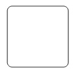
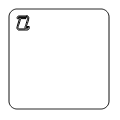
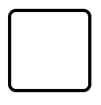
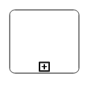
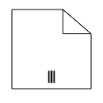
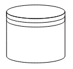

# Shapes

Diagram provides support to add different kind of nodes. They are as follows.

* Text Node
* Image Node
* HTML Node
* Native Node
* Basic Shapes
* Flow Shapes
* BPMN Shapes

## Text

Texts can be added to the Diagram as text nodes. For text nodes, the text node can be created with TextNode class . In addition, you need to define the `TextBlock` object that is used to define the `Text` to be added and to customize the appearance of that text. The following code illustrates how to create a text node.



    <ej-diagram id="diagram" width="900px" height="600px">
        <e-nodes>
            <e-text-node name="Text" width="100" height="100" offset-X="100" offset-Y="100" fill-color="transparent" border-color="transparent">
                <e-diagram-text-block text="Text Node" font-color="black" text-align="Center"></e-diagram-text-block>
            </e-text-node>          
        </e-nodes>
    </ej-diagram>


 

## Image
Diagram allows to add images as image nodes. For image nodes,the **image** node can be created with ImageNode class. In addition, the `Source` property of node enables you to set the image source. The following code illustrates how an **Image** node is created.



    <ej-diagram id="diagram" width="900px" height="600px">
        <e-nodes>
          <e-image-node name="Image" width="100" height="100" offset-X="100" offset-Y="100" border-color="black" source="sample/syncfusion.png"></e-image-node>        
        </e-nodes>
    </ej-diagram>
    


Deploy your HTML file in the web Application and export the diagram (image node) or else the image node will not be exported in the chrome and Firefox due to security issues. Please refer to the link below.

Link: http://asked.online/draw-images-on-canvas-locally-using-chrome/2546077/

Link1: http://stackoverflow.com/questions/4761711/local-image-in-canvas-in-chrome

## HTML

**HTML** elements can be embedded in the Diagram through **HTML** type node. To create a HTML node, node can be created with HtmlNode class. In addition, you need to set the id of HTML template to the `TemplateId` property of node. The following code illustrates how an **HTML** node is created.



    <!--dependency scripts-->
    
    <!—define html element-->
    





    <ej-diagram id="diagram" width="900px" height="600px">
        <e-nodes>
          <e-html-node name="Html" width="120" height="60" offset-X="100" offset-Y="100" template-id="htmlTemplate" fill-color="darkCyan"></e-html-node>        
        </e-nodes>
    </ej-diagram>



N> HTML node cannot be exported to image format, like JPEG, PNG, and BMP. It is by design that while exporting, Diagram is drawn in a canvas. Further, this canvas is exported into image formats. Currently, drawing in a canvas equivalent from all possible HTML is not feasible. Hence, this limitation. 

## Native

**Diagram** provides support to embed **SVG** element into a node. To create a native node, the node can be created with NativeNode class. Also, you need to define the id of the SVG template by using the `TemplateId` property of node. The following code illustrates how a **Native node** is created.



    <!--dependency scripts-->
    
    <!--define html element-->
    





    <ej-diagram id="diagram" width="900px" height="600px">
        <e-nodes>
            <e-native-node name="Native" width="100" height="100" offset-X="100" offset-Y="100" template-id="svgTemplate">
                <e-labels>
                    <e-diagram-label text="Mail">
                        <e-offset x="0.5f" y="1.1f"></e-offset>
                    </e-diagram-label>
                </e-labels>
            </e-native-node>    
        </e-nodes>
    </ej-diagram>
     


N> Like HTML node, Native node also cannot be exported to image format. Fill color of native node can be overridden by the inline style or fill of the SVG element specified in the template. 

## Basic Shapes

The Basic shapes are common shapes that are used to represent the geometrical information visually. Its `Shape` property can be set with any one of the built-in shape. [Basic Shapes](https://help.syncfusion.com/cr/aspnetmvc/Syncfusion.JavaScript.DataVisualization.Models.Diagram.BasicShape.html#Syncfusion_JavaScript_DataVisualization_Models_Diagram_BasicShape_Shape "Basic Shapes"). 
The following code example illustrates how to create a basic shape. 



    <ej-diagram id="diagram" width="900px" height="600px">
        <e-nodes>
          <e-basic-shape name="basic" width="100" height="70" offset-X="100" offset-Y="100" border-width="2" border-color="black" corner-radius="10" shape="Rectangle"></e-basic-shape>    
        </e-nodes>
    </ej-diagram>



N> When the `Shape` is not set for a basic shape, it is considered a "rectangle".

## Path

Path node is a commonly used basic shape that allows visually to represent the geometrical information. To create a path node, node can be created with PathNode class and PathData property. The `PathData` property of node allows you to define the path to be drawn. The following code illustrates how a Path node is created.



    <ej-diagram id="diagram" width="900px" height="600px">
       <e-nodes>
          <e-basic-shape name="Path" width="100" height="70" offset-X="100" offset-Y="100" shape="Path" fill-color="darkCyan"  border-color="black" border-width="2" path-data="M35.2441,25 L22.7161,49.9937 L22.7161,0.006575 L35.2441,25 z M22.7167,25 L-0.00131226,25 M35.2441,49.6337 L35.2441,0.368951 M35.2441,25 L49.9981,25">
          </e-basic-shape>
       </e-nodes>
    </ej-diagram>



The list of basic shapes are as follows.

## Flow Shapes

The flow shapes are used to represent the process flow. It is used for analyzing, designing, and managing for documentation process. To create a flow shape, node can be created with FlowShape class. Its `Shape` property can be set with any one of the built-in shape. [Flow Shapes](https://help.syncfusion.com/cr/aspnetmvc/Syncfusion.JavaScript.DataVisualization.Models.Diagram.FlowShape.html#Syncfusion_JavaScript_DataVisualization_Models_Diagram_FlowShape_Shape "Flow Shapes") and by default, it is considered as "Process". The following code example illustrates how to create a flow shape. 



    <ej-diagram id="diagram" width="900px" height="600px">
       <e-nodes>
          <e-flow-shape name="Flow" width="100" height="100" offset-X="100" offset-Y="100"  border-color="black" border-width="2" shape="@FlowShapes.Document"></e-flow-shape>
       </e-nodes>
    </ej-diagram>



The list of flow shapes are as follows.

## BPMN Shapes

BPMN shapes are used to represent the internal business procedure in a graphical notation and enables you to communicate the procedures in a standard manner. To create a BPMN shape, node can be created with BPMNNode class and its `Shape` should be set as any one of the built-in shape. [BPMN Shapes](https://help.syncfusion.com/cr/aspnetmvc/Syncfusion.JavaScript.DataVisualization.Models.Diagram.BPMNNode.html#Syncfusion_JavaScript_DataVisualization_Models_Diagram_BPMNNode_Shape "BPMN Shapes"). The following code example illustrates how to create a simple business process. 



    <ej-diagram id="diagram" width="900px" height="600px">
       <e-nodes>
         <e-bpmn-node name="Bpmn" width="100" height="100" offset-X="100" offset-Y="100"  border-color="black" border-width="2" shape="@BPMNShapes.Event" event="@BPMNEvents.End"></e-bpmn-node>
       </e-nodes>
    </ej-diagram>



N> The default value for the property `Shape` is "Event".

The list of BPMN shapes are as follows.

| Shape | Image |
|---|---|
| Event |  |
| Gateway |  |
| Task |  |
| Message |  |
| DataSource |  |
| DataObject |  |

The BPMN shapes and its types are explained as follows.

### Event 

An event is notated with a circle and it represents an event in a business process. The type of events are as follows.

* Start
* End
* Intermediate

The `Event` property of the node allows you to define the type of the event. The default value of the `Event` is "Start". The following code example illustrates how to create a BPMN Event.



    <ej-diagram id="diagram" width="900px" height="600px">
       <e-nodes>
         <e-bpmn-node name="Bpmn" width="100" height="70" offset-X="100" offset-Y="100"  border-color="black" border-width="2" shape="@BPMNShapes.Event" event="@BPMNEvents.End" trigger="@BPMNTriggers.None"></e-bpmn-node>
       </e-nodes>
    </ej-diagram>



| Event | Image |
|---|---|
| Start |  |
| NonInterruptingStart |  |
| Intermediate |  |
| NonInterruptingIntermediate |  |
| End |  |

Event triggers are notated as icons inside the circle and they represent the specific details of the process. The `Triggers` property of node allows you to set the type of trigger and by default, it is set as "None". The following table illustrates the type of event triggers.

| Triggers | Image |
|---|---|
| Message |  |
| Compensation |  |
| Error |  |
| Escalation |  |
| Link |  |
| Multiple |  |
| Parallel |  |
| Signal |  |
| Timer |  |

### Gateway

Gateway is used to control the flow of a process. It is represented as a diamond shape. To create a gateway, the `Shape` property of node should be set as "Gateway" and the `Gateway` property can be set with any of the appropriate [Gateways](https://help.syncfusion.com/cr/aspnetmvc/Syncfusion.JavaScript.DataVisualization.Models.Diagram.BPMNNode.html#Syncfusion_JavaScript_DataVisualization_Models_Diagram_BPMNNode_Gateway "Gateways"). The following code example illustrates how to create a BPMN Gateway.



    <ej-diagram id="diagram" width="900px" height="600px">
       <e-nodes>
         <e-bpmn-node name="Bpmn" width="100" height="70" offset-X="100" offset-Y="100"  border-color="black" border-width="2" shape="@BPMNShapes.Gateway" event="@BPMNEvents.End" gateway="@BPMNGateways.None"></e-bpmn-node>
       </e-nodes>
    </ej-diagram>



N> By default, the `Gateway` will be set as "None".

There are several types of gateways as tabulated

| Gateways | Image |
|---|---|
| Complex |  |
| EventBased |  |
| Exclusive |  |
| Inclusive |  |
| Parallel |  |

### Activity

The activity is the task that is performed in a business process. It is represented by a rounded rectangle.

There are two types of activities .They are listed as follows.

* Task – Occurs within a process and it is not broken down to finer level of detail.
* Subprocess – Occurs within a process and it is broken down to finer level of detail.

To create a BPMN activity, you need to set the `Shape` as "Activity". You also need to set the type of the [BPMN Activity](https://help.syncfusion.com/cr/aspnetmvc/Syncfusion.JavaScript.DataVisualization.Models.Diagram.BPMNNode.html#Syncfusion_JavaScript_DataVisualization_Models_Diagram_BPMNNode_Activity "BPMN Activity") by using the `Activity` property of node. By default, the type of the `Activity` is set as "Task". The following code example illustrates how to create an activity.



    <ej-diagram id="diagram" width="900px" height="600px">
      <e-nodes>
        <e-bpmn-node name="Bpmn" width="100" height="100" offset-X="100" offset-Y="100"  border-color="black" border-width="2" shape="@BPMNShapes.Activity" event="@BPMNEvents.End" activity="@BPMNActivity.Task"></e-bpmn-node>
      </e-nodes>
    </ej-diagram>



The different activities of BPMN process are listed as follows.

#### Tasks

The `Task` property of node allows you to define the `Type` of task such as sending, receiving, user based task etc… By default, the `Type` property of task is set as "None". The following code illustrates how to create different types of BPMN tasks. 



    <ej-diagram id="diagram" width="900px" height="600px">
      <e-nodes>
        <e-bpmn-node name="Bpmn" width="100" height="100" offset-X="100" offset-Y="100"  border-color="black" border-width="2" shape="@BPMNShapes.Activity" event="@BPMNEvents.End" activity="@BPMNActivity.Task">
           <e-task type="Send"></e-task>
        </e-bpmn-node>
      </e-nodes>
    </ej-diagram>



The various types of BPMN tasks are tabulated as follows.

| Task Type | Image |
|---|---|
| Service |  |
| Send |  |
| Receive |  |
| Instantiating Receive |  |
| Manual |  |
| Business Rule |  |
| User |  |
| Script |  |

#### Loop

Loop is a task that is internally being looped. The `Loop` property of task allows you to define the type of loop. The default value for `Loop` is "None". 



    <ej-diagram id="diagram" width="900px" height="600px">
      <e-nodes>
        <e-bpmn-node name="Bpmn" width="100" height="100" offset-X="100" offset-Y="100"  border-color="black"  shape="@BPMNShapes.Activity" event="@BPMNEvents.End" activity="@BPMNActivity.Task">
            <e-task loop="@BPMNLoops.Standard"></e-task>
        </e-bpmn-node>
        <e-bpmn-node name="Bpmnloop" width="100" height="100" offset-X="300" offset-Y="100" border-color="black"  shape="@BPMNShapes.Activity" event="@BPMNEvents.End" activity="@BPMNActivity.SubProcess">
            <e-subProcess loop="@BPMNLoops.Standard"></e-subProcess>
        </e-bpmn-node>
      </e-nodes>
    </ej-diagram>
    


The following table contains various types of BPMN loops.

| Loops | Task | SubProcess |
|---|---|---|
| Standard |  |  |
| SequenceMultiInstance |  |  |
| ParallelMultiInstance |  |  |

#### Compensation

Compensation is triggered when operation is partially failed and you can enable it with the `Compensation` property of task.



    <ej-diagram id="diagram" width="900px" height="600px">
      <e-nodes>
        <e-bpmn-node name="Bpmn" width="100" height="100" offset-X="100" offset-Y="100"  border-color="black"  shape="@BPMNShapes.Activity" event="@BPMNEvents.End" activity="@BPMNActivity.Task">
           <e-task compensation="true"></e-task>
        </e-bpmn-node>
        <e-bpmn-node name="Bpmnloop" width="100" height="100" offset-X="300" offset-Y="100" border-color="black"  shape="@BPMNShapes.Activity" event="@BPMNEvents.End" activity="@BPMNActivity.SubProcess">
           <e-subProcess compensation="true"></e-subProcess>
        </e-bpmn-node>
      </e-nodes>
    </ej-diagram>
     


#### Call

A call activity is a global sub-process that is reused at various points of the business flow and you can set it with the `Call` property of task.



    <ej-diagram id="diagram" width="900px" height="600px">
      <e-nodes>
         <e-bpmn-node name="Bpmn" width="100" height="100" offset-X="100" offset-Y="100"  border-color="black"  shape="@BPMNShapes.Activity" event="@BPMNEvents.End" activity="@BPMNActivity.Task">
           <e-task call="true"></e-task>
         </e-bpmn-node>
      </e-nodes>
    </ej-diagram>



#### Ad-Hoc

An ad hoc subprocess is a group of tasks that are executed in any order or skipped in order to fulfill the end condition and you can set it with the `Adhoc` property of subprocess. 



    <ej-diagram id="diagram" width="900px" height="600px">
       <e-nodes>
          <e-bpmn-node name="Bpmn" width="100" height="100" offset-X="100" offset-Y="100"  border-color="black"  shape="@BPMNShapes.Activity"  activity="@BPMNActivity.SubProcess">
            <e-subProcess adhoc="true"></e-subProcess>
          </e-bpmn-node>
       </e-nodes>
    </ej-diagram>



#### Boundary

Boundary represents the type of task that is being processed. The `Boundary` property of sub process allows you to define the type of boundary. By default, it is set as "Default".



    <ej-diagram id="diagram" width="900px" height="600px">
      <e-nodes>
        <e-bpmn-node name="Bpmn" width="100" height="100" offset-X="100" offset-Y="100"  border-color="black"  shape="@BPMNShapes.Activity"  activity="@BPMNActivity.SubProcess">
          <e-subProcess boundary="Call"></e-subProcess>
        </e-bpmn-node>
      </e-nodes>
    </ej-diagram>



The following table contains various types of BPMN boundaries.

| Boundary | Image |
|---|---|
| Call |  |
| Event |  |
| Default |  |

### Data

A data object represents information flowing through the process, such as data placed into the process, data resulting from the process, data that needs to be collected, or data that must be stored. To define a data object, set the `Shape` as "Dataobject". You can create multiple instances of data object with the `Collection` property of node.



    <ej-diagram id="diagram" width="900px" height="600px">
       <e-nodes>
         <e-bpmn-node name="Bpmn" width="100" height="100" offset-X="100" offset-Y="100"  border-color="black"  shape="@BPMNShapes.DataObject">
           <e-data collection="true"></e-data>
         </e-bpmn-node>
       </e-nodes>
    </ej-diagram>



### Datasource

DataSource is used to store or access data associated with a business process. To create a data source, set the `Shape` as "Datasource". The following code example illustrate how to create data source.



    <ej-diagram id="diagram" width="900px" height="600px">
       <e-nodes>
         <e-bpmn-node name="Bpmn" width="100" height="100" offset-X="100" offset-Y="100"  border-color="black"  shape="@BPMNShapes.DataSource"></e-bpmn-node>
       </e-nodes>
    </ej-diagram>



