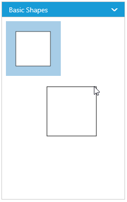

# Symbol Palette

The **SymbolPalette** displays a collection of palettes. The Palette shows a set of nodes and connectors. It allows you to drag and drop the nodes and connectors into the Diagram. 

## Palettes
 
A palette allows to display a group of related symbols and it textually annotates the group with its header.
To initialize a palette, define a palette object with the property `Name` that is displayed as the header text of palette. The `Expanded` property of palette allows to expand/collapse its palette items.
The following code example illustrates how to define a palette and how its added to symbol palette.



    //initialize a palette with its name.
    <e-palette name="Flow Shapes">
    //Sets whether the palette expands/collapse its children
    <e-palette name="Flow Shapes" expanded="true">



You can add any number of palettes to the `Palettes` collection of the symbol palette. The following example illustrates how to define symbol palette with a palette object that is defined in the previous step.



    //Initializes overview
    
        <ej-symbol-palette id="symbolpalette" width="300px" height="500px">
    <e-palette name="Flow Shapes" >
                    <e-items>
                        <e-flow-shape name="Process" height="40" width="44" fill-color="white" border-width="1" offset-x="20" offset-y="20" shape="Process"></e-flow-shape>
                        <e-flow-shape name="Decision" height="40" width="44" fill-color="white" border-width="1" offset-x="20" offset-y="20" shape="Decision"></e-flow-shape>
                        <e-flow-shape name="Sort" height="40" width="44" fill-color="white" border-width="1" offset-x="20" offset-y="20" shape="Sort"></e-flow-shape>
                        <e-flow-shape name="Document" height="40" width="44" fill-color="white" border-width="1" offset-x="20" offset-y="15" shape="Document"></e-flow-shape>
                        <e-flow-shape name="MultiDocument" height="40" width="43" fill-color="white" border-width="1" offset-x="20" offset-y="15" shape="MultiDocument"></e-flow-shape>
                    </e-items>
                </e-palette>
    


The following image shows the symbol palette with multiple palette Items.

### Palette Items

The palette items need to be defined and added to the `Items` collection of the palette. You can create a palette item as a node, group, connector, lane, or phase except swimlane. To create a palette item, you first need to define that element as JSON. The following code example illustrates how to define a palette item.



    </e-basic-shape>
                    
                    <e-basic-shape name="Ellipse" height="70" width="70" fill-color="white" border-width="1.5" shape="Ellipse"></e-basic-shape>
                    </e-basic-shape>

 

#### Customize the size of palette items

You can customize the size of the individual palette items. The `PaletteItem` property of node enables you to define the size of the symbol items. The following code example illustrates how to change the size of a palette item.



    <ej-symbol-palette id="symbolpalette" width="300px" height="500px">
    <e-palette name="Flow Shapes" >
                    <e-items>
                        <e-flow-shape name="Process" height="40" width="44" fill-color="white" border-width="1" offset-x="20" offset-y="20" shape="Process"></e-flow-shape>
                        <e-flow-shape name="Decision" height="40" width="44" fill-color="white" border-width="1" offset-x="20" offset-y="20" shape="Decision"></e-flow-shape>
                        <e-flow-shape name="Sort" height="40" width="44" fill-color="white" border-width="1" offset-x="20" offset-y="20" shape="Sort"></e-flow-shape>
                        <e-flow-shape name="Document" height="40" width="44" fill-color="white" border-width="1" offset-x="20" offset-y="15" shape="Document"></e-flow-shape>
                        <e-flow-shape name="MultiDocument" height="40" width="43" fill-color="white" border-width="1" offset-x="20" offset-y="15" shape="MultiDocument"></e-flow-shape>
                    </e-items>
                </e-palette>

        
        //Specifies the default size to render palette items

        symbolpalette.setPaletteItemHeight(20);
        symbolpalette.setPaletteItemWidth(20);



Palette item size is set based on the precedence flow given in the following table.

| Palette Item | Rendering Size |  
|---|---|---|
| Precedence - Width | paletteItem.width > model.paletteItemWidth > node.width |  
| Precedence - Height | paletteItem.height > model.paletteItem.Height > node.height |  

Palette item size can be based on the actual size of the node, regardless of the precedence. 

#### Stretch the shape in to the Palette Item

The `enableScale` property of the palette item enables you to customize the size of the item regardless of the precedence. The following code example illustrates how to customize the palette item size.



    <e-basic-shape name="Rectangle" height="160" width="80" fill-color="white" border-width="1" shape="Rectangle">
                        <e-palette-item enable-scale="true">
                            <e-margin left="4" right="4" top="12" bottom="10"></e-margin>
                        </e-palette-item>
                    </e-basic-shape>



### Palette header 

Palette headers are often used to display unit of information that proceeds the information about the palette. By default, the header content is the name of the palette by default, so when you customize the header of the palette, it will update on all the palette as well.

Following code example illustrates how to define default palette header.



    <e-palette name="Basic Shapes">



#### Customize the Palette Header

Palettes can be annotated with its header texts. Following code example illustrates how to define palette header.

Also, you can embed any HTML element into a palette header by defining the ScriptTemplate id to palette's `TemplateId` property. Following code example illustrates how to customize palette headers.



    &lt;!--dependency scripts--&gt;
        &lt;script id="svgTemplate" type="text/x-jsrender"&gt;
        &lt;!--  define HTML element --&gt;
            &lt;svg version="1.0" xmlns="http://www.w3.org/2000/svg" width="225px" height="28px"&gt;
                &lt;g visibility="visible"&gt;
                    &lt;image width="26px" height="26px" opacity="1" xmlns:xlink="http://www.w3.org/1999/xlink" xlink:href="image.png"&gt;&lt;/image&gt;
                    &lt;text x="40" y="18" font-size="14"&gt;
                        <tspan>Basic Shapes</tspan>
                    &lt;/text&gt;
                &lt;/g&gt;
            &lt;/svg&gt;
        &lt;/script&gt;												





    <e-palette name="Basic Shapes" template-id ="svgTemplate" expanded="true">



The following image shows the customized palette header

## Symbol Previews

Image, simple snippet to customize the preview size

You can customize the preview size of the individual palette items. The `PaletteItem` property of node enables you to define the preview size of the symbol items. The following code example illustrates how to change the preview size of a palette item.



        <e-palette name="Basic Shapes" template-id ="svgTemplate" expanded="true">
                <e-items>
                    <e-basic-shape name="Rectangle" height="160" width="80" fill-color="white" border-width="1" shape="Rectangle">
                        <e-palette-item preview-height ="100" enable-scale="true" >
                            <e-margin left="4" right="4" top="12" bottom="10"></e-margin>
                        </e-palette-item>
                    </e-basic-shape>
</e-items>
            </e-palette>



You can also customize the preview size of the all palette items. The `PreviewWidth` and `PreviewHeight` property of SymbolPalette enables you to define the preview size to all the symbol palette items. The following code example illustrates how to change the preview size of a symbol palette items.



            <ej-symbol-palette preview-height="100" preview-width="100" id="symbolpalette" width="300px" height="500px" show-palette-item-text="true" selected-palette-name="Flow Shapes">



Symbol palette allows to sets the offset of the dragging helper relative to the mouse cursor.



            <ej-symbol-palette id="symbolpalette" width="300px"  height="500px" preview-offset="new Syncfusion.JavaScript.DataVisualization.Models.Diagram.DiagramPoint(50,50)" show-palette-item-text="true" selected-palette-name="Flow Shapes">



preview size is set based on the precedence flow given in the following table.

| Palette Item |   Preview Size |
|---|---|---|
| Precedence - Width |  paletteItem.previewWidth > model.previewWidth > node.width |
| Precedence - Height | paletteItem.previewHeight > model.previewHeight > node.height |

Preview item size can be based on the actual size of the node, regardless of the precedence.

## Appearance 

You can show/hide the palette item texts by using the `ShowPaletteItemText` property of symbol palette and you can change the height of palette header by using `HeaderHeight` property of symbol palette. The following code illustrates how to customize the appearance of the symbol Palette.



            var symbolpalette = $("#symbolpalette").ejSymbolPalette("instance");
                symbolpalette.setPaletteItemWidth(45);
                symbolpalette.setPaletteItemHeight(45);
                //Specifies whether palette item text should be visible or not
                symbolpalette.showPaletteItemText = false;


