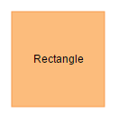
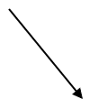

# Tools

## Drawing Tools

Drawing tool allows you to draw any kind of node/connector during runtime by clicking and dragging on the Diagram page. 

### Shapes

To draw a shape, you need to set the JSON of that shape to the `drawType` property of the Diagram model and you have to activate the drawing tool by using the `tool` property. The following code example illustrates how to draw a rectangle at run time. 



    <ej-diagram id="diagram" width="700px" height="700px" enable-context-menu="false">
<e-nodes>
<e-basic-shape name="Rectangle" width="100" height="100" offset-X="150" offset-Y="150" fill-color="#fcbc7c" border-color="#f89b4c" shape="Rectangle">
                <e-labels>
                    <e-diagram-label text="Rectangle" font-color="white"></e-diagram-label>
                </e-labels>
            </e-basic-shape>
</e-nodes>
</ej-diagram>
    //To draw an object once, activate draw once
    diagram.update({
        tool: ej.datavisualization.Diagram.Tool.DrawOnce,
    });

    //To draw an object multiple times, activate continuous draw tool
    
        diagram.update({ tool: tool | ej.datavisualization.Diagram.Tool.DrawOnce })



The following code example illustrates how to draw a path.



    <ej-diagram id="diagram" width="700px" height="700px" enable-context-menu="false">
    <e-nodes>
        <e-basic-shape name="Path" width="100" height="100" offset-X="350" offset-Y="350" shape="Path" fill-color="#fbe172" border-color="#f4cd2a" path-data="M13.560 67.524 L 21.941 41.731 L 0.000 25.790 L 27.120 25.790 L 35.501 0.000 L 43.882 25.790 L 71.000 25.790 L 49.061 41.731 L 57.441 67.524 L 35.501 51.583 z">
                    <e-labels>
                        <e-diagram-label text="Path" font-color="white"></e-diagram-label>
                    </e-labels>
                </e-basic-shape>
    </e-nodes>
    </ej-diagram>

//To draw an object multiple times, activate continuous draw tool
    
        diagram.update({ tool: tool | ej.datavisualization.Diagram.Tool.DrawOnce })



### Connectors

To draw connectors, you have to set the JSON of the connector to `drawType` property. The drawing tool can be activated by using the `tool` property as shown. The following code example illustrates how to draw a straight line connector. 



    <e-connector name="Connector1" source-node="NewIdea" target-node="Meeting" line-color="#606060" >                                                    
    </e-connector>
    //To draw an object once, activate draw once
    
        diagram.update({ tool: tool | ej.datavisualization.Diagram.Tool.DrawOnce })



### Text 

Diagram allows you to create a textNode as soon as you click on the Diagram page. The following code illustrates how to draw a text.



    <ej-diagram id="diagram" width="700px" height="700px" enable-context-menu="false">
    <e-nodes>
        <e-text-node name="Text" width="100" height="100" offset-X="550" offset-Y="550" fill-color="transparent" border-color="transparent">
                    <e-diagram-text-block text="Text Node" text-align="Center"></e-diagram-text-block>
        </e-text-node>
    </e-nodes>
    </ej-diagram>

    //To draw an object once, activate draw once
    
        diagram.update({ tool: tool | ej.datavisualization.Diagram.Tool.DrawOnce })



Once you activate the TextTool, you can also able to perform label editing of a node/connector.

### Polyline Tool

Diagram allows to create the polyline segments with straight lines and angled vertices at the control points by clicking and moving the mouse at run time on the diagram page.



    var diagram = $("#diagram").ejDiagram("instance");
    // set the default segment type as polyline
    diagram.model.drawType = {
        type: "connector",
        segments: [{ type: "polyline" }]
    };
    var tool = diagram.tool();
    //To draw an object once, activate draw once
    diagram.update({ tool: tool | ej.datavisualization.Diagram.Tool.DrawOnce })



Once you activate the polyline tool, you can also able to draw the polyline connector on diagram page.

## Tool Selection

There are some functionalities that can be achieved by clicking and dragging on the Diagram surface. They are as follows.

* Draw selection rectangle - MultipleSelect tool
* Pan the Diagram - Zoom pan
* Draw nodes/connectors - ContinuousDraw / DrawOnce

As all the three behaviors are completely different, You can achieve only one behavior at a time based on the tool that you choose.
When more than one of those tools are applied, a tool is activated based on the precedence given in the following table. 

| Precedence | Tools | Description |
|---|---|---|
| 1st | ContinuesDraw | Allows you to draw the nodes or connectors continuously. Once it is activated, you cannot perform any other interaction in the Diagram. |
| 2nd | DrawOnce | Allows you to draw single node or connector. Once you complete the drawOnce action, SingleSelect and MultipleSelect tools are automatically enabled. |
| 3rd | ZoomPan | Allows you to pan the Diagram. When you enable both the SingleSelect and ZoomPan tools, you can perform the basic interaction as the cursor hovers node/connector. Panning is enabled when cursor hovers the Diagram. |
| 4th | MultipleSelect | Allows you to select multiple nodes and connectors. When you enable both the MultipleSelect and ZoomPan tools, cursor hovers the Diagram. When panning is enabled, you cannot select multiple nodes. |
| 5th | SingleSelect | Allows you to select individual nodes or connectors. |
| 6th | None | Disables all tools |

You can set the desired tool to the `tool` property of the Diagram model. The following code illustrates how to enable single/multiple tools.



                // To Enable Single Tool 
                <ej-diagram id="diagram" width="100%" height="800px" enable-context-menu="false" tool="SingleSelect" node-template="nodeTemplate">

                model.Tool = Tool.SingleSelect;
                ViewData["Diagram"] = model;

                // Enables multiple tools
                <ej-diagram id="diagram" width="100%" height="800px" enable-context-menu="false" tool="SingleSelect | Tool.ZoomPan" node-template="nodeTemplate">

