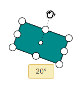
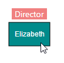

# Tooltip
In Graphical User Interface (GUI), tooltip is a message that is displayed when mouse hovers over an element. Diagram provides tooltip support while dragging, resizing, rotating a node, and when mouse hovers any Diagram element.

## Default tooltip

By default, Diagram displays a tooltip to provide the size, position, and angle related information while dragging, resizing, and rotation. The following images illustrate how the Diagram displays the node information during interaction.

| Drag | Resize | Rotate |
|---|---|---|
|  |  |  |

### Disable default tooltip

To disable the default tooltip, You need to set `SelectedItems.Tooltip` as `null`. The following code example illustrates how to disable default tooltip.



            diagram.model.selectedItems.tooltip = null;

 

## Common tooltip for all nodes and connectors

Diagram provides support to show tooltip when mouse hovers over any node/connector. 
To show tooltip on mouse over, the `Tooltip` property of Diagram model needs to be set with the tooltip `TemplateId` and `Alignment` as shown in the following example.



    





 

   <ej-diagram id="diagram" width="700px" height="560px" enable-context-menu="false">
<e-nodes>
<e-bpmn-node name="node1" width="60" add-info="ViewBag.tipone" height="60" offset-X="35" offset-Y="90" shape="Event" event="Start" trigger="Message">
                <e-labels>
                    <e-diagram-label text="elizabeth"></e-diagram-label>
                </e-labels>
            </e-bpmn-node>
</e-nodes>
</ej-diagram>
public partial class DiagramController : Controller
    {
 public ActionResult Tooltip()
        {
ViewBag.tipone = new Dictionary<string, object> { { "Description", "Managing Director" } };
return View();
        }
}

        
 

### Disable tooltip at runtime

Tooltips on mouse over can be disabled by assigning `tooltip` property as `null`. The following code example illustrates how to disable the mouse over tooltip at runtime.



    $("#diagram").ejDiagram({
        //Disables mouse over tooltip at runtime
        tooltip: null
    });

 

## Tooltip for a specific node/connector

Tooltips can be customized for every node. Tooltip can be defined for individual node/connector by using the `Tooltip` property of that node/connector. In addition to that, you have to remove the **InheritTooltip** option from the `Constraints` of that node/connector. The following code example illustrates how to customize tooltips for individual elements.



            <ej-diagram id="diagram" width="700px" height="560px" enable-context-menu="false">
<e-nodes>
<e-bpmn-node name="node1" width="60" add-info="ViewBag.tipone" height="60" offset-X="35" offset-Y="90" shape="Event" event="Start" trigger="Message"constraints="Default &~ NodeConstraints.InheritTooltip">
                <e-labels>
                    <e-diagram-label text="elizabeth"></e-diagram-label>
                </e-labels>
            </e-bpmn-node>
<e-bpmn-node name="node2" add-info="ViewBag.tiptwo" width="75" height="70" offset-X="140" offset-Y="90" shape="Gateway">
                <e-labels>
                    
                </e-labels>
            </e-bpmn-node>
</e-nodes>
</ej-diagram>

public ActionResult Tooltip()
        {
            ViewBag.tipone = new Dictionary<string, object> { { "Description", "Managing Director" } };
            ViewBag.tiptwo = new Dictionary<string, object> { { "Description", "ToolTip1}
return View();
        }

 

## Tooltip alignments

### Tooltip relative to object

Diagram provides support to show tooltip around the node/connector that is hovered by mouse. You can align the tooltip as you wish by using the `Alignment` and `Margin` properties of tooltip. The `RelativeMode` property of tooltip defines whether the tooltip has to be displayed around the object or at the mouse position. The following code example illustrates how to position the tooltip around object.



    

    





            <ej-diagram id="diagram" width="700px" height="560px" enable-context-menu="false">
<e-nodes>
<e-bpmn-node name="node1" width="60" add-info="ViewBag.tipone" height="60" offset-X="35" offset-Y="90" shape="Event" event="Start" trigger="Message">
                <e-labels>
                    <e-diagram-label text="elizabeth"></e-diagram-label>
                </e-labels>
            </e-bpmn-node>
</e-nodes>
<e-tooltip template-id="mouseovertoolTipId">
            <e-alignment horizontal="Center" vertical="Bottom"></e-alignment>
        </e-tooltip>
</ej-diagram>

$("#diagram").ejDiagram({ tooltip: { relativeMode: ej.datavisualization.Diagram.RelativeMode.Object } });

public partial class DiagramController : Controller
    {
 public ActionResult Tooltip()
        {
ViewBag.tipone = new Dictionary<string, object> { { "Description", " Director" } };
return View();
        }
}

            


### Tooltip relative to mouse position

To display the tooltip at mouse position, you need to set "Mouse" option to the `RelativeMode` property of tooltip. The following code example illustrates how to show tooltip at mouse position.



             
           <ej-diagram id="diagram" width="700px" height="560px" enable-context-menu="false">
<e-nodes>
<e-bpmn-node name="node1" width="60" add-info="ViewBag.tipone" height="60" offset-X="35" offset-Y="90" shape="Event" event="Start" trigger="Message">
                <e-labels>
                    <e-diagram-label text="elizabeth"></e-diagram-label>
                </e-labels>
            </e-bpmn-node>
</e-nodes>
<e-tooltip template-id="mouseovertoolTipId">
            <e-alignment horizontal="Center" vertical="Bottom"></e-alignment>
        </e-tooltip>
</ej-diagram>

$("#diagram").ejDiagram({ tooltip: { relativeMode: ej.datavisualization.Diagram.RelativeMode.Mouse } });

public partial class DiagramController : Controller
    {
 public ActionResult Tooltip()
        {
ViewBag.tipone = new Dictionary<string, object> { { "Description", " Director" } };
return View();
        }
}



