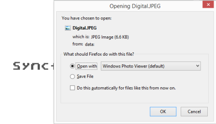

# Exporting the Digital Gauge

Digital Gauge has an exporting feature where Gauge control is converted into image format and then exported to client-side. The method API exportImage exports the Digital Gauge. It has two arguments such as filename and file format. For exporting, you can refer the following code example.



<ej-digital-gauge id="Digitalgauge"  value="syncfusion">
</ej-digital-gauge>

<input type="submit" value="Export Image" id="btnExportImage" />

FileName 

<input type="text" id="txtFileName">

FileFormat 

<select id="ddlFileType">
<option value="JPEG">JPEG</option>
<option value="PNG">PNG</option>
</select>



Execute the above code examples to render the DigitalGauge as follows.

Digital Gauge control with Export functionality
{:.caption}

