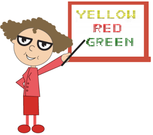

# Multiple Items 

The text in the Digital Gauge is positioned with position object. This object contains two attributes such as x and y. The x variable positions the text in the horizontal axis and y variable positions the text in the vertical axis.



<ej-digital-gauge id="Digitalgauge" height="300" width="1300" >
<e-frame background-image-url="../Content/images/gauge/board1.jpg" >
</e-frame>
<e-items>
<e-digital-gauge-items value="YELLOW">
<e-segment-settings color="Yellow"></e-segment-settings>
<e-digital-position x="80" y="0"></e-digital-position>
</e-digital-gauge-items>
<e-digital-gauge-items value="RED">
<e-segment-settings color="red"></e-segment-settings>
<e-digital-position x="80" y="20"></e-digital-position>
</e-digital-gauge-items>
<e-digital-gauge-items value="GREEN">
<e-segment-settings color="green"></e-segment-settings>
<e-digital-position x="80" y="40"></e-digital-position>
</e-digital-gauge-items>
</e-items>
</ej-digital-gauge>



Execute the above code example to render the DigitalGauge as follows.

Digital Gauge control with multiple items
{:.caption}