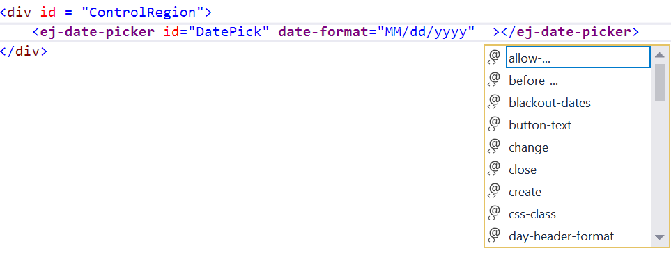

# TagHelpers

Tag Helpers are used to write server-side code in razor view page. It is a feature of Razor view engine which converts the server-side code into HTML and serves it to the web browser. The main advantage of using Tag Helpers over HTML Helpers is that the Razor markup using Tag Helpers looks like standard HTML and it also has rich **intelliSense** with the scope of existing elements. The most important feature of the Tag Helper is that they can be independent from the C# syntax. Tag helper provides more reliable and reusable code that can be created and used across different views, as and when it is needed.

## EJTagHelpers

We can easily configure Syncfusion UI Components in Razor view using EJ Tag helpers in ASP.NET Core application.

## Adding Tag Helpers

We can enable the EJ tag helper support by adding the namespaces for component references and **@addTagHelper** directive to the cshtml file.

   ~~~ cshtml

        @using Syncfusion.JavaScript

        @addTagHelper “*, Syncfusion.EJ

   ~~~

To add EJ tag helpers globally in your project, add the component references and **@addTagHelper** directive to **Views/_ViewImports.cshtml**.

## Configuring Syncfusion UI components with Tag Helpers

Open a view page to render Syncfusion UI components in Tag Helper Syntax. The following example demonstrates how to render the Essential DatePicker using EJ TagHelper.

   ~~~ cshtml

        <ej-date-picker id="datepicker" value="@DateTime.Now"></ej-date-picker>

   ~~~

## API Configuration with Tag Helpers

We can configure the EJ components with its properties by using tag attributes. It also has rich IntelliSense support which displays all the methods and properties of EJ controls on the page model.

   

## Wiring Client Side Events

Client side events can be wired in the same way as properties. But here all the client side events are grouped into **ClientSideEvents** Action method. The events can be set with tag-attributes as a string literal that points to a JavaScript function handler.

   ~~~ cshtml

        <ej-date-picker id="DatePick" date-format="MM/dd/yyyy"  change="ChangeValue" select="SelectOn"></ej-date-picker>

   ~~~

## Related Links

* [Getting Started with Syncfusion controls in ASP.NET Core](https://help.syncfusion.com/aspnet-core/gettingstarted/getting-started-2-0)   

* [Installation](https://help.syncfusion.com/aspnet-core/core-concepts) 

* [Core Concepts](https://help.syncfusion.com/aspnet-core/installation)

* [Demo Samples](http://aspnetcore.syncfusion.com/)