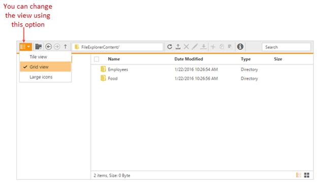

# Customization

## Dimension Customization

The dimension of the FileExplorer can be customized through “[Height](http://help.syncfusion.com/js/api/ejfileexplorer#members:height)” and “[Width](http://help.syncfusion.com/js/api/ejfileexplorer#members:width)” property. The dimension can be set in percentage (ex; width: “100 %”), so that the control inherits the width from the parent element.

In the view page, add FileExplorer with custom height and width
    


<ej-file-explorer id="custom" path="wwwroot/images/FileExplorer" ajax-action="@Url.Content("FileActionDefault")" height="300px" width="900px">
    <e-file-ajax-settings>
        <e-download url="/FileExplorer/Download{0}"></e-download>
        <e-get-image url="/FileExplorer/GetImage{0}"></e-get-image>
        <e-upload url="/FileExplorer/Upload{0}"></e-upload>
    </e-file-ajax-settings>
</ej-file-explorer>


    
## Customizing the Navigation pane

The navigation pane contains the tree view element which displays all the folders from the filesystem in a hierarchical manner. This is useful to a quick navigation of any folder in the filesystem.

The visibility of the navigation pane can be controlled by the “[ShowNavigationPane](http://help.syncfusion.com/js/api/ejfileexplorer#members:shownavigationpane)” property. By disabling this property, you can hide the navigation pane from FileExplorer.

In the view page, add FileExplorer and specify the navigation pane as false
    


<ej-file-explorer id="custom" path="wwwroot/images/FileExplorer" ajax-action="@Url.Content("FileActionDefault")"show-navigation-pane="false">
    <e-file-ajax-settings>
        <e-download url="/FileExplorer/Download{0}"></e-download>
        <e-get-image url="/FileExplorer/GetImage{0}"></e-get-image>
        <e-upload url="/FileExplorer/Upload{0}"></e-upload>
    </e-file-ajax-settings>
</ej-file-explorer>
    
        

    
## Customizing the Content pane

The content pane is the main part of the Fie explorer UI which displays all the files and folders from the filesystem. The content pane supports the following two types of layout views:

* Grid
* Tile
* Large Icons

The **grid view** displays the files and folders in a grid layout with the details in separate columns. By default the grid view having the four columns which displays the file name, type, date modified and size of the file. For more details about grid view customization, refer [here](#customizing-the-grid-view).

The **tile view** display the files and folders like a small size icons in left side and file details in right. It allows the thumbnails for the image files so that you can view the tiny preview of all image files.

The **large icons view** display the files and folders like a large size icons with name. It allows the thumbnails for the image files so that you can view the tiny preview of all image files.

**Changing the Layout views**
You can change the layout of current view by the switcher which displays at right-bottom of footer in the FileExplorer. By clicking the grid and large icons view buttons you can change the layout of current view.

You can change the layout using toolbar option. While clicking this tool, popup opens with different layout types. Here you can choose any options.

Also the layout views can be changed through the “[Layout](http://help.syncfusion.com/js/api/ejfileexplorer#members:layout)” property.

    
### Customizing the Grid view

By default sorting is enabled in grid view of FileExplorer, it helps you to sort each columns in ascending or descending order by pressing the corresponding column header. The sorting functionality can be disabled by setting “[AllowSorting](http://help.syncfusion.com/js/api/ejfileexplorer#members:gridsettings-allowsorting)” property to false.

The behavior of the columns can be customized through the “[Columns](http://help.syncfusion.com/js/api/ejfileexplorer#members:gridsettings-columns)” property.

In the view page, add FileExplorer with custom grid settings



<ej-file-explorer id="custom" path="wwwroot/images/FileExplorer" ajax-action="@Url.Content("FileActionDefault")">
    <e-file-grid-settings>
        <e-file-columns>
          <e-column-field header-text="Name" field="Name" width="150"></e-column-field>    
          <e-column-field header-text="DateModified" field="dateModified" width="150"></e-column-field>
          <e-column-field header-text="size" field="size" width="90" text-align="Right"></e-column-field>
        </e-file-columns>
    </e-file-grid-settings>
    <e-file-ajax-settings>
        <e-download url="/FileExplorer/Download{0}"></e-download>
        <e-get-image url="/FileExplorer/GetImage{0}"></e-get-image>
        <e-upload url="/FileExplorer/Upload{0}"></e-upload>
    </e-file-ajax-settings>
</ej-file-explorer>


    
## Footer Customization

The footer displays the details of the current selected files and folders, and the footer contains the switcher to change the layout view. The visibility of the footer can be customized by the “[ShowFooter](http://help.syncfusion.com/js/api/ejfileexplorer#members:showfooter)” property.

In the view page, add FileExplorer helper and hides the footer as shown below.


<ej-file-explorer id="custom" path="wwwroot/images/FileExplorer" ajax-action="@Url.Content("FileActionDefault")" show-footer="false">
    <e-file-ajax-settings>
        <e-download url="/FileExplorer/Download{0}"></e-download>
        <e-get-image url="/FileExplorer/GetImage{0}"></e-get-image>
        <e-upload url="/FileExplorer/Upload{0}"></e-upload>
    </e-file-ajax-settings>
</ej-file-explorer>

    
