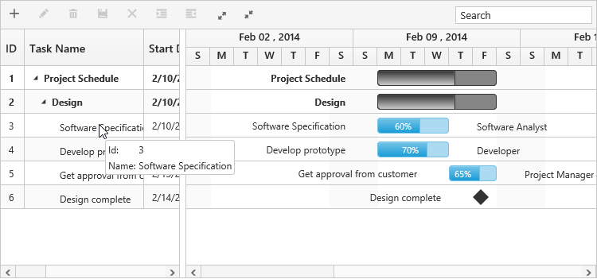

# Customizations 

Gantt provides support for the following UI customizations,

* Taskbar template
* Task label template
* Tooltip template

## Taskbar template

You can design your own taskbars to view the tasks in Gantt by using `taskbar-template` property. And it is possible to map the JsRender script or script element’s ID to this property. It is also possible to customize the parent taskbars and milestones with custom templates by using `parent-taskbar-template` and `milestone-template` properties. 

The following code example shows how to define template for taskbars in Gantt. 


<ej-gantt id="ganttSample3" datasource="ViewBag.datasource" 
        //...
        taskbar-template="#taskbarTemplate"
        parent-taskbar-template="#parentTaskbarTemplate"
        milestone-template="#milestoneTemplate">
  </ejGantt>






The DOM structure and class names mentioned in the above code snippet is mandatory for providing the editing support in custom templates.

The following screenshot shows the template for taskbars in Gantt.

## Task label template

By default, task name will be displayed to the left and resource names will be displayed to the right of the taskbars as task labels. But these task labels are customizable.

### Mapping datasource fields as task labels

It is also possible to set any datasource fields as task labels using `right-task-label-mapping` and `left-task-label-mapping` properties.

The following code example explains how to set task name field as right label and task ID field as left label,


<ej-gantt id="ganttSample3" datasource="ViewBag.datasource" 
        //...
        right-task-label-mapping="taskName"
        left-task-label-mapping="taskID">
  </ejGantt>



The following screenshot shows Gantt with task labels mapped with different datasource fields

### Task label templates

It is possible to customize the task labels with templates, by using `right-task-label-template` and `left-task-label-template` properties.

The following code example explains how to map custom templates to task labels.


<ej-gantt id="ganttSample3" datasource="ViewBag.datasource" 
        //...
        right-task-label-template="#rightlabelTemplate"
        left-task-label-template="#leftlabelTemplate">
  </ejGantt>






The following screenshot shows Gantt with task label templates.

## Tooltip template

The default tooltip in Gantt can be customized by using the `taskbar-tooltip-template-id` property. We need to map the JsRender script element’s ID value to this property.

The following code example shows how to customize the tooltip.


<ej-gantt id="ganttSample3" datasource="ViewBag.datasource" 
        //...
        taskbar-tooltip-template-id="tooltipTemplate">
  </ejGantt>






The following screenshot shows Gantt with task tooltip customization.

### Cell tooltip 

TreeGrid part tooltip can also be customized using `cell-tooltip-template` property. We need to map the script element or element id to this property. The following code explains how to customize the cell tooltip in Gantt.


<ej-gantt id="ganttSample3" datasource="ViewBag.datasource" 
        //...
        show-grid-cell-tooltip="true"
        cell-tooltip-template="#CustomToolTip">
  </ejGantt>





