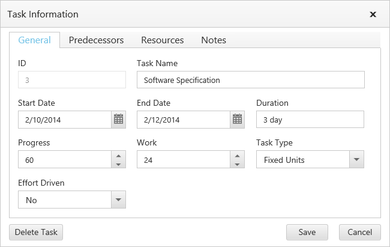

# Editing

The Gantt control provides built-in support to add, insert and update the tasks. The following are the types of editing available in Gantt,

* Cell Editing
* Normal Editing
* Taskbar Editing
* Predecessor Editing

## Cell Editing

Update the task details through grid cell editing by setting `edit-mode` as `cellEditing`.

The following code example shows you how to enable `cellEditing` in Gantt control.


<ej-gantt id="ganttSample" datasource="ViewBag.datasource"
    //...>
    <e-gantt-edit-settings allow-editing="true" edit-mode="cellEditing"></e-gantt-edit-settings>
</ejGantt> 


The output of Gantt with cellEditing is as follows.

## Normal Editing

Update the task details through edit dialog by setting `edit-mode` as `normal`.

The following code example shows you how to enable normal editing in Gantt control.


<ej-gantt id="ganttSample" datasource="ViewBag.datasource"
    //...>
    <e-gantt-edit-settings allow-editing="true" edit-mode="cellEditing"></e-gantt-edit-settings>
</ejGantt> 


The following screenshot shows the output of `normal` editing.

## Taskbar Editing

Update the task details by interactions such as resizing and dragging the taskbar. The following code example shows you how to enable taskbar resizing in Gantt control.


<ej-gantt id="ganttSample" datasource="ViewBag.datasource"
    //...
    allow-gantt-chart-editing="true">
</ejGantt> 


You can also enable or disable the progressbar resizing by setting `enable-progress-bar-resizing`. The following code example shows you to disable this property.


<ej-gantt id="ganttSample" datasource="ViewBag.datasource"
    //...
    enable-progress-bar-resizing="true">
</ejGantt> 


## Predecessor Editing

Update the predecessor details of a task using mouse interactions. The following code example shows how to enable predecessor editing.


<ej-gantt id="ganttSample" datasource="ViewBag.datasource"
    //...
    predecessor-mapping="Predecessor"
    allow-gantt-chart-editing="true">
</ejGantt> 


The following screen shot shows the predecessor editing in Gantt control.

[Click](http://aspnetcore.syncfusion.com/gantt/ganttediting) here to view the online demo sample for editing in Gantt.