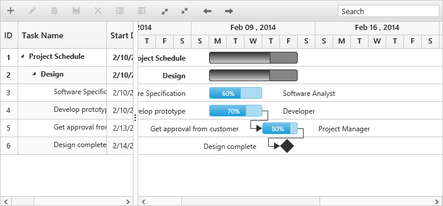
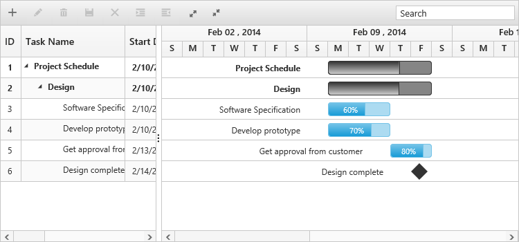
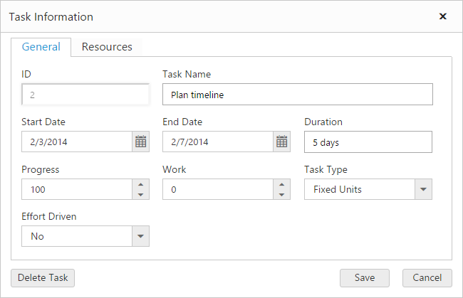
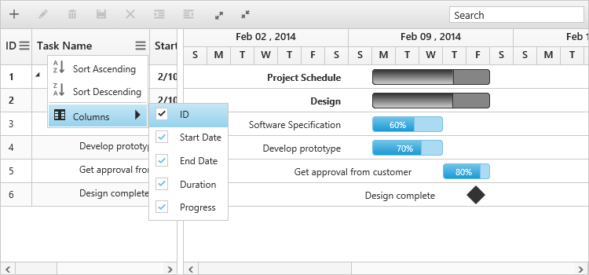
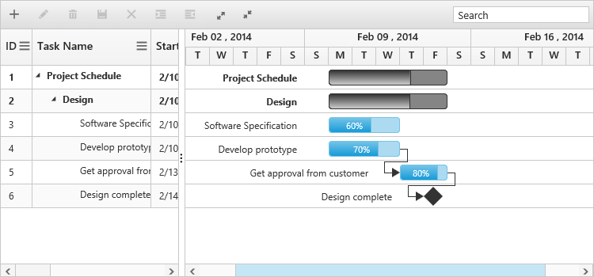

# Getting Started

This section explains briefly about how to create a Gantt chart in your application with ASP.NET Core 1.0.

## Create your first Gantt in Asp.Net core 1.0

This section explains briefly about the control structure and how to create a Gantt chart.

### Control Structure

Gantt chart is used to edit and visualize project schedule and also to track progress of a task. The following screen shot illustrates the elements of a Gantt chart.

Elements of a Gantt chart
{:.caption}

* Toolbar – It is a collection of toolbar buttons to add, edit, delete a task. You can outdent and indent a task using outdent and indent buttons. Following screen shot illustrates the function of each toolbar button,

Toolbar of Gantt chart
{:.caption}

* Search Textbox – It is used to search tasks, which contains the search string.
* Resource Names – It displays the names of the resources assigned to that task.
* Task bar – It is a graphical representation of the duration of task.
* Task Progress – It displays the percentage of the task completed.
* Header – It represents time scale based on which a task bar is drawn.
* Tree Grid – It displays the tasks and its sub tasks in hierarchical table.
* Task Relationship – It determines when to start or finish a task.
* Interactive Editing – You can edit the duration of a task by dragging or resizing the task bar. Following screen shot illustrates this.

Editing options Gantt chart
{:.caption}

## Create your Gantt chart

In this tutorial, you will learn how to create a simple Gantt chart, add tasks and subtasks, and set relationship between tasks for design phase of software project. The following screen shot displays the output after completing this tutorial.

Simple Gantt chart
{:.caption}

1. First, create a new ASP.Net core project; please refer [ASP.Net core 1.0-Getting Started](https://help.syncfusion.com/aspnet-core/gettingstarted/getting-started-1-0-1) documentation to create new project and add necessary DLL’s and script files.

2. Create a data source in Controllers/HomeController.cs file, data source can be added to Gantt using `datasource` property in Gantt.

~~~ csharp

public class Data {
 public string StartDate { get;  set; }
 public int Id {  get;  set; }
 public string Name {  get;  set; }
 public int Duration {  get;  set; }
 public int PercentDone {  get;  set; }
 public List < Data > Children {  get;  set; }
 public string Predescessor {  get;  set; }
}

public class GanttData {

 public static List <Data> GetData() {
  List <Data> list = new List <Data> ();
  list.Add(new Data() {
   Id = 1,
    Name = "Parent Task 1",
    StartDate = "02/23/2014",
    Duration = 5,
    PercentDone = 40,
    Children = (new List <Data> () {
     new Data() {
       Id = 2,
        Name = "Child Task 1",
        StartDate = "02/23/2014",
        Duration = 5,
        PercentDone = 40
      },
      new Data() {
       Id = 3,
        Name = "Child Task 2",
        StartDate = "02/23/2014",
        Duration = 5,
        PercentDone = 40,
      },
      new Data() {
       Id = 4,
        Name = "Child Task 3",
        StartDate = "02/23/2014",
        Duration = 5,
        PercentDone = 40,
      }
    })

  });

  list.Add(new Data() {
   Id = 5,
    Name = "Parent Task 2",
    StartDate = "03/14/2014",
    Duration = 5,
    PercentDone = 40,

    Children = (new List <Data> () {
     new Data() {
       Id = 6,
        Name = "Child Task 1",
        StartDate = "03/02/2014",
        Duration = 5,
        PercentDone = 40
      },
      new Data() {
       Id = 7,
        Name = "Child Task 2",
        StartDate = "03/02/2014",
        Duration = 5,
        PercentDone = 40,
      },
      new Data() {
       Id = 8,
        Name = "Child Task 3",
        StartDate = "03/02/2014",
        Duration = 5,
        PercentDone = 40,
      },
      new Data() {
       Id = 9,
        Name = "Child Task 4",
        StartDate = "03/02/2014",
        Duration = 5,
        PercentDone = 40,
      }
    })

  });
  list.Add(new Data() {
   Id = 10,
    Name = "Parent Task 3",
    StartDate = "03/09/2014",
    Duration = 5,
    PercentDone = 40,

    Children = (new List <Data> () {
     new Data() {

       Id = 11,
        Name = "Child Task 1",
        StartDate = "03/9/2014",
        Duration = 5,
        PercentDone = 40
      },
      new Data() {
       Id = 12,
        Name = "Child Task 2",
        StartDate = "03/9/2014",
        Duration = 5,
        PercentDone = 40,
      },
      new Data() {
       Id = 13,
        Name = "Child Task 3",
        StartDate = "03/9/2014",
        Duration = 5,
        PercentDone = 40,
      },
      new Data() {
       Id = 14,
        Name = "Child Task 4",
        StartDate = "03/9/2014",
        Duration = 5,
        PercentDone = 40,
      },
      new Data() {
       Id = 15,
        Name = "Child Task 5",
        StartDate = "03/9/2014",
        Duration = 5,
        PercentDone = 40,
      }
    })
  });
  return list;
 }
}

public ActionResult GanttEditing() {
 var DataSource = GanttData.GetData();
 ViewBag.datasource = DataSource;
 ViewBag.toolbarItems = new List <String> () {  "add",  "edit",  "delete",  "update",  "cancel",  "indent",  "outdent",  "expandAll",  "collapseAll" };
 return View();
}
    
~~~

3. Add the following code example in the Index.cshtml file to create a Gantt control in the View page.	

   ~~~ cshtml

   <ej-gantt id="ganttSample3" datasource="ViewBag.datasource"
          task-id-mapping="Id"
          task-name-mapping="Name"
          start-date-mapping="StartDate"
          duration-mapping="Duration"
          progress-mapping="PercentDone"
          schedule-start-date="02/23/2014"
          schedule-end-date="03/10/2014"         
          predecessor-mapping="Predecessor"
          tree-column-index=1
          child-mapping="Children"
          is-responsive="true">
          </ej-gantt> 
          
   ~~~
   
   
The following screen shot displays the Gantt.

Gantt chart
{:.caption}

## Enable Toolbar

Gantt control contains the toolbar options to edit, search, expand and collapse all records, indent, outdent, delete, and add a task. You can enable toolbar using Toolbar option.



<ej-gantt id="ganttSample3" datasource="ViewBag.datasource" 
          //...
          is-responsive="true">
          <e-gantt-toolbar-settings show-toolbar="true" toolbar-items="ViewBag.toolbarItems" />
</ej-gantt>   




 
  public ActionResult GanttEditing()
        {
            var DataSource = GanttData.GetData();
            ViewBag.datasource = DataSource;
            ViewBag.toolbarItems = new List<String>(){"add","edit","delete","update","cancel","indent","outdent","expandAll","collapseAll"};
            return View();
        }
        


The following screen shot displays a Tool bar in Gantt.

Toolbar in Gantt chart
{:.caption}

N> add, edit, delete, indent and outdent options are enabled when enabling the `allow-editing`, `allow-adding`, `allow-delete` and `allow-indent` in the edit Options.

## Enable sorting 

Gantt control has the sorting functionality for arranging the tasks in ascending or descending based on the particular column.

### Multicolumn sorting:

Enable the multicolumn sorting in Gantt by setting `allow-multi-sorting`to `True`. You can sort multiple columns in Gantt by selecting the desired column header while holding the CTRL key.



<ej-gantt id="ganttSample3" datasource="ViewBag.datasource"

    //...
    allow-sorting="true"
    allow-multi-sorting="true">

</ej-gantt> 



## Enable Editing

You can enable editing using `e-gantt-edit-settings` and `allow-gantt-chart-editing` options.

### Cell Editing:

Modify the task details through the grid cell editing by setting the edit-mode as cell-editing.

### Normal Editing:

Modify the task details through the edit dialog by setting the edit-mode as Normal.

### Taskbar Editing:

Modify the task details through user interaction like resizing and dragging the taskbar.

### Predecessor Editing:

Modify the predecessor details of a task by using mouse interactions by setting `allow-gantt-chart-editing` as `true` and setting the value for `predecessor-mapping` property.



<ej-gantt id="ganttSample3" datasource="ViewBag.datasource"
          allow-gantt-chart-editing="true"
          predecessor-mapping="Predecessor">
          <e-gantt-edit-settings allow-adding="true" allow-deleting="true" allow-editing="true" edit-mode="cellEditing" allow-indent="true"/>
</ej-gantt>   



The following screen shot displays the Gantt control with Enable Editing options.

Gantt control with Enable Editing options
{:.caption}

N> Both cellEditing and normal editing operations are performed through double click action.

## Enable Context Menu

You can enable the context menu in Gantt by setting the `enable-context-menu` to `True`.



<ej-gantt id="ganttSample3" datasource="ViewBag.datasource"          
          enable-context-menu="true">
</ej-gantt>



The following screen shot displays Gantt chart with Enable Context menu option.

Gantt chart with Enable Context menu option
{:.caption}

## Enable Column Menu

You can enable the column menu in Gantt, by setting the `show-column-chooser` as `true`.



<ej-gantt id="ganttSample3" datasource="ViewBag.datasource"          
          show-column-chooser="true">
</ej-gantt>



The following screen shot displays Gantt chart in which column chooser option is enabled:

## Provide tasks relationship

In Gantt control, you have the predecessor support to show the relationship between two different tasks.

### Types:

* Start to Start (SS)

You cannot start a task until the other task is also started.

* Start to Finish (SF)

You cannot finish a task until the other task is started.

* Finish to Start (FS)

You cannot start a task until the other task is completed.

* Finish to Finish (FF)

You cannot finish a task until the other task is completed.

You can show the relationship in tasks by using the PredecessorMapping as follows.



<ej-gantt id="ganttSample3" datasource="ViewBag.datasource"
    predecessor-mapping="Predecessor">
</ej-gantt>  



The following screen shot displays the relationship between tasks.

Gantt chart with relationships between tasks
{:.caption}

## Provide Resources

In ASP.NET core 1.0 Gantt, you can display and assign the resource for each task. Create a collection of list object, which contains id and name of the resource and assign it to ResourceCollection option. Then, specify the field name for id and name of the resource in the resource collection to `resource-id-mapping` and `resource-name-mapping` properties. The name of the field which contains the actual resources assigned for a particular task in the data-source is specified using `resource-info-mapping`.



public class ResourceListData

{

    public int ResourceID { get; set; }

    public string ResourceName { get; set; }

}

public class ResourceList

{

    public static List<ResourceListData> GetData()

    {

        List<Resources> resourceDetails = new List<Resources>();

           resourceDetails.Add(new Resources() { ResourceID = 1, ResourceName = "Project Manager" });

           resourceDetails.Add(new Resources() { ResourceID = 2, ResourceName = "Software Analyst" });

           resourceDetails.Add(new Resources() { ResourceID = 3, ResourceName = "Developer" });

           resourceDetails.Add(new Resources() { ResourceID = 4, ResourceName = "Testing Engineer" });

          return resourceDetails;   
     }

} 

 public ActionResult GanttEditing()
 {
            var DataSource = GanttData.GetData();
            ViewBag.datasource = DataSource;
            var Resources = ResourceList.GetData();
            ViewBag.resources = Resources;
            return View();
 }



Add the following code example in the index.cshtml file, to create the Gantt control with resource in the View page.



<ej-gantt id="ganttSample3" datasource="ViewBag.datasource"
       //...
       resource-info-mapping="ResourceID"
       resource-name-mapping="ResourceName"
       resource-id-mapping="ResourceID"
       resources="ViewBag.resources"
       is-responsive="true">
</ej-gantt>  



The following screen shot displays resource allocation for tasks in Gantt.

Resource allocation for tasks in Gantt
{:.caption}

## Highlight Weekend

In Gantt, you can on or off weekends high lighting by setting the `highlight-weekends` as `true` or `false`.


  <ej-gantt id="ganttSample3" datasource="ViewBag.datasource"
     highlight-weekends="true">
  </ej-gantt> 


The following screen shot displays Gantt chart in which highlight weekends is enabled:

This section explains briefly about the control structure and how to create a Gantt chart.

