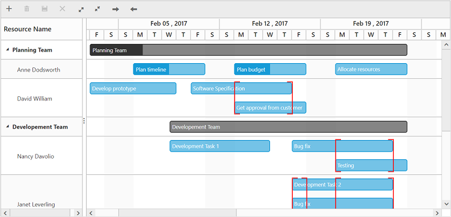
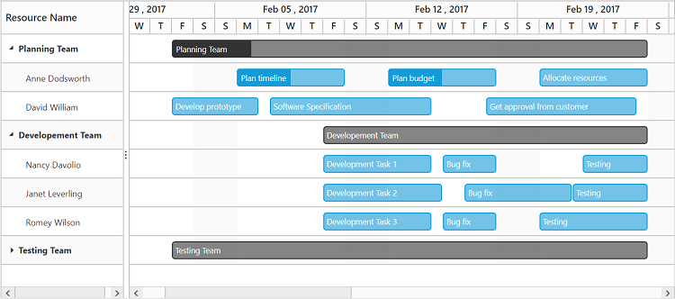
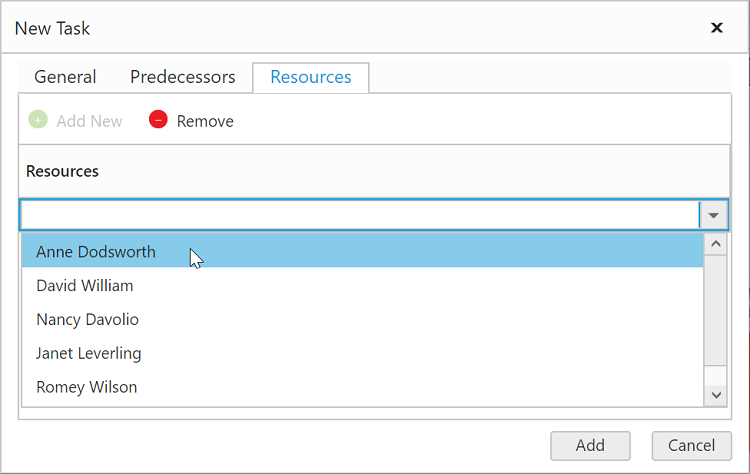
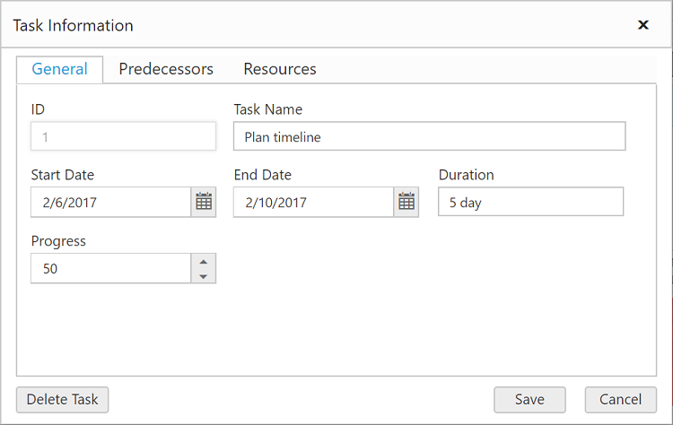
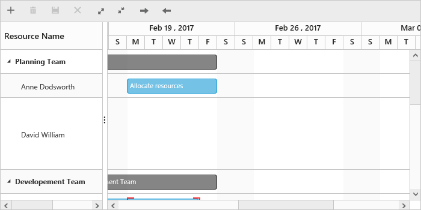
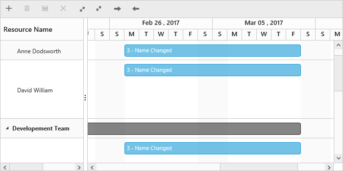
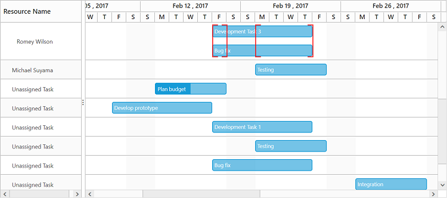
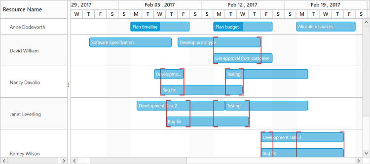

# Resource Allocation View
Resource allocation view is used to visualize the resource usage in a project. Resources are displayed in separate rows and all the tasks assigned to a specific resource will be displayed in the chart side. In this view, a user can able to easily identify the overallocation of resources in a project.

## Data Binding
User can bind two types of data structure to Gantt in resource allocation view,

* Hierarchical data source binding
* Flat data binding

### Hierarchical data source binding
The following code example explains how to bind the hierarchical data.



<ej-gantt id="resourceGantt" datasource="ViewBag.datasource"
    view-type="ResourceView"
    resource-name-mapping="ResourceName"
    task-collection-mapping="Tasks"
    task-id-mapping="TaskID"
    //...>
</ej-gantt>





public class TaskDetails
{
    public int TaskID { get; set; }
    public string TaskName { get; set; }
    public string StartDate { get; set; }
    public string EndDate { get; set; }
    public int Duration { get; set; }
    public string Progress { get; set; }
    public List<TaskDetails> SubTasks { get; set; }
    public List<object> ResourceID { get; set; }
    public string Predecessors { get; set; }
}

public class ResourceDetails
{
    public string ResourceName { get; set; }
    public List<TaskDetails> Tasks { get; set; }
}

public List<ResourceDetails> GetResourceData()
{
    List<ResourceDetails> data = new List<ResourceDetails>() {
    new ResourceDetails()
    {
        ResourceName = "Anne Dodsworth",
        Tasks = new List<TaskDetails>()
        {
            new TaskDetails() { TaskID = 1, TaskName= "Plan timeline", StartDate= "02/06/2017", EndDate = "02/10/2017", Duration= 5, Progress= "50"},
            new TaskDetails() { TaskID= 2, TaskName= "Plan budget", StartDate= "02/13/2017", EndDate= "02/17/2017", Duration= 5, Progress= "50"},
            new TaskDetails() { TaskID= 3, TaskName= "Allocate resources", StartDate= "02/20/2017", EndDate= "02/24/2017", Duration= 5, Progress= "0"}
        }
    }
    };
    //...
    return data;
}

public ActionResult ResourceView()
{
    ViewBag.datasource = GetResourceData();
    return View();
}



### Flat data binding
The following code example explains how to bind the flat data.



<ej-gantt id="resourceGanttSample" datasource="ViewBag.datasource"
    resources="ViewBag.resources"
    view-type="ResourceView"
    resource-id-mapping="ResourceId"
    resource-name-mapping="ResourceName"
    resource-info-mapping="ResourceID"
    task-id-mapping="TaskID"
    //...>
</ej-gantt>





    public class TaskDetails
    {
        public int TaskID { get; set; }
        public string TaskName { get; set; }
        public string StartDate { get; set; }
        public string EndDate { get; set; }
        public int Duration { get; set; }
        public string Progress { get; set; }
        public string Priority { get; set; }
        public bool Approved { get; set; }  
        public List<TaskDetails> SubTasks { get; set; }
        public List<Object> ResourceID{ get; set; }
        public bool IsManual { get; set; }
    }

    public class GanttResources
    {
        public string ResourceName { get; set; }
        public int ResourceId { get; set; }
        public int TeamId { get; set; }
    }

    public List<GanttResources> GetResources()
    {
        List<GanttResources> data = new List<GanttResources>(){
            new GanttResources(){ ResourceId = 1, ResourceName = "Anne Dodsworth" },
            new GanttResources(){ ResourceId = 2, ResourceName = "David William"},
            new GanttResources(){ ResourceId = 3, ResourceName = "Nancy Davolio"},
            //...
        };
        return data;
    }

     public List<TaskDetails> GetResourceFlatData()
        {
            List<TaskDetails> data = new List<TaskDetails>() {
             new TaskDetails() { TaskID = 1, TaskName= "Plan timeline", StartDate= "02/06/2017", EndDate = "02/10/2017", Duration= 5, Progress= "50", ResourceID= new List<object>(){1}},
             new TaskDetails() { TaskID= 2, TaskName= "Plan budget", StartDate= "02/13/2017", EndDate= "02/17/2017", Duration= 5, Progress= "50", ResourceID= new List<object>(){1}},
             new TaskDetails() { TaskID= 3, TaskName= "Allocate resources", StartDate= "02/20/2017", EndDate= "02/24/2017", Duration= 5, Progress= "0", ResourceID= new List<object>(){1}},
             //..
            }
         return data;
        }    

    public ActionResult ResourceView()
        {
            ViewBag.datasource = GetResourceFlatData();
            ViewBag.resources = GetResources();
            return View();
        }



## Grouping
The resources and the tasks assigned to those resources can be grouped into categories. The property `group-collection` is used to define the groups to be displayed in the project. The properties `group-id-mapping` and `group-name-mapping` are used to map the group details.

The below code snippet explains grouping of the resources in resource allocation view.


    <ej-gantt id="resourceGanttSample" datasource="ViewBag.datasource"
        resources="ViewBag.resources"
        group-collection="ViewBag.groups"
        view-type="ResourceView"
        resource-id-mapping="ResourceId"
        resource-name-mapping="ResourceName"
        resource-info-mapping="ResourceID"
        group-name-mapping="TeamName"
        group-id-mapping="TeamId"
        task-id-mapping="TaskID"
        //..>
    </ej-gantt>





 public class TaskDetails
    {
        public int TaskID { get; set; }
        public string TaskName { get; set; }
        public string StartDate { get; set; }
        public string EndDate { get; set; }
        public int Duration { get; set; }
        public string Progress { get; set; }
        public string Priority { get; set; }
        public bool Approved { get; set; }  
        public List<TaskDetails> SubTasks { get; set; }
        public List<Object> ResourceID{ get; set; }
        public bool IsManual { get; set; }
    }

    public class GanttResources
    {
        public string ResourceName { get; set; }
        public int ResourceId { get; set; }
        public int TeamId { get; set; }
    }

    public List<GanttResources> GetResources()
    {
        List<GanttResources> data = new List<GanttResources>(){
            new GanttResources(){ ResourceId = 1, ResourceName = "Anne Dodsworth",TeamId=1 },
            new GanttResources(){ ResourceId = 2, ResourceName = "David William", TeamId=1},
            new GanttResources(){ ResourceId = 3, ResourceName = "Nancy Davolio", TeamId=2},
            //...
        };
        return data;
    }

    public class ResourceGroupDetails
    {
        public string TeamName { get; set; }
        public int TeamId { get; set; }
    }

    public List<ResourceGroupDetails> GetResourceGroups()
    {
        List<ResourceGroupDetails> data = new List<ResourceGroupDetails>(){
            new ResourceGroupDetails(){ TeamName="Planning Team", TeamId=1},
            new ResourceGroupDetails(){ TeamName="Development Team", TeamId=2},
            new ResourceGroupDetails(){ TeamName="Testing Team", TeamId=3}
        };
        return data;
    }

     public List<TaskDetails> GetResourceFlatData()
        {
            List<TaskDetails> data = new List<TaskDetails>() {
             new TaskDetails() { TaskID = 1, TaskName= "Plan timeline", StartDate= "02/06/2017", EndDate = "02/10/2017", Duration= 5, Progress= "50", ResourceID= new List<object>(){1}},
             new TaskDetails() { TaskID= 2, TaskName= "Plan budget", StartDate= "02/13/2017", EndDate= "02/17/2017", Duration= 5, Progress= "50", ResourceID= new List<object>(){1}},
             new TaskDetails() { TaskID= 3, TaskName= "Allocate resources", StartDate= "02/20/2017", EndDate= "02/24/2017", Duration= 5, Progress= "0", ResourceID= new List<object>(){1}},
             //..
            }
         return data;
        }    

    public ActionResult ResourceView()
        {
            ViewBag.datasource = GetResourceFlatData();
            ViewBag.resources = GetResources();
            ViewBag.groups = GetResourceGroups();
            return View();
        }


The below screen shot depicts a resource view in a project with 3 groups.

## CRUD data operations

### Adding a task
It is possible to add a task dynamically either by using toolbar insert icon or by context menu add option. The below screen shot shows the toolbar add and context menu add options.

When the insert option is clicked, the add dialog will be displayed prompting the user to provide the task details. After providing the task details, when user click the save button without providing the resource information or without assigning any resource to the task, the task will be added at the top by default.

If the newly added task should be assigned to a specific resource, user can able to select the resource information in the resource tab of add dialog.

The below screen shot depicts a new task being assigned to a resource `Anne Dodsworth`.

N> It is not possible to add a resource to the project dynamically.
N> A task can be assigned to one or more resource while adding.

### Editing

#### Editing a Task
A task can be edited either by using edit dialog or by mouse interactions. A user can edit a task using edit dialog by performing double click action on the taskbar, user can then edit the task information in the edit dialog.

A task’s schedule can be changed by left resizing, right resizing or dragging the task across the dates.

#### Update task values dynamically
In resource allocation view also, we can update the task details dynamically on any action like external button click by using [`updateRecordByTaskId`](/api/js/ejgantt#methods:updaterecordbytaskid "updateRecordByTaskId(data)") method. The below code example explains how to use this method in resource allocation view.



<ej-gantt id="resourceGanttSample" datasource="ViewBag.datasource"
    resources="ViewBag.resources"
    group-collection="ViewBag.groups"
    view-type="ResourceView"
    //..>
</ej-gantt>

<button id="update">Update Tasks</button>



The below screenshot shows the result of above code example.

Before update
{:.caption}

After update
{:.caption}

### Deleting

#### Deleting Task
User should select a task to be removed from the project, and then the task can be deleted using context menu delete button.

#### Deleting Resource
User can able to delete a resource and the tasks assigned to it using toolbar and context menu delete options. After selecting the resource row, when clicking the delete toolbar icon, the resource will be removed from the project and the tasks assigned to that resource will be listed in unassigned tasks’ list. The same will happen for context menu delete option.

The below screen shot depicts the tasks of the removed resource added as unassigned tasks to the project.

## Unassigned Tasks and Resources
There may be some instances, where one or more resources are not yet included in the project plan. Therefore, those resources are left with no tasks assigned to them. Those resources are termed as `unassigned resource`. The right side of the resource row will be left blank with no tasks.
The below code snippet shows a resource with no tasks assigned to it.



public List<ResourceDetails> GetResourceData()
{
    List<ResourceDetails> data = new List<ResourceDetails>() {
    new ResourceDetails()
    {
        ResourceName = "Anne Dodsworth",
        Tasks = new List<TaskDetails>()
        {
            new TaskDetails() { TaskID = 1, TaskName= "Plan timeline", StartDate= "02/06/2017", EndDate = "02/10/2017", Duration= 5, Progress= "50"},
            new TaskDetails() { TaskID= 2, TaskName= "Plan budget", StartDate= "02/13/2017", EndDate= "02/17/2017", Duration= 5, Progress= "50"},
            new TaskDetails() { TaskID= 3, TaskName= "Allocate resources", StartDate= "02/20/2017", EndDate= "02/24/2017", Duration= 5, Progress= "0"}
        }
    },
    new ResourceDetails()
    {
        ResourceName = "Nancy Davolio",
        Tasks = new List<TaskDetails>() {}
    }
    //...
    };
    return data;
}


In the below screen shot, the resource `Nancy Davolio` is the unassigned resource.

There may be instances where some tasks are not yet assigned with resources. Those tasks that are not assigned to any resources are termed as unassigned tasks. Unassigned tasks are displayed at bottom, with resource name as `Unassigned Task`. Unassigned tasks can be assigned to any resources in the project.
The below code snippet shows a task with no resource assigned to it.



    public class GanttResources
    {
        public string ResourceName { get; set; }
        public int ResourceId { get; set; }
        public int TeamId { get; set; }
    }

    public List<GanttResources> GetResources()
    {
        List<GanttResources> data = new List<GanttResources>(){
            new GanttResources(){ ResourceId = 1, ResourceName = "Anne Dodsworth",TeamId=1 },
            new GanttResources(){ ResourceId = 2, ResourceName = "David William", TeamId=1},
            new GanttResources(){ ResourceId = 3, ResourceName = "Nancy Davolio", TeamId=2},
            //...
        };
        return data;
    }

    public List<TaskDetails> GetResourceFlatData()
    {
        List<TaskDetails> data = new List<TaskDetails>() {
            //...
            new TaskDetails() { TaskID= 2, TaskName= "Plan budget", StartDate= "02/13/2017", EndDate= "02/17/2017", Duration= 5, Progress= "50"},
            //..
        }
        return data;
    }  


In the below screen shot, there more instances of unassigned tasks.

## Resource Overallocation
By default, a resource can work 8 hours a work day, but when a resource is forced to work more than 8 hours it is termed as overallocation. Or when a resource is assigned with two or more tasks which is occurring in a same date range, this state is termed as over allocation for a resource. The overlapped tasks are highlighted like in the below screen shot. The overlapped tasks will be displayed one below the other with an overlapped highlighted region.

