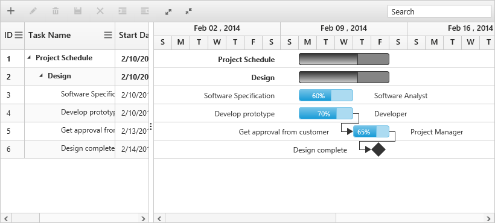

# Resources

Resources are represented by staff, equipment and materials etc. In Gantt control you can show /allocate the resources (human resources) for each task. The following steps explain how to configure Gantt with Resources

**Step 1**: Create a collection object, that contains id and name of the resource and assign it to `resources` property.

**Step 2**:  Then specify the field name for id and name of the resource in the resource collection to `resource-id-mapping` and `resource-name-mapping` properties. 

**Step 3**: The name of the field, which contains the actual resources assigned for a particular task in the dataSource is specified using `resource-info-mapping`.



 public ActionResult Resource()
        {
            //...
            var Resources = ResourceList.GetData();
            ViewBag.resources = Resources;
            return View();
        }

        public class ResourceList
        {
            public static List<ResourceListData> GetData()
            {
                List<ResourceListData> list=new List<ResourceListData>();
                list.Add(new ResourceListData() { Id = 1, Name = "Project Manager" });
                list.Add(new ResourceListData() { Id = 2, Name = "Software Analyst" });
                list.Add(new ResourceListData() { Id = 3, Name = "Developer" });
                list.Add(new ResourceListData() { Id = 4, Name = "Testing Engineer" });
                return list;
            }
        }

        public class ResourceListData
        {
            public int Id { get; set; }
            public string Name { get; set; }
        }

        public class ResourceDataSource
        {
            //...
                List<ResourceData> list = new List<ResourceData>();
                list.Add(new ResourceData()
                {
                    Id = 1,
                    Name = "Software Specification",
                    Resources =new List<int>(){2},
                    //...
                }
        }





<ej-gantt id="ganttSample" datasource="ViewBag.datasource"
    //...
    resource-id-mapping="Id"
    resource-name-mapping="Name"
    resource-info-mapping="Resources"
    resources="ViewBag.resources"
    show-resource-names="true">
</ejGantt>



The following screenshot shows Gantt control with Resources.

