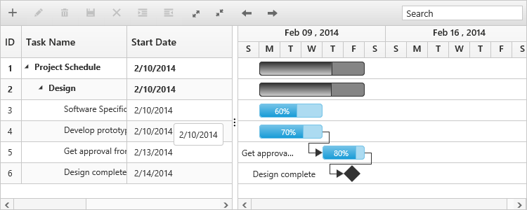
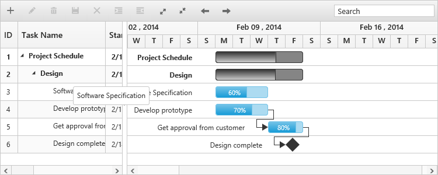

# Tooltip

Gantt has support to display tooltip for both taskbars and for column cells.

## Taskbar Tooltip

In Gantt, you can enable or disable taskbar mouse hover tooltip by using the `enable-taskbar-tooltip` property. By default, this property is set to `true`. The following code example shows, how to enable the taskbar tooltip in Gantt.


    <ej-gantt id="ganttSample" datasource="ViewBag.datasource"
        //...
        enable-taskbar-tooltip="true">
    </ejGantt>


This tooltip can be customized further by using `taskbar-tooltip-template` property, which is described briefly in the [customization](/aspnet-core/gantt/customizations) section.

## Taskbar drag tooltip

It is possible to enable or disable the tooltip while performing editing actions on taskbar (left resizing, right resizing, dragging and progress resizing) by using the `enable-taskbar-drag-tooltip` property. By default, this property is set to `true`. The following code example explains this behavior.


    <ej-gantt id="ganttSample" datasource="ViewBag.datasource"
        //...
        enable-taskbar-drag-tooltip="true">
    </ejGantt>


## Cell tooltip

It is possible to enable or disable the TreeGrid cell tooltip in mouse hover by using `show-grid-cell-tooltip` property. By default, this property is set to `true`. The following code example explains, how to enable disable this property,


    <ej-gantt id="ganttSample" datasource="ViewBag.datasource"
        //...
        show-grid-cell-tooltip="true">
    </ejGantt>


This tooltip can be customizable using the `cell-tooltip-template` property, which is described briefly in the [customization](/aspnet-core/gantt/customizations) section.

## Tree column (Expander column) tooltip 

It is also possible to display tooltip only for expander column by setting `show-grid-expand-cell-tooltip` property. The following code example shows you to enable expander column tooltip in Gantt.


    <ej-gantt id="ganttSample" datasource="ViewBag.datasource"
        //...
        show-grid-expand-cell-tooltip="true">
    </ejGantt>


