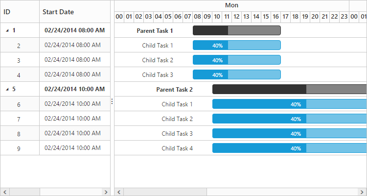

# Working Time Range

In Gantt control, working hours in a day for a project can be defined by using `e-gantt-day-working-time` property. Based on the working hours, automatic date scheduling and duration validations for a task are performed.

The below code snippet explains on how to define the working time range for the project in Gantt,


    <ej-gantt id="ganttSample" datasource="ViewBag.datasource"
        //...
        task-type="FixedWork">
        <e-gantt-day-working-time-collection>
            <e-gantt-day-working-time from="08:00 AM" to="12:00 PM"></e-gantt-day-working-time>
            <e-gantt-day-working-time from="01:00 PM" to="05:00 PM"></e-gantt-day-working-time>
        </e-gantt-day-working-time-collection>
    </ejGantt>


N> 1. Individual tasks can lie between any time within the defined working time range of the project.

N> 1. `e-gantt-day-working-time` property is used to define the working time for the whole project.

The following screen shot shows working time range in Gantt control. 

