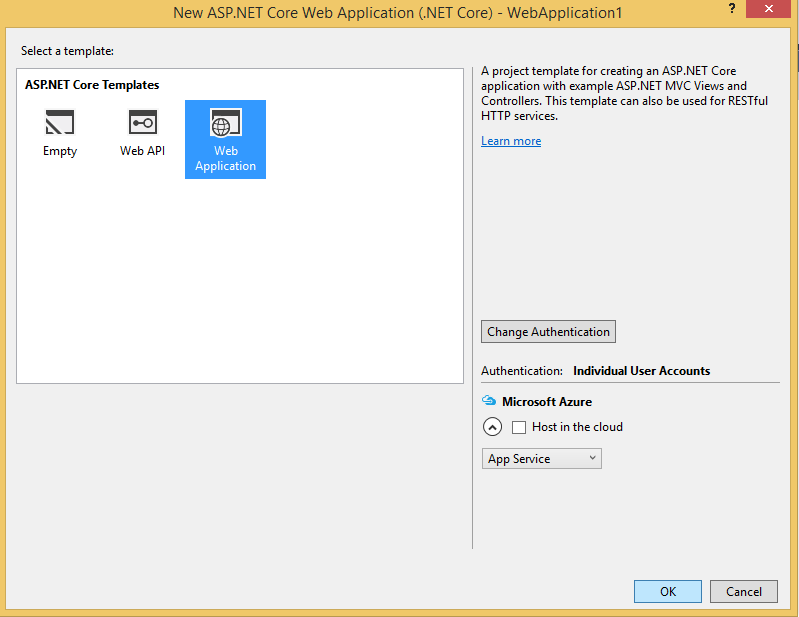
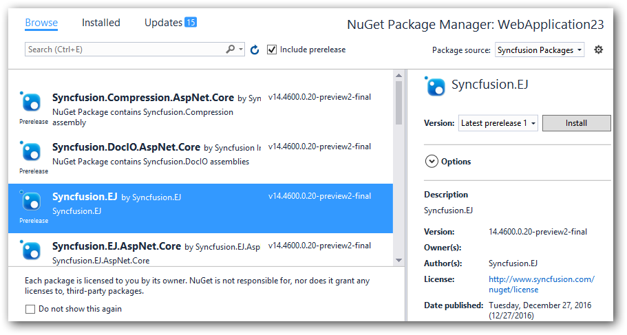
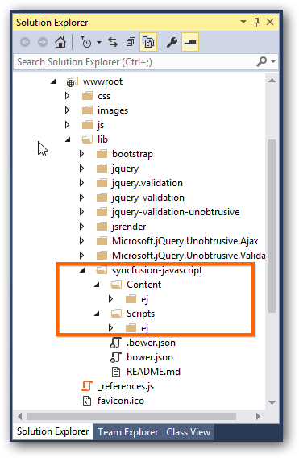

# Getting Started

## ASP.NET Core 1.1 Application 

### Using Visual Studio 2017

#### System Requirements

To work with ASP.NET Core 1.1 you need to make sure, whether you have installed the following software on your machine

* Visual Studio 2017.
* DotNetCore [1.1 SDK](https://go.microsoft.com/fwlink/?LinkID=835014)

#### Configure Syncfusion UI Components in ASP.NET Core Application

The following steps helps to create a ASP.NET Core web application to utilize Syncfusion components.

* Open Visual Studio 2017 to create ASP.NET Core web application.

* After project creation, install the Syncfusion Packages in your created application.

* Select the **Tools-> NuGet Package Manager-> Package Manager Settings** the dialog window will open.

* Navigate to the **NuGet Package Manager->Package Sources** from the Options dialog.

* Click the Add button to create the new Package Source.

* Select the newly created Package Source and rename the source name using the Name input box.

  **Name**: Name of the package that listed in Available package sources  
  **Source**: Syncfusion ASP.NET Core NuGet Package feed URL
  [http://nuget.syncfusion.com/nuget_aspnetcore/nuget/getsyncfusionpackages/aspnetcore](http://nuget.syncfusion.com/nuget_aspnetcore/nuget/getsyncfusionpackages/aspnetcore)

* Select the Update and then click the OK button. The package’s source get added to the list of available package sources.

* Right click your project references and then select “**Manage NuGet Package**” option. In this window choose the “**Syncfusion Packages registered name**” from the package source dropdown. And check the “**include prerelease**” option.

* Now, our Syncfusion Packages will list in this window. Select and install the “**Syncfusion.EJ.AspNet.Core**” package from this list.

> The package **"Syncfusion.EJ.MVC"** renamed into **"Syncfusion.EJ.AspNet.Core"** from Volume 3, 2016 (14.3.0.49) release. The "**preview2-final**" keyword removed our Syncfusion packages naming from Volume 1, 2017 (15.1.0.33) release.

* Then the packages will get installed and it will be automatically referred to your application. Open your **bower.json** file and specify our bower name “**syncfusion-javascript**” and the value with *. The * specifies the latest version of our scripts and themes files. After, the bower installation has completed, the project folder structure look like a below structure.

*  Now open **_viewImports.cshtml** file from the views folder and add the following namespace for components references and Tag Helper support.



@using Syncfusion.JavaScript

@addTagHelper "*, Syncfusion.EJ"



*  Refer the necessary scripts and CSS files in your **layout.cshtml** page from **lib -> syncfusion-javascript** folder.

N> Kindly include the below mentioned scripts and CSS references under the appropriate environment. (For eg: If your environment is "Development", then refer the scripts and CSS files under *<environment names="Development">*)

   
   
<html>

<head>

<link rel="stylesheet" href="~/lib/bootstrap/dist/css/bootstrap.css" />

<link href="~/lib/syncfusion-javascript/Content/ej/web/bootstrap-theme/ej.web.all.min.css" rel="stylesheet" />

<link href="~/lib/syncfusion-javascript/Content/ej/web/responsive-css/ej.responsive.css" rel="stylesheet" />

</head>

<body>

</body>

</html>

   

N> jQuery.easing external dependency has been removed from version 14.3.0.49 onwards. Kindly include this jQuery.easing dependency for versions lesser than 14.3.0.49 in order to support animation effects.

*  Add **ScriptManager** to the bottom of the **layout.cshtml** page. The **ScriptManager** used to place our control initialization script in the page.

   
   
    <ej-script-manager></ej-script-manager>
	
   

*  Now open your view page to render our Syncfusion components in Tag Helper syntax.   
   
   
   
	<ej-date-picker id="datepicker" value="@DateTime.Now"></ej-date-picker>
	
   

*  Finally compile your project, after successful compilation then press F5 key to deploy your project.   

   