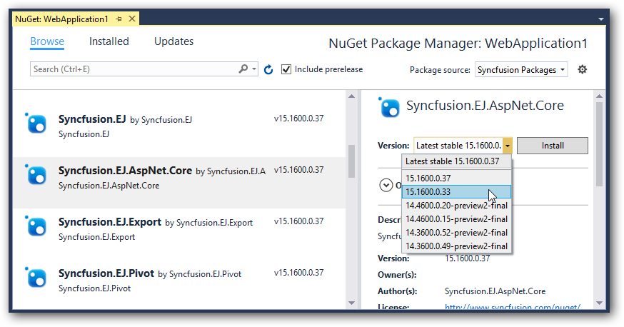
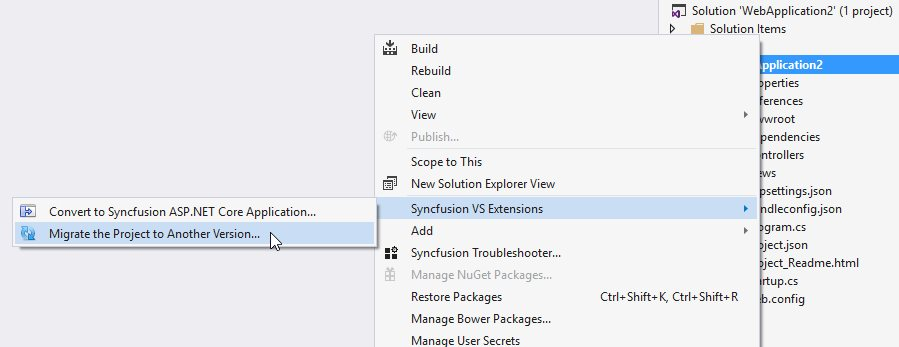

# Getting Started

## ASP.NET Core 1.1 Application 

### Using Visual Studio 2017

#### System Requirements

To work with ASP.NET Core 1.1 you need to make sure, whether you have installed the following software on your machine

* Visual Studio 2017.
* DotNetCore [1.1 SDK](https://go.microsoft.com/fwlink/?LinkID=835014)

#### Configure Syncfusion UI Components in ASP.NET Core Application

You can configure Syncfusion components into an ASP.NET Core Application in following ways.

* Using Syncfusion Project Templates
* Using Syncfusion Project Conversion utility
* Configure the project manually

##### Using Syncfusion Project Templates

Syncfusion provides the **Visual** **Studio** **Project** **Templates** for the Syncfusion ASP.NET Core platform to create Syncfusion ASP.NET Core Web Application.

I> The Syncfusion ASP.NET Core project templates are available from v15.2.0.40.

The following steps direct you to create the **Syncfusion** **ASP****.****NET** **Core** **Application** through the **Visual** **Studio** **Project** **Template**.

1. To create a Syncfusion ASP.NET Core project, choose **New** **Project****->** **Syncfusion****->****.NET** **Core****->****Syncfusion** **ASP****.****NET** **Core** **Application** from **Visual** **Studio**.

   

2. Name the **Project**, choose the destination location when required and set the Framework of the project, then click **OK**. The Project Configuration Wizard appears.

   N> Minimum target Framework version is 4.5.2 for Syncfusion ASP.NET Core Project Templates.
   
3. Choose the options to configure the Syncfusion ASP.NET Core Application by using the following Project Configuration dialog.

   ### Project configurations:

   **Project Type:** Select the type of ASP.NET Core Project, either .NET Core or .NET Framework.

   **.NET Core Version:** Select the version of ASP.NET Core Project, either ASP.NET Core 1.0 or ASP.NET Core 1.1.

   **Assets From:** Load the Syncfusion assets to ASP.NET Core Project, either Bower, CDN or Installed Location.

   **Theme Selection:** Choose the required Theme.

   **Components:** Choose the Required Syncfusion components to configure.

   
   
4. Once you click Create button, the Syncfusion ASP.NET Core Application is created.

5. Required Syncfusion NuGet/Bower packages, Scripts and CSS are added to the Project.

   

   

##### Using Syncfusion Project Conversion utility

Syncfusion Project Conversion is a Visual Studio add-in that converts an existing ASP.NET Core application into a Syncfusion ASP.NET Core Web application by adding the required assemblies and resource files.

I> The Syncfusion ASP.NET Core Web Application Project Conversion utility is available from v15.2.0.40.

The following steps direct you to use the Syncfusion Project Conversion in the existing ASP.NET Core Web Application.

1. Open an existing Microsoft ASP.NET Core Web Application or create a new Microsoft ASP.NET Core Web Application. 

2. Right-click on **Project** from Solution Explorer and select **Syncfusion VS Extensions** and choose the **Convert to Syncfusion ASP.NET Core Application**. Refer to the following screenshot for more information.

   

3. Project Conversion Wizard opens to configure the project.

   

   **Choose the assets from:**

   * Bower - Refer to the assets from Bower package manager. 

   * CDN - Refer to the assets from Syncfusion CDN links.

   * Installed Location - Refer to the assets from Syncfusion installed locations.     
   
   
   
   **Choose the Theme:**
   
   The master page of project will be updated based on selected theme. The Theme Preview section shows the controls preview before convert into a Syncfusion project
   
   

   **Choose Copy Global Resources:** 
    
   The localization culture files will be shipped into Scripts\ej\i18n directory of the project.

      

4. Choose the required controls from Components section and Click the **Convert** button to convert it into a Syncfusion Project.

   
   
   The **Project Backup** dialog will be opened. If click Yes it will backup the current project before converting it to Syncfusion project. If click No it will convert the project to Syncfusion project without backup. 
   
   

5. The required Syncfusion NuGet/Bower packages, Scripts and CSS are included in the ASP.NET Core Web Application. Refer to the following screenshots for more information.

   

   
   
Once you converted your ASP.NET Core Web Application to Syncfusion ASP.NET Core Web Application using Syncfusion Visual Studio Extension, Perform the following steps to render the Syncfusion controls to your project.

1. Include the Syncfusion control snippets to any of the view page of your project. Refer the following screenshot for more information.

   

2. Then run the project and the following output will be displayed.

   
   
   
   I> Refer all the required external and internal scripts only once in the page with proper order. Refer this [link](https://help.syncfusion.com/js/control-initialization#adding-the-required-javascript-files) to know about order of script reference.
   
##### Configure the project manually

The following steps helps to create an ASP.NET Core web application to utilize Syncfusion components.

* Open Visual Studio 2017 to create ASP.NET Core web application.

* After project creation, install the Syncfusion Packages in your created application.

* Select the **Tools-> NuGet Package Manager-> Package Manager Settings** the dialog window will open.

* Navigate to the **NuGet Package Manager->Package Sources** from the Options dialog.

* Click the Add button to create the new Package Source.

* Select the newly created Package Source and rename the source name using the Name input box.

  **Name**: Name of the package that listed in Available package sources  
  **Source**: Syncfusion ASP.NET Core NuGet Package feed URL
  [http://nuget.syncfusion.com/nuget_aspnetcore/nuget/getsyncfusionpackages/aspnetcore](http://nuget.syncfusion.com/nuget_aspnetcore/nuget/getsyncfusionpackages/aspnetcore)

* Select the Update and then click the OK button. The package’s source get added to the list of available package sources.

* Right click your project references and then select “**Manage NuGet Package**” option. In this window choose the “**Syncfusion Packages registered name**” from the package source dropdown. And check the “**include prerelease**” option.

* Now, our Syncfusion Packages will list in this window. Select and install the “**Syncfusion.EJ.AspNet.Core**” package from this list.

> The package **"Syncfusion.EJ.MVC"** renamed into **"Syncfusion.EJ.AspNet.Core"** from Volume 3, 2016 (14.3.0.49) release. The "**preview2-final**" keyword removed our Syncfusion packages naming from Volume 1, 2017 (15.1.0.33) release.

* Then the packages will get installed and it will be automatically referred to your application. Open your **bower.json** file and specify our bower name “**syncfusion-javascript**” and the value with *. The * specifies the latest version of our scripts and themes files. After, the bower installation has completed, the project folder structure look like a below structure.

*  Now open **_viewImports.cshtml** file from the views folder and add the following namespace for components references and Tag Helper support.



@using Syncfusion.JavaScript

@addTagHelper "*, Syncfusion.EJ"



*  Refer the necessary scripts and CSS files in your **layout.cshtml** page from **lib -> syncfusion-javascript** folder.

N> Include the below mentioned scripts and CSS references under the appropriate environment. (For eg: If your environment is "Development", then refer the scripts and CSS files under the tag *environment names="Development"*). Refer all the required external and internal scripts only once in the page with proper order. Refer this [link](https://help.syncfusion.com/js/control-initialization#adding-the-required-javascript-files) to know about order of script reference.

   
   
<html>

<head>

<link rel="stylesheet" href="~/lib/bootstrap/dist/css/bootstrap.css" />

<link href="~/lib/syncfusion-javascript/Content/ej/web/bootstrap-theme/ej.web.all.min.css" rel="stylesheet" />

<link href="~/lib/syncfusion-javascript/Content/ej/web/responsive-css/ej.responsive.css" rel="stylesheet" />

</head>

<body>

</body>

</html>

   

N> jQuery.easing external dependency has been removed from version 14.3.0.49 onwards. Kindly include this jQuery.easing dependency for versions lesser than 14.3.0.49 in order to support animation effects.

*  Add **ScriptManager** to the bottom of the **layout.cshtml** page. The **ScriptManager** used to place our control initialization script in the page.

   
   
    <ej-script-manager></ej-script-manager>
	
   

*  Now open your view page to render our Syncfusion components in Tag Helper syntax.   
   
   
   
	<ej-date-picker id="datepicker" value="@DateTime.Now"></ej-date-picker>
	
   

*  Finally compile your project, after successful compilation then press F5 key to deploy your project.   

   
   
#### Syncfusion Project Migration

Syncfusion Project Migration is a Visual Studio add-in that allows you to migrate the existing Syncfusion ASP.NET Core Web Application from one Essential Studio version to another version.

I> The Syncfusion ASP.NET Core Web Application Project Migration utility is available from v15.2.0.40.

The following steps direct you to migrate your existing Syncfusion ASP.NET Core Web Application. 

1. Right-click on **Syncfusion ASP.NET Core Web Application** from Solution Explorer and select **Syncfusion VS Extensions**. Choose **Migrate the Project to Another version**

   

2. The **Project Migration** window appears. You can choose the required Essential Studio version that is installed in the machine. 

   

3. The **Project Migration** window allows you to configure the following options:

   i. **Essential Studio Version:** Select any version from the list of installed versions.
   
   ii. **Assets From:** Load the Syncfusion assets to ASP.NET Core Project, either Bower, CDN or Installed Location.
   
4. Click the Migrate Button. The **Project Backup** dialog will be opened. If click Yes it will backup the current project before migrate the Syncfusion project. If click No it will migrate the project to required Syncfusion version without backup
   
   
      
5. The Syncfusion NuGet/Bower Packages, Scripts and CSS are updated to the corresponding version in the project.