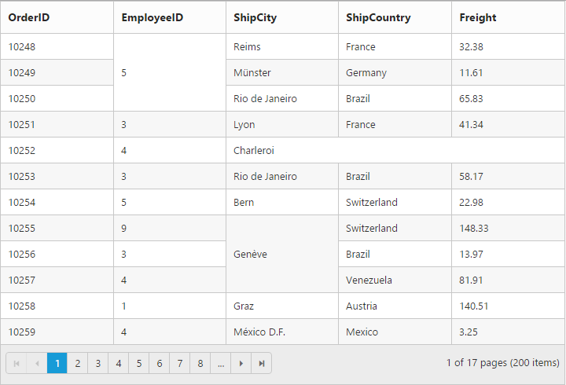

# Cell

## Auto wrap 

Auto wrap enables the Grid to wrap cell content or header content to next line when the content exceeds the boundary of the cell width. To enable auto wrap, set `allow-text-wrap` property as `true`. 

We can specify the mode of auto wrap using `wrap-mode` property of the `e-text-wrap-settings`. 

Three types of `wrap-mode` are available and they are,
  
 1. Both
 2. Header
 3. Content 
 
N> 1. By default the `wrap-mode` will be set as `Both`. 
N> 2. While using `e-text-wrap-settings` then it is must to set `allow-text-wrap` as `true`.
N> 3. For `wrapMode` property you can assign `enum` value (`Syncfusion.JavaScript.WrapMode.Both`).
 
## Both

When `wrap-mode` of `e-text-wrap-settings` property set as `Both` then the auto wrap will be enable for both grid content and header. 

The following code example describes the above behavior.




   <ej-grid id="FlatGrid" allow-paging="true" allow-text-wrap="true" datasource="ViewBag.DataSource">
       <e-text-wrap-settings wrap-mode="Both"></e-text-wrap-settings>
        <e-columns>
            <e-column field="OrderID" header-text="OrderID" width="90"></e-column>
            <e-column field="EmployeeID" header-text="EmployeeID" width="100"></e-column>
            <e-column field="Freight" header-text="Freight" width="100"></e-column>
            <e-column field="ShipCity" header-text="ShipCity"  width="90"></e-column>
            <e-column field="ShipAddress" header-text="Ship Address" width="110"></e-column>
        </e-columns>
   </ej-grid>




      namespace MVCSampleBrowser.Controllers
          {
            public class GridController : Controller
              { 
                public IActionResult GridFeatures()
                 {
                   var DataSource = new NorthwindDataContext().OrdersViews.ToList();
                   ViewBag.DataSource = DataSource;
                   return View();
                 }
             }
        } 
    
  

The following output is displayed as a result of the above code example.

### Header

When `wrap-mode` of `e-text-wrap-settings` property set as `Header` then the auto wrap will be enable only for grid header alone. 

The following code example describes the above behavior.




   <ej-grid id="FlatGrid" allow-paging="true" allow-text-wrap="true" datasource="ViewBag.DataSource">
       <e-text-wrap-settings wrap-mode="Header"/>
        <e-columns>
            <e-column field="OrderID" header-text="OrderID" width="90"></e-column>
            <e-column field="EmployeeID" header-text="EmployeeID" width="100"></e-column>
            <e-column field="Freight" header-text="Freight" width="100"></e-column>
            <e-column field="ShipCity" header-text="ShipCity"  width="90"></e-column>
            <e-column field="ShipAddress" header-text="Ship Address" width="110"></e-column>
        </e-columns>
   </ej-grid>




      namespace MVCSampleBrowser.Controllers
          {
            public class GridController : Controller
              { 
                public IActionResult GridFeatures()
                 {
                   var DataSource = new NorthwindDataContext().OrdersViews.ToList();
                   ViewBag.DataSource = DataSource;
                   return View();
                 }
             }
        } 
    
  

The following output is displayed as a result of the above code example.

### Content

When `wrap-mode` of `e-text-wrap-settings` property set as `Content` then the auto wrap will be enable only for grid content alone. 

The following code example describes the above behavior.




   <ej-grid id="FlatGrid" allow-paging="true" allow-text-wrap="true" datasource="ViewBag.DataSource">
       <e-text-wrap-settings wrap-mode="Content"/>
        <e-columns>
            <e-column field="OrderID" header-text="OrderID" width="90"></e-column>
            <e-column field="EmployeeID" header-text="EmployeeID" width="100"></e-column>
            <e-column field="Freight" header-text="Freight" width="100"></e-column>
            <e-column field="ShipCity" header-text="ShipCity" width="90"></e-column>
            <e-column field="ShipAddress" header-text="Ship Address" width="110"></e-column>
        </e-columns>
   </ej-grid>




      namespace MVCSampleBrowser.Controllers
          {
            public class GridController : Controller
              { 
                public IActionResult GridFeatures()
                 {
                   var DataSource = new NorthwindDataContext().OrdersViews.ToList();
                   ViewBag.DataSource = DataSource;
                   return View();
                 }
             }
        } 
    
  

The following output is displayed as a result of the above code example.

## Cell Merging

The grid has options to merge the grid cells based on the required conditions. This can be enabled by setting `allow-cell-merging` property as `true` and the merge conditions can be defined in `merge-cell-info` event. In this event, you can get the column details and data of that particular row and column which is helpful in defining conditions. 

You can merge the rows and cells of grid, using `rowMerge`, `colMerge` and `merge` functions available in `merge-cell-info` event's argument.

The following code example describes the above behavior.



    
     <ej-grid id="FlatGrid" allow-paging="true" allow-cell-merging="true" merge-cell-info ="mergeCellInfo" datasource="ViewBag.DataSource">
         <e-columns>
            <e-column field="OrderID" header-text="OrderID"></e-column>
            <e-column field="EmployeeID" header-text="EmployeeID"></e-column>
            <e-column field="ShipCity" header-text="ShipCity"></e-column>
            <e-column field="ShipCountry" header-text="ShipCountry"></e-column>
            <e-column field="Freight" header-text="Freight"></e-column>
          </e-columns>
   </ej-grid>




      namespace MVCSampleBrowser.Controllers
          {
            public class GridController : Controller
              { 
                public IActionResult GridFeatures()
                 {
                   var DataSource = new NorthwindDataContext().OrdersViews.ToList();
                   ViewBag.DataSource = DataSource;
                   return View();
                 }
             }
        } 


      

  

The following output is displayed as a result of the above code example.

## Displaying HTML content

This will helps you to show actual HTML value in grid content and header. To disable HTML code, set `disable-html-encode` property of `columns` as true. 

The following code example describes the above behavior.




   <ej-grid id="FlatGrid" allow-paging="true" datasource="ViewBag.DataSource">
        <e-columns>
            <e-column field="OrderID" header-text="OrderID"></e-column>
            <e-column field="CustomerID" header-text="
Cust ID
" disable-html-encode="true"></e-column>
            <e-column field="EmployeeID" header-text="
Employee ID
" disable-html-encode="false"></e-column>
            <e-column field="ShipCountry" header-text="ShipCountry"></e-column>
        </e-columns>
   </ej-grid>




      namespace MVCSampleBrowser.Controllers
          {
            public class GridController : Controller
              { 
                public IActionResult GridFeatures()
                 {
                   var DataSource = new NorthwindDataContext().OrdersViews.ToList();
                   ViewBag.DataSource = DataSource;
                   return View();
                 }
             }
        } 
    
  

The following output is displayed as a result of the above code example.

## Tooltip

When you move the cursor over the particular cell it provides an information about the corresponding cell value.

**Template**

HTML templates can be specified in the `tooltip` property of the particular column cell as a string (HTML element) or ID of the template's HTML element.You can use JsRender syntax in the template. For more information about JsRender syntax, please refer [this link](http://www.jsviews.com/#jsrapi "this link"). 

N> It's a standard way to enclose the template within the `script` tag with `type` as "text/x-jsrender". 
N> The `tooltip` template must contain `value` property to bind the corresponding cell text in tooltip
 
The following code example describes the above behavior.




   <ej-grid id="FlatGrid" allow-paging="true" datasource="ViewBag.DataSource">
        <e-columns>
            <e-column field="OrderID"></e-column>
            <e-column field="EmployeeID"></e-column>
            <e-column field="ShipCity" tooltip="#colTip"></e-column>
            <e-column field="Freight"></e-column>
        </e-columns>
   </ej-grid>




      namespace MVCSampleBrowser.Controllers
          {
            public class GridController : Controller
              { 
                public IActionResult GridFeatures()
                 {
                   var DataSource = new NorthwindDataContext().OrdersViews.ToList();
                   ViewBag.DataSource = DataSource;
                   return View();
                 }
             }
        } 


      
      
      
    
  

The following output is displayed as a result of the above code example.

## ClipMode

When the cell value contains a long text that is not fit into the grid column cell, the `clip-mode` property is used. By using the `clip-mode`, the cell value will be displayed with ellipsis or with clipped content when the text overflows inside a column cell.

N> By default the `clip-mode` will be set as `Clip`. 

**List of types**
  
 1. Clip
 2. Ellipsis
 3. EllipsisWithTooltip 
 
### Clip

When the content overflows, the remaining content will be hidden in the particular cell

The following code example describes the above behavior.




   <ej-grid id="FlatGrid" allow-paging="true" datasource="ViewBag.DataSource">
        <e-columns>
            <e-column field="OrderID"></e-column>
            <e-column field="ShipCity"></e-column>
            <e-column field="ShipName" clip-mode="Clip"></e-column>
            <e-column field="Freight"></e-column>
        </e-columns>
   </ej-grid>




      namespace MVCSampleBrowser.Controllers
          {
            public class GridController : Controller
              { 
                public IActionResult GridFeatures()
                 {
                   var DataSource = new NorthwindDataContext().OrdersViews.ToList();
                   ViewBag.DataSource = DataSource;
                   return View();
                 }
             }
        } 

  

The following output is displayed as a result of the above code example.

 
### Ellipsis

Ellipsis will be displayed when the content overflows its column width. Here Tooltip will not be shown for corresponding columns.

The following code example describes the above behavior.




   <ej-grid id="FlatGrid" allow-paging="true" datasource="ViewBag.DataSource">
        <e-columns>
            <e-column field="OrderID"></e-column>
            <e-column field="ShipCity"></e-column>
            <e-column field="ShipName" clip-mode="Ellipsis"></e-column>
            <e-column field="Freight"></e-column>
        </e-columns>
   </ej-grid>




      namespace MVCSampleBrowser.Controllers
          {
            public class GridController : Controller
              { 
                public IActionResult GridFeatures()
                 {
                   var DataSource = new NorthwindDataContext().OrdersViews.ToList();
                   ViewBag.DataSource = DataSource;
                   return View();
                 }
             }
        } 

  

The following output is displayed as a result of the above code example.

### Ellipsis With Tooltip

Ellipsis will be displayed when the content overflows its column width. Here tooltip will be shown only for the corresponding column cells that shows ellipsis.

N> If `clip-mode` is set as `EllipsisWithTooltip`, then `tooltip` must be given.

The following code example describes the above behavior.




   <ej-grid id="FlatGrid" allow-paging="true" datasource="ViewBag.DataSource">
        <e-columns>
            <e-column field="OrderID"></e-column>
            <e-column field="ShipCity"></e-column>
            <e-column field="ShipName" tooltip="#colTip" clip-mode="EllipsisWithTooltip"></e-column>
            <e-column field="Freight"></e-column>
        </e-columns>
   </ej-grid>




      namespace MVCSampleBrowser.Controllers
          {
            public class GridController : Controller
              { 
                public IActionResult GridFeatures()
                 {
                   var DataSource = new NorthwindDataContext().OrdersViews.ToList();
                   ViewBag.DataSource = DataSource;
                   return View();
                 }
             }
        } 


      
      
      
    
  

The following output is displayed as a result of the above code example.

