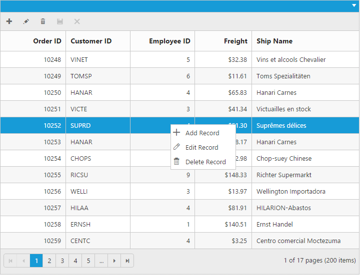

# Context Menu

Context menu is used to improve user action with Grid using popup menu. It can be shown by defining `EnableContextMenu` property of `ContextMenuSettings` as true. Context menu has option to add default items in `ContextMenuItems` property of `ContextMenuSettings` and customized items in `CustomContextMenuItems` property of `ContextMenuSettings`.

## Default Context Menu items

Please find the below table for default context menu items and its actions.

 <table>
        <tr>
            <th>
                Section
            </th>
            <th>
                Context menu items
            </th>
            <th>
                Action
            </th>
        </tr>
        <tr>
            <td rowspan="4">
                Header
            </td>
            <td>
                Sort in Ascending Order
            </td>
            <td>
                Sort column in Ascending order
            </td>
        </tr>
        <tr>
            <td>
                Sort in Descending Order
            </td>
            <td>
                Sort column in Descending order
            </td>
        </tr>
        <tr>
            <td>
                Group
            </td>
            <td>
                Group the current column
            </td>
        </tr>
        <tr>
            <td>
                Ungroup
            </td>
            <td>
                Ungroup the current column if already grouped
            </td>
        </tr>
        <tr>
            <td rowspan="5">
                Body
            </td>
            <td>
                Add Record
            </td>
            <td>
                Start Add new record
            </td>
        </tr>
        <tr>
            <td>
                Edit Record
            </td>
            <td>
                Start Edit in current record
            </td>
        </tr>
        <tr>
            <td>
                Delete Record
            </td>
            <td>
                Delete the current record
            </td>
        </tr>
        <tr>
            <td>
                Save
            </td>
            <td>
                Save the record if Add/Edit record is started
            </td>
        </tr>
        <tr>
            <td>
                Cancel
            </td>
            <td>
                Cancel Added/Edited state
            </td>
        </tr>
        <tr>
            <td rowspan="4">
                Pager
            </td>
            <td>
                Next Page
            </td>
            <td>
                Go to Next Page
            </td>
        </tr>
        <tr>            
            <td>
                Last Page
            </td>
            <td>
                Go to Last page
            </td>
        </tr>
        <tr>
            <td>
                Previous page
            </td>
            <td>
                Go to previous page
            </td>
        </tr>
        <tr>
            <td>
                First page
            </td>
            <td>
                Go to first page
            </td>
        </tr>
 </table>
 



    @{Html.EJ().Grid<object>("FlatGrid")
        .Datasource((IEnumerable<object>)ViewBag.datasource)
        .EditSettings(edit =>
        {
            edit.AllowAdding().AllowDeleting().AllowEditing();
        })
        .ToolbarSettings(toolbar =>
        {
            toolbar.ShowToolbar().ToolbarItems(items =>
            {
                items.AddTool(ToolBarItems.Add);
                items.AddTool(ToolBarItems.Edit);
                items.AddTool(ToolBarItems.Delete);
                items.AddTool(ToolBarItems.Update);
                items.AddTool(ToolBarItems.Cancel);
            });
        })
        .ContextMenuSettings(contextMenu =>
        {
            contextMenu.EnableContextMenu();
        })
        .AllowPaging()
        .AllowSorting()
        .AllowGrouping()
        .Columns(col =>
        {
            col.Field("OrderID").IsPrimaryKey(true).HeaderText("Order ID").TextAlign(TextAlign.Right).Width(90).Add();

            col.Field("CustomerID").HeaderText("Customer ID").Width(90).Add();

            col.Field("EmployeeID").HeaderText("Employee ID").TextAlign(TextAlign.Right).Width(90).Add();

            col.Field("Freight").Format("{0:c2}").HeaderText("Freight").Width(80).TextAlign(TextAlign.Right).Add();

            col.Field("ShipName").HeaderText("Ship Name").Width(150).Add();

        }).Render();
    }




    namespace MVCSampleBrowser.Controllers
    {
        public class GridController : Controller
        {
            public IActionResult Index(){
                var DataSource = new NorthwindDataContext().OrdersViews.ToList();
                ViewBag.datasource = DataSource;
                return View();
            }
        }
    }


    
 

{:caption}

Context menu at header

{:caption}

Context menu at body

{:caption}

Context menu at pager

N> `AllowGrouping`, `AllowSorting` should be enabled to perform default context menu actions in Grid header. `AllowEditing`, `AllowDeleting` and `AllowAdding` should be enabled to perform default actions in body.

## Custom Context Menu

Custom context menu is used to create your own menu item and its action. To add customized context menu items, you need to use `ContextMenuSettings.CustomContextMenuItems` property and to bind required actions for this, use `ContextClick` event.




    @{Html.EJ().Grid<object>("FlatGrid")
        .Datasource((IEnumerable<object>)ViewBag.datasource)
        .ContextMenuSettings(contextMenu =>
        {
            contextMenu.EnableContextMenu();
            contextMenu.DisableDefaultItems();
            contextMenu.CustomContextMenuItems(c => c.AddItem("clear_selection", "Clear Selection"));
        })
        .AllowPaging()        
        .ClientSideEvents(eve => {eve.ContextClick("contextclick");})
        .Columns(col =>
        {
            col.Field("OrderID").IsPrimaryKey(true).HeaderText("Order ID").TextAlign(TextAlign.Right).Width(90).Add();

            col.Field("CustomerID").HeaderText("Customer ID").Width(90).Add();

            col.Field("EmployeeID").HeaderText("Employee ID").TextAlign(TextAlign.Right).Width(90).Add();

            col.Field("Freight").Format("{0:c2}").HeaderText("Freight").Width(80).TextAlign(TextAlign.Right).Add();

            col.Field("ShipCountry").HeaderText("Ship Country").Width(150).Add();

        }).Render();
    }
    





    namespace MVCSampleBrowser.Controllers
    {
        public class GridController : Controller
        {
            public IActionResult Index(){
                var DataSource = new NorthwindDataContext().OrdersViews.ToList();
                ViewBag.datasource = DataSource;
                return View();
            }
        }
    }


    


## Sub Context Menu

Sub context menu is used to add customized sub menu to the custom context menu item. To add a sub context menu, you need to use `ContextMenuSettings.SubContextMenu` property and to bind required actions for this, use `ContextClick` event.




    @{Html.EJ().Grid<object>("FlatGrid")
        .Datasource((IEnumerable<object>)ViewBag.datasource)
        .ContextMenuSettings(contextMenu =>
        {
            contextMenu.EnableContextMenu();
            contextMenu.DisableDefaultItems();
            contextMenu.CustomContextMenuItems(c => 
            { 
                c.AddItem("clear_selection", "Clear Selection");
                c.AddItem("Hide_column", "Hide Column");
            });
            contextMenu.SubContextMenu(submenu =>
            {
                submenu.ContextMenuItem("Hide Column").SubMenu(new List<string>() { "Order ID", "Customer ID", "Employee ID" }).Add();
            });
        })
        .AllowPaging()        
        .ClientSideEvents(eve => {eve.ContextClick("contextclick");})
        .Columns(col =>
        {
            col.Field("OrderID").IsPrimaryKey(true).HeaderText("Order ID").TextAlign(TextAlign.Right).Width(90).Add();

            col.Field("CustomerID").HeaderText("Customer ID").Width(90).Add();

            col.Field("EmployeeID").HeaderText("Employee ID").TextAlign(TextAlign.Right).Width(90).Add();

            col.Field("Freight").Format("{0:c2}").HeaderText("Freight").Width(80).TextAlign(TextAlign.Right).Add();

            col.Field("ShipCountry").HeaderText("Ship Country").Width(150).Add();

        }).Render();
    }

    





    namespace MVCSampleBrowser.Controllers
    {
        public class GridController : Controller
        {
            public IActionResult Index(){
                var DataSource = new NorthwindDataContext().OrdersViews.ToList();
                ViewBag.datasource = DataSource;
                return View();
            }
        }
    }


    


