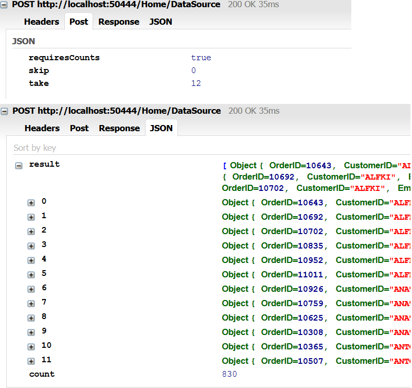
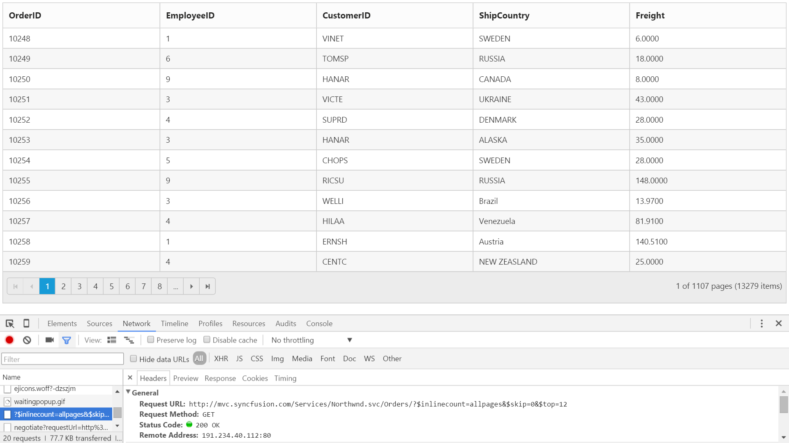
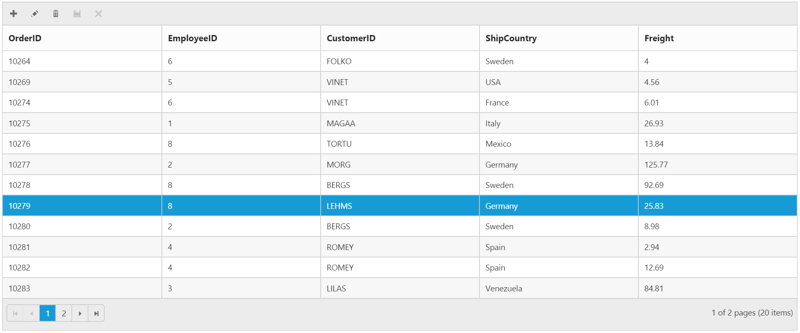

# Data Adaptors with Grid widget in ASP.NET Core Grid

The Data Adaptor is a mechanism through which the `DataManager` interact with the remote service or local dataSource. The `DataManager` has several preconfigured Data Adaptors, refer to the [link](https://help.syncfusion.com/aspnet-core/datamanager/dataadaptors).
   
In Grid, the Adaptor can be specified using the `adaptor` property of the `e-datamanager`.
 
 
N> For the `adaptor` property, you can assign Adaptor name either as `string` value (”JsonAdaptor”) or Enum value as `AdaptorType.JsonAdaptor`.
  
##  JSON Adaptor

The JSON Adaptor is used when the grid is bound with local datasource. It can be enabled in Grid using `adaptor` property as `JsonAdaptor`. The `JsonAdaptor` is the default Adaptor used by `DataManager` when bind with local dataSource such as IEnumerable, DataTable etc.  

 The following code example describes the above behavior.
 
  
 
<ej-grid id="Grid">
    <e-datamanager json="ViewBag.datasource" adaptor="JsonAdaptor"></e-datamanager>
    <e-columns>
        <e-column field="FirstName" header-text="First Name" text-align="Left" ></e-column>
        <e-column field="LastName" header-text="Last Name" text-align="Left"></e-column>
        <e-column field="Email" text-align="Left"></e-column>
    </e-columns>
</ej-grid>


    
          namespace Grid.Controllers
           {    
           public class HomeController : Controller
            {        
          public ActionResult Index()
             {
               List<Person> Persons = new List<Person>();
               Persons.Add(new Person() { FirstName = "John", LastName = "Beckett", Email = "john@syncfusion.com" });
               Persons.Add(new Person() { FirstName = "Ben", LastName = "Beckett", Email = "ben@syncfusion.com" });
               Persons.Add(new Person() { FirstName = "Andrew", LastName = "Beckett", Email = "andrew@syncfusion.com" });
               ViewBag.datasource = Persons;
               return View();
              }
            }
          }

  

The following output is displayed as a result of the above code example.

 
   
##  Url Adaptor

The Url Adaptor is the base Adaptor that would interact with remote services. It can be enabled in Grid using `adaptor` property of `e-datamanager` as `UrlAdaptor`. For every operations, an AJAX post will be send to the specified data service. 
    
N> When using `UrlAdaptor`, grid actions such as `Paging, Filtering` and `Sorting` should be handled at the server side itself. We have `DataOperation` class to do these server side operations. Please refer to the Knowledge Base [link](https://support.syncfusion.com/kb/article/4411/server-side-api-for-datamanager-operations). These operations can also be done using the `QueryableDataOperations` class which accepts the IQueryable Data. Please refer the Kb [link](https://support.syncfusion.com/kb/article/7406/server-side-api-for-datamanager-operations-with-iqueryable-data).

The following code example describes the above behavior.

  
 
<ej-grid id="OrdersView"  allow-paging="true">
    <e-datamanager url="DataSource" adaptor="UrlAdaptor"></e-datamanager>
    <e-columns>
        <e-column field="OrderID" header-text="Order ID"></e-column>
        <e-column field="CustomerID" header-text="Customer ID"></e-column>
        <e-column field="EmployeeID" header-text="Employee ID"></e-column>
        <e-column field="Freight" header-text="Freight" format="{0:C2}"></e-column>
    </e-columns>
</ej-grid>


        
     namespace Grid.Controllers
     {
       using Syncfusion.JavaScript;
       using Syncfusion.JavaScript.DataSources;    
       public class HomeController : Controller
        {
           // GET: /<controller>/
            private NORTHWNDContext _context;

            public HomeController(NORTHWNDContext context)
            {
                _context = context;
            }

        public IEnumerable OrderData = _context.OrdersViews.ToList();
        public ActionResult Index()
        {
            return View();
        }
        public ActionResult DataSource(DataManager dataManager) 
        {
            IEnumerable data = OrderData;
            DataOperations operation = new DataOperations();
            if (dataManager.Sorted != null && dataManager.Sorted.Count > 0) //Sorting
            {
                data= operation.PerformSorting(data, dataManager.Sorted);
            }            
            if (dataManager.Where != null && dataManager.Where.Count > 0) //Filtering
            {
                data= operation.PerformWhereFilter(data, dataManager.Where, dataManager.Where[0].Operator);
            }            
            int count = data.Cast<OrdersView>().Count();
            if (dataManager.Skip != 0)
            {
                data= operation.PerformSkip(data, dataManager.Skip);
            }            
            if (dataManager.Take != 0)
            {
                data= operation.PerformTake(data, dataManager.Take);
            }
            return Json(new { result = data, count = count });
          }
        }
      }

 

 I> 1. The response from server should be wrapped in an object with properties named `result` to hold the data and `count` to hold the total records count.
 I> 2. The `count` must be returned along with response when paging is enabled in Grid.
 
 The following output is displayed as a result of the above code example.
 
 
 
 
##  OData Adaptor
 
OData Adaptor that is extended from `UrlAdaptor`, is used for consuming data through OData Service. 
  
We have an online OData Service http://js.syncfusion.com/demos/ejServices/Wcf/Northwind.svc/Orders created specifically for Syncfusion Controls

N> `ODataAdaptor` is the default Adaptor of `DataManager` and so no need to specify Adaptor when binding OData service

You can use the following code example to use OData Adaptor.

  
 
<ej-grid id="FlatGrid" allow-paging="true">
    <e-datamanager url="http://js.syncfusion.com/demos/ejServices/Wcf/Northwind.svc/Orders" adaptor="ODataAdaptor"></e-datamanager>
    <e-columns>
        <e-column field="OrderID"></e-column>
        <e-column field="EmployeeID"></e-column>
        <e-column field="CustomerID"></e-column>
        <e-column field="ShipCountry"></e-column>
        <e-column field="Freight"></e-column>
    </e-columns>
</ej-grid>

 

The following output is displayed as a result of the above code example.

 

##  ODataV4 Adaptor

ODataV4 Adaptor that is extended from `ODataAdaptor`, is used for consuming data from ODataV4 Service
       
To consume ODataV4 service, set the service link to the `url` property of grid `e-datamanager` and you can set Adaptor type as `ODataV4Adaptor` to the `adaptor` Property.

You can use the following code example to use ODataV4 Adaptor.

  
 
<ej-grid id="FlatGrid" allow-paging="true">
    <e-datamanager url="http://services.odata.org/v4/northwind/northwind.svc/Orders" adaptor="ODataV4Adaptor"></e-datamanager>
    <e-columns>
        <e-column field="OrderID"></e-column>
        <e-column field="EmployeeID"></e-column>
        <e-column field="CustomerID"></e-column>
        <e-column field="ShipCountry"></e-column>
        <e-column field="Freight"></e-column>
    </e-columns>
</ej-grid>

 

The following output is displayed as a result of the above code example.

 

##  WebAPI Adaptor

WebAPI Adaptor that is extended from `ODataAdaptor`, is used for consuming data from WebAPI Service

To consume Web API service, set the service link to the `url` property of Grid `e-datamanager` and you can set Adaptor type as `WebApiAdaptor` to the `adaptor` Property of `e-datamanager`.

You can use the following code example to use WebAPI Adaptor.

  

<ej-grid id="FlatGrid" allow-paging="true">
    <e-datamanager url="/api/Orders" adaptor="WebApiAdaptor"></e-datamanager>
    <e-columns>
        <e-column field="OrderID"></e-column>
        <e-column field="EmployeeID"></e-column>
        <e-column field="CustomerID"></e-column>
        <e-column field="ShipCountry"></e-column>
        <e-column field="Freight"></e-column>
    </e-columns>
</ej-grid>


        
        public partial class OrdersController : Controller
        {
            // GET: /<controller>/
            private NORTHWNDContext _context;

            public OrdersController(NORTHWNDContext context)
            {
                _context = context;
            }
            public object Get()
            {
                var queryString = Request.Query;
                StringValues Skip;
                StringValues Take;
                int skip = (queryString.TryGetValue("$skip", out Skip)) ? Convert.ToInt32(Skip[0]) : 0;
                int top = (queryString.TryGetValue("$top", out Take)) ? Convert.ToInt32(Take[0]) : 12;
                return new { result = _context.Orders.Skip(skip).Take(top), count = _context.Orders.Count();
            }
        }

 

The following output is displayed as a result of the above code example.

 

##  RemoteSave Adaptor

Sometimes you may need to perform all Grid Actions in client-side except the CRUD operations that should be interacted with server-side to persist data. It can be achieved in Grid by using `RemoteSaveAdaptor`.

Datasource must be set to `Json` Property and set Adaptor type as `remoteSaveAdaptor` to the `adaptor` Property of Grid `e-datamanager`. CRUD operations can be mapped to server-side using `update-url`, `insert-url`, `remove-url`, `batch-url`, `crud-url` properties.

You can use the following code example to use RemoteSaveAdaptor.

  

<ej-grid id="FlatGrid" allow-paging="true" >
        <e-datamanager json="(IEnumerable<object>)ViewBag.dataSource" update-url="Home/Update" insert-url="Home/Insert" remove-url="Home/Remove" adaptor="remoteSaveAdaptor"></e-datamanager>
        <e-toolbar-settings show-toolbar="true" toolbar-items=@(new List<string>() { "Add", "Edit", "Delete","Update","Cancel" }) >
        </e-toolbar-settings>
        <e-edit-settings allow-adding="true" allow-deleting="true" allow-editing="true"></e-edit-settings>
        <e-columns>
            <e-column field="OrderID" is-primary-key="true"></e-column>
            <e-column field="EmployeeID"></e-column>
            <e-column field="CustomerID"></e-column>
            <e-column field="ShipCountry"></e-column>
            <e-column field="Freight"></e-column>
        </e-columns>
    </ej-grid>



        namespace EJGrid.Controllers
          {
             public class HomeController : Controller
              {
             public ActionResult Index()
              {
                var data = OrderRepository.GetAllRecords();
                ViewBag.dataSource = data;
                return View();
              }
             public ActionResult Update(CRUDModel<EditableOrder> value)
              {
                OrderRepository.Update(value);
                var data = OrderRepository.GetAllRecords();
                return Json(value);
              }
             public ActionResult Insert(CRUDModel<EditableOrder> value)
              {
                OrderRepository.Add(value);
                var data = OrderRepository.GetAllRecords();
                return Json(value);
             }
            public ActionResult Remove(int key)
            {
               OrderRepository.Delete(key);
               var data = OrderRepository.GetAllRecords();
               return Json(data);
            }
         }
      }


 

The following output is displayed as a result of the above code example.

 

On performing CRUD operations in Grid, the record changes will be sent to server-side as in the following screenshot.

 

##  Foreign Key Adaptor

The Grid can have a look up column. The Foreign key column using `foreign-key-field` has some limitations such as sort/group operations on column will happen based on `field` instead of `foreign-key-field`. The `ForeignKeyAdaptor` can be used to overcome this limitation.
      
N> It works by specifying a virtual column (which is not in the grid datasource) in the Grid. This Adaptor should be initialized in the `load` event of the grid. `ForeignKeyAdaptor` supported for only local data binding.

The following code example describes the above behavior.      

  

<ej-grid id="Grid" allow-paging="true" allow-sorting="true" load="onLoad">
    <e-datamanager json="@ViewBag.datasource"></e-datamanager>
    <e-columns>
        <e-column field="OrderID" header-text="Order ID" is-primary-key="true"></e-column>
        <e-column field="CustomerID" header-text="Custoer ID"></e-column>
        <e-column field="EmployeeID_FirstName" header-text="Name"></e-column>
        <e-column field="Freight" header-text="Freight" format="{0:C2}" text-align="Right"></e-column>
    </e-columns>
</ej-grid>



        namespace Grid.Controllers
         {      
          public class HomeController : Controller
           {
             // GET: /<controller>/
            private NORTHWNDContext _context;

            public HomeController(NORTHWNDContext context)
            {
                _context = context;
            }
           public ActionResult Index()
            {
              ViewBag.datasource = _context.OrdersViews.ToList();
              ViewBag.employeeData = JsonConvert.SerializeObject(_context.EmployeeViews.ToList());
              return View();
            }
          }
        }
 


        

           

 I> 1. The `field` name of the virtual column should be the name of the field to display from foreign datasource and the foreignKeyField value.
 I> 2. By default, the `ForeignKeyAdaptor` uses `JsonAdaptor`, to use other Adaptors specify the Adaptor name as the second argument during initialization.

The following output is displayed as a result of the above code example.

 

##  Custom Adaptor         

Instead of using the pre-configured Adaptors, the `DataManager` allow us to write our own data Adaptor.

Please refer here for more details about creating custom Adaptor.

The custom Adaptor should be assigned to the Grid `DataSource` in the `load` event.

For instance, though we have not provided in-built support to bind XML data, you can achieve by creating custom Adaptor as explained in below KB.
 
https://www.syncfusion.com/kb/3375/how-to-process-xml-data-from-server-using-datamanager-and-bound-to-grid 

N> To create a custom Adaptor for remote service, the `UrlAdaptor` can be used as base Adaptor. 

