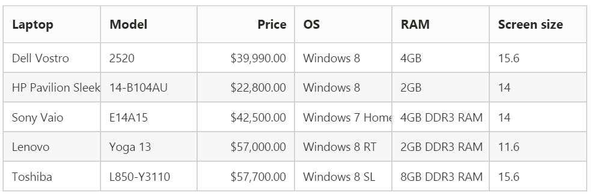
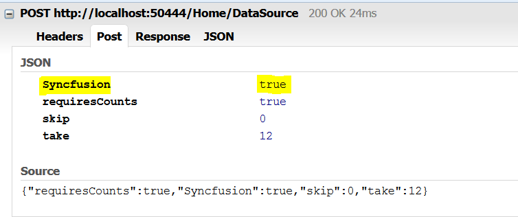
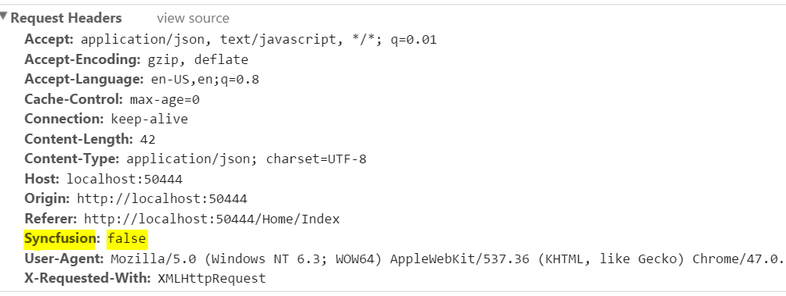
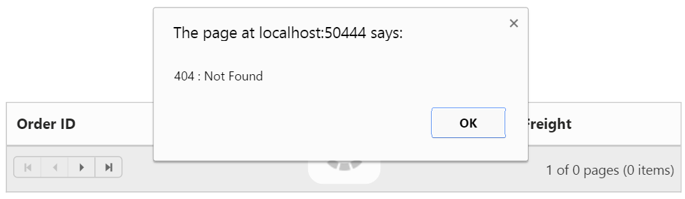

---
layout: post
title: DataBinding with Grid widget for Syncfusion Essential ASPNET Core
description: How to bind in-memory JSON and remote web services in Grid
platform: aspnet-core
control: Grid
documentation: ug
--- 
# Data Binding

Grid `datasource` property allows to bind datasource as the instance of one of the following types.
   
*	Collection that implements IEnumerable or IEnumerable&lt;T&gt;.
*	DataTable.
*	ITypedList.
*	REST Service URL as string.
*	Table – Allows to bind HTML Table and it accepts table template script "ID".
*	ORM components such as Entity Framework/Linq to SQL.
     
We can also bind the above type of datasource by using lambda Expressions of Grid `datasource` Property.
  
In the following section, let us see on how to bind various datasources to Grid using `datasource` API.
  
## IEnumerable
 
The Grid can be bound with either non-generic collection or generic collection that implements [IEnumerable](https://msdn.microsoft.com/en-us/library/system.collections.ienumerable.aspx) interface. It can be assigned to Grid’s `datasource` property.
    
N> The IEnumerable datasource can be passed as either directly to the datasource property or to the json property of the child tag.
  
The following code example describes the above behavior.
  
 


<ej-grid id="Grid" datasource=" ViewBag.datasource">
    <e-columns>
        <e-column field="FirstName" header-text="First Name" text-align="Left" ></e-column>
        <e-column field="LastName" header-text="Last Name" text-align="Left"></e-column>
        <e-column field="Email" text-align="Left"></e-column>
    </e-columns>
</ej-grid>


namespace samplebrowser.Controllers.Grid
{
    public class Person
    {
        public string FirstName { get; set; }
        public string LastName { get; set; }
        public string Email { get; set; }
    }

    public partial class GridController : Controller
    {
        // GET: /<controller>/
        public ActionResult Databinding()
        {
            List<Person> Persons = new List<Person>();
            Persons.Add(new Person() { FirstName = "John", LastName = "Beckett", Email = "john@syncfusion.com" });
            Persons.Add(new Person() { FirstName = "Ben", LastName = "Beckett", Email = "ben@syncfusion.com" });
            Persons.Add(new Person() { FirstName = "Andrew", LastName = "Beckett", Email = "andrew@syncfusion.com" });
            ViewBag.datasource = Persons;
            return View();
        }
    }
}


 

The following output is displayed as a result of the above code example.

##  DataTable

A DataTable, which represents one table of in-memory relational data that has in-built schema to work easily with data column and data row objects.

Binding DataTable to Grid is a very simpler way that you only need to set DataTable model to Grid `datasource` API.

The following code example describes the above behavior.

 


 <ej-grid id="Grid" datasource="ViewBag.datasource">
</ej-grid>



        
        namespace EJGrid.Controllers
         {
          public class HomeController : Controller
           {
            public ActionResult Index()
            {
              DataTable dt = new DataTable("Table1");
              DataColumn cl = new DataColumn("No");
              dt.Columns.Add(cl);
              cl = new DataColumn("Name");
              dt.Columns.Add(cl);

              DataRow dr = dt.NewRow();
              dr[0] = 1;
              dr[1] = "John";
              dt.Rows.Add(dr);
              
              dr = dt.NewRow();
              dr[0] = 2;
              dr[1] = "Smith";
              dt.Rows.Add(dr);

              dr = dt.NewRow();
              dr[0] = 3;
              dr[1] = "Tomps";
              dt.Rows.Add(dr);

              dr = dt.NewRow();
              dr[0] = 4;
              dr[1] = "Hanar";
              dt.Rows.Add(dr);

              dr = dt.NewRow();
              dr[0] = 5;
              dr[1] = "Reek";
              dt.Rows.Add(dr);

              ViewBag.dataSource = dt;
             return View();
            }
          }
       }

 

The following output is displayed as a result of the above code example.

##  ITypedList Binding 
      
ITypedList provides functionality to discover the schema for a binding list, where the properties available to bind differ from the public properties of the object to bind.

To implement ITypedList binding, create a generic type named class that derives from ITypedList interface. Define the named class based on properties descriptor of the Grid Model class, to return list according to the custom implementation.

Create a collection of ITypedList and bind it to Grid using `datasource` property.

The following code example describes the above behavior.

 
 

<ej-grid id="FlatGrid" datasource="ViewBag.dataSource" allow-paging="true">
    <e-columns>
        <e-column field="OrderID"></e-column>
        <e-column field="CustomerID"></e-column>
        <e-column field="Freight"></e-column>
        <e-column field="ShipCountry"></e-column>
        <e-column field="ShipCity"></e-column>
    </e-columns>
</ej-grid>


 

         [Serializable()]
         public class SortableBindingList<T> : BindingList<T>, ITypedList
         {
          [NonSerialized()]
          private PropertyDescriptorCollection properties;
          public SortableBindingList()
             : base()
            {
               // Get the 'shape' of the list. 
              // Only get the public properties marked with Browsable = true.
             PropertyDescriptorCollection pdc = TypeDescriptor.GetProperties(
                 typeof(T),
                 new Attribute[] { new BrowsableAttribute(true) });

             // Sort the properties.
             properties = pdc.Sort();
            }
          #region ITypedList Implementation
          public PropertyDescriptorCollection GetItemProperties(PropertyDescriptor[] listAccessors)
          {
             PropertyDescriptorCollection pdc;
             if (listAccessors != null && listAccessors.Length > 0)
             {
                // Return child list shape.
                pdc = ListBindingHelper.GetListItemProperties(listAccessors[0].PropertyType);
             }
             else
             {
                // Return properties in sort order.
                pdc = properties;
             }
             return pdc;
          }
          // This method is only used in the design-time framework 
         // and by the obsolete DataGrid control.
         public string GetListName(PropertyDescriptor[] listAccessors)
         {
           return typeof(T).Name;
         }
        #endregion
      }

     namespace EJGrid.Controllers
     {
      public class HomeController : Controller
       {
         public ActionResult Index()
         {
            var data = OrderRepository.GetAllRecords();
            SortableBindingList<EditableOrder> ord = new SortableBindingList<EditableOrder>();
            
            foreach (var temp in data)
            {
                ord.Add(temp);
            }
            ViewBag.dataSource = ord;
            return View();
          }
        }
      }

 

The following output is displayed as a result of the above code example.

See Also

For more information on ITypedList interface please refer to this [link](https://msdn.microsoft.com/en-us/library/System.ComponentModel.ITypedList.aspx).

##  Complex Binding

The Grid can display nested or navigation properties in the column that would provide the way to display the field from another entity. The complex property can be provided in the `field` property  either as string value concatenated by dot or using lambda Expression.   

N> 1. To display navigation properties using complex binding, the corresponding property should be eager loaded. Lazy loading is not supported for complex binding. 
  
The following code example describes the above behavior.

 

        
<ej-grid id="Grid" datasource="ViewBag.datasource">
        <e-columns>
            <e-column field="FirstName" header-text="First Name" text-align="Left"></e-column>
            <e-column field="LastName" header-text="Last Name" text-align="Left"></e-column>
            <e-column field="Designation.Position" header-text="Designation" text-align="Left"></e-column>
            <e-column field="Email" header-text="Email" text-align="Left"></e-column>
        </e-columns>
    </ej-grid>


 
       
        namespace Grid.Controllers
        {    
          public class HomeController : Controller
           {        
           public ActionResult Index()
            {
             List<Person> Persons = new List<Person>();
            Persons.Add(new Person() { FirstName = "John", LastName = "Beckett", Email = "john@syncfusion.com", Designation = new Designation{ Position = "Manager"  } });
            Persons.Add(new Person() { FirstName = "Ben", LastName = "Beckett", Email = "ben@syncfusion.com", Designation = new Designation{ Position = "Asst. Manager" } });
            Persons.Add(new Person() { FirstName = "Andrew", LastName = "Beckett", Email = "andrew@syncfusion.com", Designation = new Designation{ Position = "Engineer"  } });
            ViewBag.datasource = Persons;
            return View();
           }
         }
       }

 

The following output is displayed as a result of the above code example.

##  WCF DataService / OData Service

To consume WCF DataService in Grid control, provide the service link directly to the Grid `datamanager` property.

We have an online OData Service `http://js.syncfusion.com/demos/ejServices/Wcf/Northwind.svc/Orders` created specifically for Syncfusion Controls

The following code example describes the above behavior.

 


<ej-grid id="FlatGrid" datasource="ViewBag.dataSource" allow-paging="true">
    <e-datamanager url="http://js.syncfusion.com/demos/ejServices/Wcf/Northwind.svc/Orders"></e-datamanager>
    <e-columns>
        <e-column field="OrderID"></e-column>
        <e-column field="EmployeeID"></e-column>
        <e-column field="CustomerID"></e-column>
        <e-column field="ShipCountry"></e-column>
        <e-column field="Freight"></e-column>
    </e-columns>
</ej-grid>    


 

The following output is displayed as a result of the above code example.

##  Web API Service

Web API Adaptor is used for processing request and response messages from Web API Service.

To consume Web API service, set the service link to the `url` property of Grid `datamanager` and you can set adaptor type as `AdaptorType.WebApiAdaptor` to the `Adaptor` Property of Grid `datamanager`

 I> The datasource from Web API service must be returned as object that has property `Items` with its value as datamanager and another property `Count` with its value as datamanager total records count.

DataOperation queries such as sorting, filtering, etc., would be sent to Web API Service corresponding to Grid actions performed and they need to be handled manually as Web API Service does not process it by default.

 N> In ASP.NET core default casing as camelCase.So, we need to return the data as JSON and the JSON object must contain a property as `result` with dataSource as its value and one more property `count` with the dataSource total records count as its value.
 
The following code example describes the above behavior.
    
 

    
     <ej-grid id="FlatGrid" datasource="ViewBag.dataSource" allow-paging="true">
    <e-datamanager url="/api/Orders" adaptor="WebApiAdaptor"></e-datamanager>
    <e-columns>
        <e-column field="OrderID"></e-column>
        <e-column field="EmployeeID"></e-column>
        <e-column field="CustomerID"></e-column>
        <e-column field="ShipCountry"></e-column>
        <e-column field="Freight"></e-column>
    </e-columns>
</ej-grid>

 
    
        namespace EJGrid.Controllers
         {
          public class OrdersController: ApiController 
           { 
            // GET: api/Orders 
            NORTHWNDEntities db = new NORTHWNDEntities(); 
            public object Get() 
           { 
             var queryString = HttpContext.Current.Request.QueryString; 
             int skip = Convert.ToInt32(queryString["$skip"]); 
             int take = Convert.ToInt32(queryString["$top"]); 
             var data = db.Orders.Skip(skip).Take(take).ToList(); 
             return new { Items = data.Skip(skip).Take(take), Count = data.Count() }; 
            } 
          } 
        }

        

The following output is displayed as a result of the above code example.

##  HTML Table binding

HTML table can be set as a data source for grid. The ID of the HTML table should be assigned to the `Table` property of the `DataManager` API.

I> HTML table is the only valid element to use through `DataManager`.
  
The following code example describes the above behavior.
 
  


<ej-grid id="Grid" allow-paging="true">
    <e-datamanager table="#GridTable"></e-datamanager>
    <e-columns>
        <e-column field="Laptop" header-text="Laptop" text-align="Left"></e-column>
        <e-column field="Model" header-text="Model"></e-column>
        <e-column field="Price" header-text="Price"></e-column>
        <e-column field="OS" header-text="OS" text-align="Left"></e-column>
        <e-column field="RAM" header-text="RAM" text-align="Left"></e-column>
        <e-column field="ScreenSize" header-text="ScreenSize"></e-column>
    </e-columns>
</ej-grid>



    
      



The following output is displayed as a result of the above code example.

##  Miscellaneous

###  Load On Demand

By default, Grid with remote data binding will work in `On-Demand` concept for which either `Paging` or `VirtualScrolling` feature should be enabled in Grid. It helps improving performance of loading a large data set.

The following code example describes the above behavior.

   
  

<ej-grid id="FlatGrid" allow-paging="true">
    <e-datamanager url="http://js.syncfusion.com/demos/ejServices/Wcf/Northwind.svc/Orders"></e-datamanager>
    <e-columns>
        <e-column field="OrderID"></e-column>
        <e-column field="EmployeeID"></e-column>
        <e-column field="CustomerID"></e-column>
        <e-column field="ShipCountry"></e-column>
        <e-column field="Freight"></e-column>
    </e-columns>
</ej-grid>




The following output is displayed as a result of the above code example.

###  Load at once

`Load at once` concept in Grid can be used to load all data from remote service at a single request and all further Grid action will be performed at client-side on the cached data.

`offline` property of Grid `DataManager` is used to enable `Load at once` in Grid control

The following code example describes the above behavior.

  
 

<ej-grid id="FlatGrid"  allow-paging="true">
    <e-datamanager url="http://js.syncfusion.com/demos/ejServices/Wcf/Northwind.svc/Orders" offline="true"></e-datamanager>
    <e-columns>
        <e-column field="OrderID"></e-column>
        <e-column field="EmployeeID"></e-column>
        <e-column field="CustomerID"></e-column>
        <e-column field="ShipCountry"></e-column>
        <e-column field="Freight"></e-column>
    </e-columns>
</ej-grid>        




The following output is displayed as a result of the above code example.

###  Data caching

The `datamanager` can cache loaded data. The caching functionality can be enabled by setting the `enable-caching` property in `datamanager`.
    
The `time-till-expiration` and `caching-page-size` properties are used to control the expiration time of data and the cache page size settings respectively.

N> window`s localStorage is used to cache the loaded data. 

The following code example describes the above behavior.

  
 
   
<ej-grid id="Grid"  allow-paging="true">
    <e-datamanager url="DataSource" enable-caching="true" caching-page-size="4" time-till-expiration="120000" adaptor="@AdaptorType.UrlAdaptor"></e-datamanager>
    <e-columns>
        <e-column field="OrderID" header-text="Order ID"></e-column>
        <e-column field="CustomerID" header-text="Customer ID"></e-column>
        <e-column field="EmployeeID" header-text="Employee ID"></e-column>
        <e-column field="Freight" header-text="Freight" format="{0:C2}"></e-column>
    </e-columns>
</ej-grid>




The following output is displayed as a result of the above code example.

###  Custom request parameters and HTTP Header

####  Adding request parameters

The ‘addParams’ function in DataManager’s Query class can be used to add additional custom parameter in data requests. The Grid has an option to set default Query which can be used to add custom parameter.
      
The following code example describes the above behavior.

  
 

<ej-grid id="OrdersView"  allow-paging="true" query="ej.Query().addParams('Syncfusion', true)">
    <e-datamanager url="DataSource" adaptor="UrlAdaptor"></e-datamanager>
    <e-columns>
        <e-column field="OrderID" header-text="Order ID"></e-column>
        <e-column field="CustomerID" header-text="Customer ID"></e-column>
        <e-column field="EmployeeID" header-text="Employee ID"></e-column>
        <e-column field="Freight" header-text="Freight" format="{0:C2}"></e-column>
    </e-columns>
</ej-grid>




E> Attempting to add custom parameters with key name same as any default AJAX parameters used by `DataManager` will results in error.

The following output is displayed as a result of the above code example.

####  Adding custom HTTP headers

The Custom header can be added through `DataManager` `Headers` options. While performing, CRUD operations, the `addParams` cannot be used to send additional parameters to the server in such cases the parameters can be send as custom header.

The following code example describes the above behavior.

  
 
    List<Syncfusion.JavaScript.Models.KeyValue>
    str = new List<Syncfusion.JavaScript.Models.KeyValue>();
    str.Add(new Syncfusion.JavaScript.Models.KeyValue() {Key ="Syncfusion", Value = false });

                <ej-grid id="Grid" allow-paging="true">
                <e-datamanager url="DataSource" adaptor="@AdaptorType.UrlAdaptor" headers="@(str)"></e-datamanager>
                <e-columns>
                    <e-column field="OrderID" header-text="Order ID"></e-column>
                    <e-column field="CustomerID" header-text="Customer ID"></e-column>
                    <e-column field="EmployeeID" header-text="Employee ID"></e-column>
                    <e-column field="Freight" header-text="Freight" format="{0:C2}"></e-column>
                </e-columns>
            </ej-grid>        




N>  To add custom headers to the DataManager through JavaScript, refer to this [link]( https://www.syncfusion.com/kb/5963)

The following output is displayed as a result of the above code example.

###  Handling HTTP Errors

During server interaction from the Grid, there may occur some server-side exceptions and you can acquire those error messages or exception details in client-side using `action-failure` event of Grid control.

The argument passed to the `action-failure` Grid event contains the error details returned from server. Please refer the following table for some error details that would be acquired in client-side event arguments.
              
<table>
<tr>
<th>Parameter</th>
<th>Description</th>
</tr>
<tr>
<td>arguments.error.status</td>
<td>It returns the response error code.</td></tr>
<tr>
<td>arguments.error.statusText</td>
<td>It returns the error message.</td>
</tr>
 </table>
              
The following code example describes the above behavior.

  
 

    <ej-grid id="Grid" allow-paging="true" action-failure="OnActionFailure">
        <e-datamanager url="DataSource" adaptor="UrlAdaptor"></e-datamanager>
        <e-columns>
            <e-column field="OrderID" header-text="Order ID"></e-column>
            <e-column field="CustomerID" header-text="Customer ID"></e-column>
            <e-column field="EmployeeID" header-text="Employee ID"></e-column>
            <e-column field="Freight" header-text="Freight" format="{0:C2}"></e-column>
        </e-columns>
    </ej-grid>




             



The following output is displayed as a result of the above code example.

