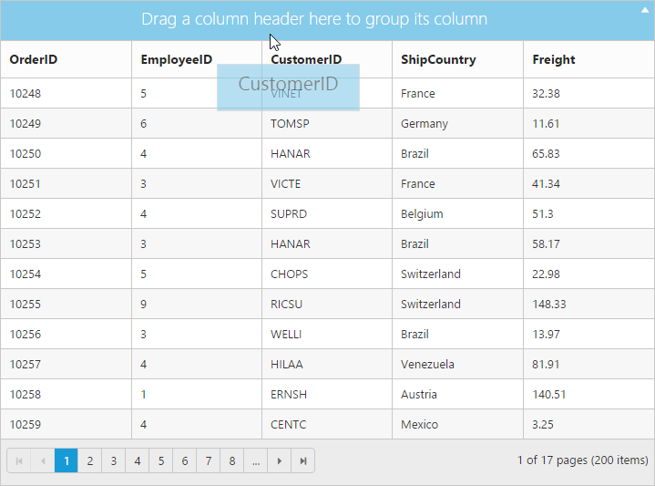
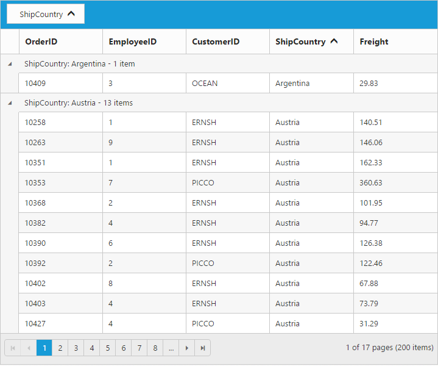
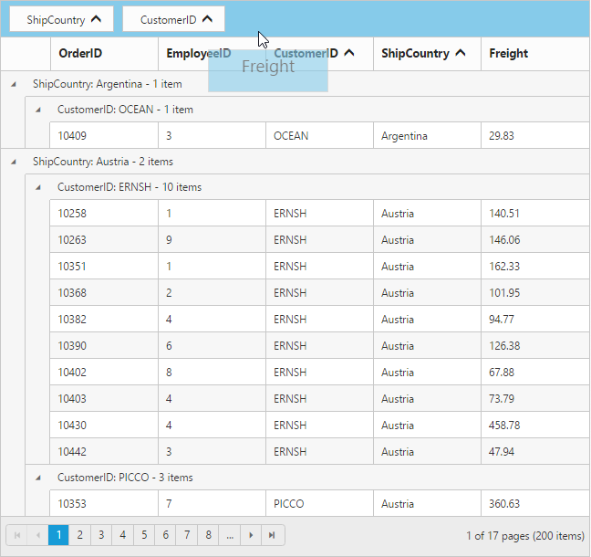
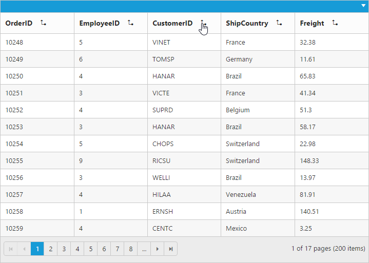
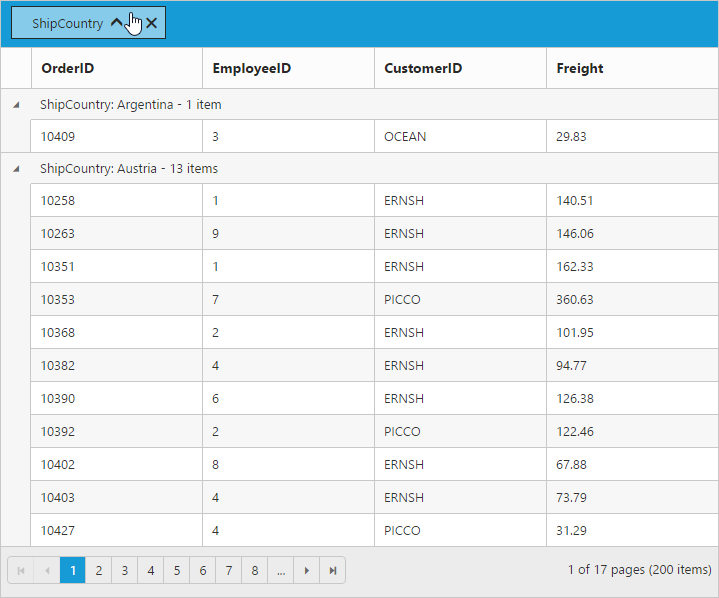
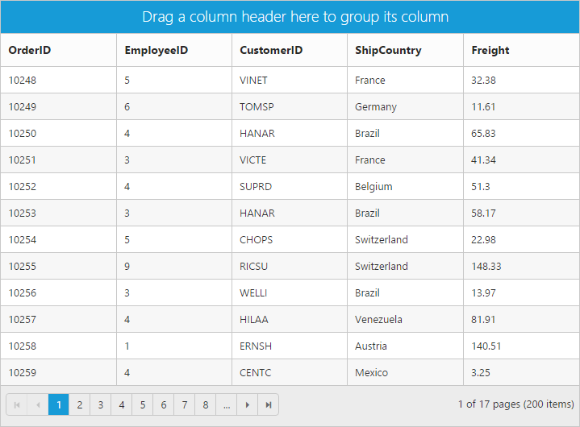

# Grouping

The Grid control has options to group the records based on the required column. When grouping is applied, grouped records are organized into a hierarchical structure to facilitate easier expand and collapse of records. To enable grouping, set `allow-grouping` property as `true`.

Columns can be grouped by simply dragging the column header and drop on the group drop area or simply click the group button which is displayed in the column. By default, sorting is done while grouping the column.

The following code example describes the above behavior.
 



   <ej-grid id="FlatGrid" allow-paging="true" allow-grouping="true" datasource="ViewBag.DataSource">
        <e-columns>
            <e-column field="OrderID" header-text="Order ID"></e-column>
            <e-column field="EmployeeID" header-text="Employee ID"></e-column>
            <e-column field="CustomerID" header-text="Customer ID"></e-column>
            <e-column field="ShipCountry" header-text="Ship Country"></e-column>
            <e-column field="Freight" header-text="Freight"></e-column>
        </e-columns>
   </ej-grid>




      namespace MVCSampleBrowser.Controllers
          {
            public class GridController : Controller
              { 
                public IActionResult GridFeatures()
                 {
                   var DataSource = new NorthwindDataContext().OrdersViews.ToList();
                   ViewBag.DataSource = DataSource;
                   return View();
                 }
             }
        } 
    
  

The following output is displayed as a result of the above code example.

## Initial Grouping

While initializing the grid itself, there is an option to group the column and display it in a hierarchical structure. To enable initial grouping, set array of column's `field` name to be grouped in `GroupedColumns` property  of `group-settings`.

The following code example describes the above behavior.
            



   <ej-grid id="FlatGrid" allow-paging="true" allow-grouping="true" group-settings ="@(new GroupSettings { GroupedColumns= new List<string>() { "ShipCountry" } })" datasource="ViewBag.DataSource">
        <e-columns>
            <e-column field="OrderID" header-text="Order ID"></e-column>
            <e-column field="EmployeeID" header-text="Employee ID"></e-column>
            <e-column field="CustomerID" header-text="Customer ID"></e-column>
            <e-column field="ShipCountry" header-text="Ship Country"></e-column>
            <e-column field="Freight" header-text="Freight"></e-column>
        </e-columns>
   </ej-grid>




      namespace MVCSampleBrowser.Controllers
          {
            public class GridController : Controller
              { 
                public IActionResult GridFeatures()
                 {
                   var DataSource = new NorthwindDataContext().OrdersViews.ToList();
                   ViewBag.DataSource = DataSource;
                   return View();
                 }
             }
        } 
    
  

The following output is displayed as a result of the above code example.

## Multi-Column Grouping

Group multiple columns by simply drag and drop the columns one by one from column header into group drop area.

The following code example describes the above behavior.




   <ej-grid id="FlatGrid" allow-paging="true" allow-grouping="true" group-settings ="@(new GroupSettings { GroupedColumns= new List<string>() { "ShipCountry","CustomerID"} })" datasource="ViewBag.DataSource">
       <e-columns>
            <e-column field="OrderID" header-text="Order ID"></e-column>
            <e-column field="EmployeeID" header-text="Employee ID"></e-column>
            <e-column field="CustomerID" header-text="Customer ID"></e-column>
            <e-column field="ShipCountry" header-text="Ship Country"></e-column>
            <e-column field="Freight" header-text="Freight"></e-column>
        </e-columns>
   </ej-grid>




      namespace MVCSampleBrowser.Controllers
          {
            public class GridController : Controller
              { 
                public IActionResult GridFeatures()
                 {
                   var DataSource = new NorthwindDataContext().OrdersViews.ToList();
                   ViewBag.DataSource = DataSource;
                   return View();
                 }
             }
        } 
    
  

The following output is displayed as a result of the above code example.

## Group Buttons

To do grouping easily without doing drag and drop column header by setting `ShowToggleButton` property of `group-settings` as `true`.

The following code example describes the above behavior.




   <ej-grid id="FlatGrid" allow-paging="true" allow-grouping="true" group-settings ="@(new GroupSettings { ShowToggleButton=true })" datasource="ViewBag.DataSource">
       <e-columns>
            <e-column field="OrderID" header-text="Order ID"></e-column>
            <e-column field="EmployeeID" header-text="Employee ID"></e-column>
            <e-column field="CustomerID" header-text="Customer ID"></e-column>
            <e-column field="ShipCountry" header-text="Ship Country"></e-column>
            <e-column field="Freight" header-text="Freight"></e-column>
        </e-columns>
   </ej-grid>




      namespace MVCSampleBrowser.Controllers
          {
            public class GridController : Controller
              { 
                public IActionResult GridFeatures()
                 {
                   var DataSource = new NorthwindDataContext().OrdersViews.ToList();
                   ViewBag.DataSource = DataSource;
                   return View();
                 }
             }
        } 
    
  

The following output is displayed as a result of the above code example.

## Hide Ungroup Button

Hide ungroup button from grouped columns which is in the group drop area by setting the `ShowUngroupButton` property of `group-settings` as `false`.

The following code example describes the above behavior.




   <ej-grid id="FlatGrid" allow-paging="true" allow-grouping="true" group-settings ="@(new GroupSettings { ShowUngroupButton=false })" datasource="ViewBag.DataSource">
       <e-columns>
            <e-column field="OrderID" header-text="Order ID"></e-column>
            <e-column field="EmployeeID" header-text="Employee ID"></e-column>
            <e-column field="CustomerID" header-text="Customer ID"></e-column>
            <e-column field="ShipCountry" header-text="Ship Country"></e-column>
            <e-column field="Freight" header-text="Freight"></e-column>
        </e-columns>
   </ej-grid>




      namespace MVCSampleBrowser.Controllers
          {
            public class GridController : Controller
              { 
                public IActionResult GridFeatures()
                 {
                   var DataSource = new NorthwindDataContext().OrdersViews.ToList();
                   ViewBag.DataSource = DataSource;
                   return View();
                 }
             }
        } 
    
  

The following output is displayed as a result of the above code example.

## Hide Grouped Column

While grouping a particular column, there is an option to hide the grouped columns from grid. To enable hide grouped column option, set `ShowGroupedColumn` property of `group-settings` as `false`.

The following code example describes the above behavior.




   <ej-grid id="FlatGrid" allow-paging="true" allow-grouping="true" group-settings ="@(new GroupSettings { ShowGroupedColumn=false })" datasource="ViewBag.DataSource">
        <e-columns>
            <e-column field="OrderID" header-text="Order ID"></e-column>
            <e-column field="EmployeeID" header-text="Employee ID"></e-column>
            <e-column field="CustomerID" header-text="Customer ID"></e-column>
            <e-column field="ShipCountry" header-text="Ship Country"></e-column>
            <e-column field="Freight" header-text="Freight"></e-column>
        </e-columns>
   </ej-grid>




      namespace MVCSampleBrowser.Controllers
          {
            public class GridController : Controller
              { 
                public IActionResult GridFeatures()
                 {
                   var DataSource = new NorthwindDataContext().OrdersViews.ToList();
                   ViewBag.DataSource = DataSource;
                   return View();
                 }
             }
        } 
    
  

The following output is displayed as a result of the above code example.

## AutoSize Drop Area

Drag any column header and move it to the group drop area, then its portion expands smoothly. Stop this animation by setting `EnableDropAreaAutoSizing` property of `group-settings` as `false`.

The following code example describes the above behavior.




   <ej-grid id="FlatGrid" allow-paging="true" allow-grouping="true" group-settings ="@(new GroupSettings { EnableDropAreaAutoSizing=false })" datasource="ViewBag.DataSource">
        <e-columns>
            <e-column field="OrderID" header-text="Order ID"></e-column>
            <e-column field="EmployeeID" header-text="Employee ID"></e-column>
            <e-column field="CustomerID" header-text="Customer ID"></e-column>
            <e-column field="ShipCountry" header-text="Ship Country"></e-column>
            <e-column field="Freight" header-text="Freight"></e-column>
        </e-columns>
   </ej-grid>




      namespace MVCSampleBrowser.Controllers
          {
            public class GridController : Controller
              { 
                public IActionResult GridFeatures()
                 {
                   var DataSource = new NorthwindDataContext().OrdersViews.ToList();
                   ViewBag.DataSource = DataSource;
                   return View();
                 }
             }
        } 
    
  

The following output is displayed as a result of the above code example.

## Hide Drop Area 

To avoid ungrouping or further grouping of a column after an initial column grouping by setting `ShowDropArea` property of `group-settings` as `false`.

The following code example describes the above behavior.
 



   <ej-grid id="FlatGrid" allow-paging="true" allow-grouping="true" group-settings ="@(new GroupSettings { GroupedColumns= new List<string>() { "ShipCountry" }, ShowDropArea=false })" datasource="ViewBag.DataSource">
       <e-columns>
            <e-column field="OrderID" header-text="Order ID"></e-column>
            <e-column field="EmployeeID" header-text="Employee ID"></e-column>
            <e-column field="CustomerID" header-text="Customer ID"></e-column>
            <e-column field="ShipCountry" header-text="Ship Country"></e-column>
            <e-column field="Freight" header-text="Freight"></e-column>
        </e-columns>
   </ej-grid>




      namespace MVCSampleBrowser.Controllers
          {
            public class GridController : Controller
              { 
                public IActionResult GridFeatures()
                 {
                   var DataSource = new NorthwindDataContext().OrdersViews.ToList();
                   ViewBag.DataSource = DataSource;
                   return View();
                 }
             }
        } 
    
   

The following output is displayed as a result of the above code example.

## Group Caption Format/Group Caption Template

Using `CaptionFormat` property of `group-settings` you can render any type of JsRender templates or customizing the group caption text. 

You can use JsRender syntax in the template.For more information about JsRender syntax, please refer [the link](http://www.jsviews.com/#jsrapi "the link").

N>  1. It's a standard way to enclose the `template` within the `script` tag with `type` as "text/x-jsrender". 
N>  2. Using locale property of `CaptionFormat`, you can only customize the default group caption text.

The following code example describes the above behavior.




   <ej-grid id="FlatGrid" allow-paging="true" allow-grouping="true" action-complete="complete" group-settings ="@(new GroupSettings { CaptionFormat="#template" })" datasource="ViewBag.DataSource">
        <e-columns>
            <e-column field="OrderID" header-text="Order ID"></e-column>
            <e-column field="EmployeeID" header-text="Employee ID"></e-column>
            <e-column field="CustomerID" header-text="Customer ID"></e-column>
            <e-column field="ShipCountry" header-text="Ship Country"></e-column>
            <e-column field="Freight" header-text="Freight"></e-column>
        </e-columns>
   </ej-grid>




      namespace MVCSampleBrowser.Controllers
          {
            public class GridController : Controller
              { 
                public IActionResult GridFeatures()
                 {
                   var DataSource = new NorthwindDataContext().OrdersViews.ToList();
                   ViewBag.DataSource = DataSource;
                   return View();
                 }
             }
        } 
 

            
     
     

         

    
   


The following output is displayed as a result of the above code example.

