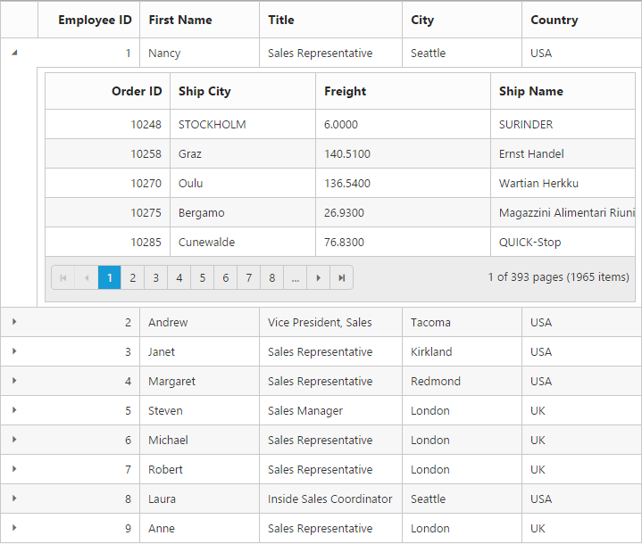

# Hierarchical Bindings

Hierarchical binding can be used to create the Grid with parent and child relation, this facilitate you to view the child records for a particular row by clicking on the Expander button present in first column of each grid row. This can be enabled by defining `ChildGrid` and `QueryString`.

The `ChildGrid` property is used to define the model properties that has to be applied on the child grid. The `ChildGrid` is the extended class of the base class Grid such that it holds all the properties of the Grid. The `QueryString` is a property that has to be specified within the ChildGrid, which defines the relation between the parent and child grid. The `QueryString` property is used to denote the primaryKey field of the parent grid which is to be mapped with the foreignKey field of the child grid. Based on the mapping, the child grid records are filtered from the table and is bound as datasource for the child grid.





@{Html.EJ().Grid<EmployeeView>("HierarchyGrid")
        .Datasource((IEnumerable<object>)ViewBag.datasource)
        .Columns(col =>
        {
            col.Field("EmployeeID").HeaderText("Employee ID").TextAlign(TextAlign.Right).Width(85).Add();
            col.Field("FirstName").HeaderText("First Name").Width(100).Add();
            col.Field("Title").Width(120).Add();
            col.Field("City").Width(100).Add();
            col.Field("Country").Width(100).Add();
        })
                 .ChildGrid(child =>
                 {
                     child.Datasource("http://mvc.syncfusion.com/Services/Northwnd.svc/Orders/")
                        .QueryString("EmployeeID")
                        .AllowPaging()
                        .PageSettings(page => page.PageSize(5))
                        .Columns(col =>
                        {
                            col.Field("OrderID").HeaderText("OrderID").TextAlign(TextAlign.Right).Width(75).Add();
                            col.Field("ShipCity").HeaderText("ShipCity").Width(100).Add();
                            col.Field("Freight").Width(120).Add();
                            col.Field("ShipName").Width(100).Add();
                        });
                 }).Render();
        }




public partial class GridController : Controller

{

	//

	// GET: /HierarchyGrid/

	 public IActionResult HierarchyGrid()

        {

            var DataSource = new NorthwindDataContext().EmployeeViews.ToList();

            ViewBag.datasource = DataSource;

            return View();

        }

}



 

## Expand or Collapse All Child's

The Grid can able to expand and collapse all the `ChildGrid` through programmatically using [`expandAll`](http://help.syncfusion.com/js/api/ejgrid#methods:expandall "expandAll") and [`collapseAll`](http://help.syncfusion.com/js/api/ejgrid#methods:collapseall "collapseAll") method.





<button id="expand">expandAll</button>
<button id="collapse">collapseAll</button>

 @{Html.EJ().Grid<EmployeeView>("HierarchyGrid")
        .Datasource((IEnumerable<object>)ViewBag.datasource)
        .ChildGrid(child =>
        {
            child.Datasource("http://mvc.syncfusion.com/Services/Northwnd.svc/Orders/")
               .QueryString("EmployeeID")
               .AllowPaging()
               .PageSettings(page => page.PageSize(5))
               .Columns(col =>
               {
                   col.Field("OrderID").HeaderText("OrderID").TextAlign(TextAlign.Right).Width(75).Add();
                   col.Field("ShipCity").HeaderText("ShipCity").Width(100).Add();
                   col.Field("Freight").Width(120).Add();
                   col.Field("ShipName").Width(100).Add();
               });
        }).Render();

    }




public partial class GridController : Controller

{

	//

	// GET: /HierarchyGrid/

	 public IActionResult HierarchyGrid()

        {

            var DataSource = new NorthwindDataContext().EmployeeViews.ToList();

            ViewBag.datasource = DataSource;

            return View();

        }

}



 

