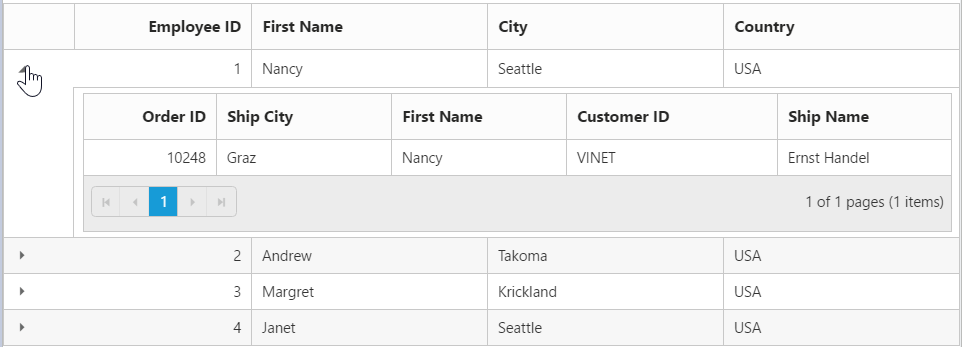

# How to

## Export Grid to target location without download prompt(Excel, Word or PDF)

In the Export method we have assigned the target location to save the exported file in the specified path. The target folder is placed using the Server.MapPath.

The following code example shows how to save the exported files in a target location.





<ej-grid id="FlatGrid" datasource="ViewBag.datasource" allow-paging="true" allow-text-wrap="false" allow-scrolling="true">
    <e-toolbar-settings show-toolbar="true" toolbar-items=@(new List<string>() {"excelExport","wordExport","pdfExport" })>
    </e-toolbar-settings>   
    <e-columns>
        <e-column field="OrderID" header-text="OrderID" width="70" text-align="Left"></e-column>
        <e-column field="CustomerID" header-text="CustomerID" width="70" text-align="Left"></e-column>
        <e-column field="EmployeeID" header-text="EmployeeID" text-align="Left" width="70"></e-column>
        <e-column field="Freight" header-text="Freight" width="70"></e-column>
        <e-column field="ShipCity" header-text="Shipcity" text-align=Left width="70"></e-column>        
    </e-columns>
</ej-grid>





public partial class GridController : Controller
    {

        private NORTHWNDContext _context;

        public GridController(NORTHWNDContext context)
        {
            _context = context;
        }
        public ActionResult Exporting()
        {
            ViewBag.datasource = _context.Orders.Take(100).ToList();
            return View();
        }
        private readonly IHostingEnvironment _hostingEnvironment;
        public GridController(IHostingEnvironment hostingEnvironment)
        {
            _hostingEnvironment = hostingEnvironment;
        }
        public ActionResult ExportToExcel(string GridModel)
        {
            ExcelExport exp = new ExcelExport();
            var DataSource = _context.Orders.Take(100).ToList(); ;
            GridProperties gridProp = (GridProperties)JsonConvert.DeserializeObject(GridModel, typeof(GridProperties));
            string targetFolder = _hostingEnvironment.WebRootPath;
            GridExcelExport excelExp = new GridExcelExport();
            excelExp.FileName = "Export.xlsx"; excelExp.Excelversion = ExcelVersion.Excel2010;
            excelExp.Theme = "flat-saffron";
            excelExp.LocalSave = true;
            excelExp.FilePath = targetFolder;
            return exp.Export(gridProp, DataSource, excelExp);
        }

        public ActionResult ExportToWord(string GridModel)
        {
            WordExport exp = new WordExport();
            var DataSource = _context.Orders.Take(100).ToList();
            GridProperties gridProp = (GridProperties)JsonConvert.DeserializeObject(GridModel, typeof(GridProperties));
            string targetFolder = _hostingEnvironment.WebRootPath;
            GridWordExport wrdExp = new GridWordExport();
            wrdExp.FileName = "Export.docx";
            wrdExp.Theme = "flat-saffron";
            wrdExp.LocalSave = true;
            wrdExp.FilePath = targetFolder;
            return exp.Export(gridProp, DataSource, wrdExp);
        }
        public ActionResult ExportToPdf(string GridModel)
        {
            PdfExport exp = new PdfExport();
            var DataSource = _context.Orders.Take(100).ToList();
            GridProperties gridProp = (GridProperties)JsonConvert.DeserializeObject(GridModel, typeof(GridProperties));
            string targetFolder = _hostingEnvironment.WebRootPath;
            GridPdfExport pdfExp = new GridPdfExport();
            pdfExp.FileName = "Export.pdf";
            pdfExp.Theme = "flat-saffron";
            pdfExp.LocalSave = true;
            pdfExp.FilePath = targetFolder;
            return exp.Export(gridProp, DataSource, pdfExp);

        }
   }


 

## Hierarchy Grid with different foreignKeyField in parent and child table

The `query-string` property is used to filter the childGrid data based on value in parent Grid data. But when the field name provided in `query-string` does not exists in Child Grid, then `foreign-key-field` property is used to filter the childGrid data. If the foreign key column name differs for parent and child grid then use `foreign-key-field` property of Grid.

The following code example explains the above behavior.





<ej-grid id="HierarchyGrid" datasource="ViewBag.datasource" allow-paging="true">
    <e-columns>
        <e-column field="EmployeeID" header-text="Employee ID" text-align="Right" width="85"></e-column>
        <e-column field="FirstName" header-text="First Name" width="100"></e-column>
        <e-column field="City" width="100"></e-column>
        <e-column field="Country" width="100"></e-column>
    </e-columns>
    <ej-grid query-string="FirstName" foreign-key-field="CustomerName" allow-paging="true">
        <e-datamanager url="http://js.syncfusion.com/demos/ejServices/Wcf/Northwind.svc/Orders"></e-datamanager>
        <e-page-settings page-size="5"></e-page-settings>
        <e-columns>
            <e-column field="OrderID" header-text="Order ID" text-align="Right" width="75"></e-column>
            <e-column field="ShipCity" header-text="Ship City" width="100"></e-column>
            <e-column field="CustomerName" header-text="First Name" width="120"></e-column>
            <e-column field="CustomerID" header-text="Customer ID" width="120"></e-column>
            <e-column field="ShipName" header-text="Ship Name" width="100"></e-column>
        </e-columns>
    </ej-grid>
</ej-grid>




public partial class GridController : Controller
    {
        private NORTHWNDContext _context;

        public GridController(NORTHWNDContext context)
        {
            _context = context;
        }
        public ActionResult HierarchyGrid()
        {
            
            var DataSource = _context.Employees.ToList();

            ViewBag.datasource = DataSource;

            return View();
        }

    }



 

The following output is displayed as a result of the above code example.
