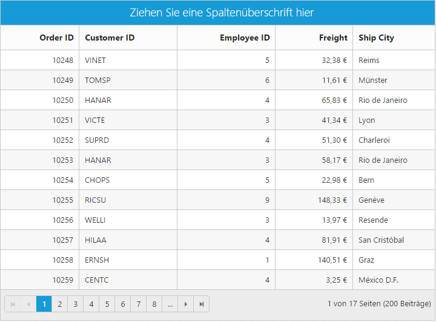
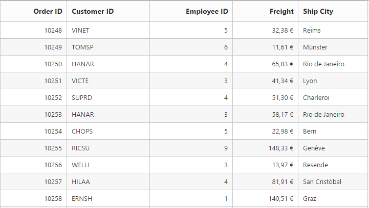

# Globalization and localization

## Localization

All text in Grid can be localized using `ej.Grid.Locale` object. Please find the table with list of properties and its value in locale object.

<table>
<tr>
<th>
Locale key words </th><th>
Text</th></tr>
<tr>
<td>
EmptyRecord</td><td>
No records to display</td></tr>
<tr>
<td>
GroupDropArea</td><td>
Drag a column header here to group its column</td></tr>
<tr>
<td>
DeleteOperationAlert</td><td>
No records selected for delete operation</td></tr>
<tr>
<td>
EditOperationAlert</td><td>
No records selected for edit operation</td></tr>
<tr>
<td>
SaveButton</td><td>
Save</td></tr>
<tr>
<td>
OkButton</td><td>
OK</td></tr>
<tr>
<td>
CancelButton</td><td>
Cancel</td></tr>
<tr>
<td>
EditFormTitle</td><td>
Details of</td></tr>
<tr>
<td>
AddFormTitle</td><td>
Add New Record</td></tr>
<tr>
<td>
Notactionkeyalert</td><td>
This Key-Combination is not available </td></tr>
<tr>
<td>
Keyconfigalerttext</td><td>
This Key-Combination has already been assigned to</td></tr>
<tr>
<td>
GroupCaptionFormat</td><td>
{{"{{"}}:headerText{{}}}}: {{"{{"}}:key{{}}}} - {{"{{"}}:count{{}}}} {{"{{"}}if count == 1 {{}}}} item {{"{{"}}else{{}}}} items {{"{{"}}/if{{}}}}</td></tr>
<tr>
<td>
BatchSaveConfirm</td><td>
Are you sure you want to save changes?</td></tr>
<tr>
<td>
BatchSaveLostChanges</td><td>
Unsaved changes will be lost. Are you sure you want to continue?</td></tr>
<tr>
<td>
ConfirmDelete</td><td>
Are you sure you want to Delete Record?</td></tr>
<tr>
<td>
PagerInfo</td><td>
{0} of {1} pages ({2} items)</td></tr>
<tr>
<td>
FrozenColumnsViewAlert</td><td>
Frozen columns should be in grid view area</td></tr>
<tr>
<td>
FrozenColumnsScrollAlert</td><td>
Enable allowScrolling while using frozen Columns</td></tr>
<tr>
<td>
FrozenNotSupportedException</td><td>
Frozen Columns and Rows are not supported for Grouping, Row Template, Detail Template, Hierarchy Grid and Batch Editing</td></tr>
<tr>
<td>
Add</td><td>
Add</td></tr>
<tr>
<td>
Edit</td><td>
Edit</td></tr>
<tr>
<td>
Delete</td><td>
Delete</td></tr>
<tr>
<td>
Update</td><td>
Update</td></tr>
<tr>
<td>
Cancel</td><td>
Cancel</td></tr>
<tr>
<td>
Done</td><td>
Done</td></tr>
<tr>
<td>
Columns</td><td>
Columns</td></tr>
<tr>
<td>
PrintGrid</td><td>
Print</td></tr>
<tr>
<td>
ExcelExport</td><td>
Excel Export</td></tr>
<tr>
<td>
WordExport</td><td>
Word Export</td></tr>
<tr>
<td>
PdfExport</td><td>
PDF Export</td></tr>
<tr>
<td>
StringMenuOptions</td><td>
[{text: "StartsWith",value: "StartsWith"},{text: "EndsWith",value: "EndsWith"},{text: "Contains",value: "Contains"},{text: "Equal",value: "Equal"},{text: "NotEqual",value: "NotEqual"}]</td></tr>
<tr>
<td>
NumberMenuOptions</td><td>
[{text: "LessThan",value: "LessThan"},{text: "GreaterThan",value: "GreaterThan"},{text: "LessThanOrEqual",value: "LessThanOrEqual"},{text: "GreaterThanOrEqual",value: "GreaterThanOrEqual"},{text: "Equal",value: "Equal"},{text: "NotEqual",value: "NotEqual"}]</td></tr>
<tr>
<td>
PredicateAnd</td><td>
AND</td></tr>
<tr>
<td>
PredicateOr</td><td>
OR</td></tr>
<tr>
<td>
Filter</td><td>
Filter</td></tr>
<tr>
<td>
FilterMenuCaption</td><td>
Filter Value</td></tr>
<tr>
<td>
FilterbarTitle</td><td>
's filter bar cell</td></tr>
<tr>
<td>
MatchCase</td><td>
Match Case</td></tr>
<tr>
<td>
Clear</td><td>
Clear</td></tr>
<tr>
<td>
ResponsiveFilter</td><td>
Filter</td></tr>
<tr>
<td>
ResponsiveSorting</td><td>
Sort</td></tr>
<tr>
<td>
Search</td><td>
Search</td></tr>
<tr>
<td>
DatePickerWaterMark</td><td>
Select date</td></tr>
<tr>
<td>
EmptyDataSource</td><td>
DataSource must not be empty at initial load since columns are generated from dataSource in AutoGenerate Column Grid</td></tr>
<tr>
<td>
True</td><td>
True</td></tr>
<tr>
<td>
False</td><td>
False</td></tr>
<tr>
<td>
UnGroup</td><td>
Click here to ungroup</td></tr>
<tr>
<td>
AddRecord</td><td>
Add Record</td></tr>
<tr>
<td>
EditRecord</td><td>
Edit Record</td></tr>
<tr>
<td>
DeleteRecord</td><td>
Delete Record</td></tr>
<tr>
<td>
Save</td><td>
Save</td></tr>
<tr>
<td>
Grouping</td><td>
Grouping</td></tr>
<tr>
<td>
Ungrouping</td><td>
Ungrouping</td></tr>
<tr>
<td>
SortInAscendingOrder</td><td>
Sort In Ascending Order</td></tr>
<tr>
<td>
SortInDescendingOrder</td><td>
Sort In Descending Order</td></tr>
<tr>
<td>
NextPage</td><td>
Next Page</td></tr>
<tr>
<td>
PreviousPage</td><td>
Previous Page</td></tr>
<tr>
<td>
FirstPage</td><td>
First Page</td></tr>
<tr>
<td>
LastPage</td><td>
Last Page</td></tr>
</table>





    @{Html.EJ().Grid<OrdersView>("Localization")

        .Datasource((IEnumerable<object>)ViewBag.datasource)

        .AllowGrouping()

        .AllowPaging()

        .Locale("de-DE")

        .GroupSettings(group=>group.EnableDropAreaAnimation(false))

        .Columns(col =>

        {

            col.Field("OrderID").HeaderText("Order ID").IsPrimaryKey(true).TextAlign(TextAlign.Right).Width(75).Add();

            col.Field("CustomerID").HeaderText("Customer ID").Width(95).Add();

            col.Field("EmployeeID").HeaderText("Employee ID").TextAlign(TextAlign.Right).Width(95).Add();

            col.Field("Freight").HeaderText("Freight").TextAlign(TextAlign.Right).Width(75).Format("{0:C}").Add();

            col.Field("ShipCity").HeaderText("Ship City").Width(80).Add();

        }).Render();

      } 




public partial class GridController : Controller

{

	//

	// GET: /Localization/

	public IActionResult Localization()

	{

		var DataSource = new NorthwindDataContext().OrdersViews.ToList();

		ViewBag.dataSource = DataSource;

		return View();

	}

}





 

I> You need to change pager locale in `ej.Pager.Locale` object.

## Excel-Filter Localization

All text in Excel-Filter can be localized using `ej.ExcelFilter.Locale` object. Please find the table with list of properties and its value in locale object.

<table>
<tr>
<th>
Locale key words </th><th>
Text</th></tr>
<tr>
<td>
SortNoSmaller</td><td>
Sort Smallest to Largest</td></tr>
<tr>
<td>
SortNoLarger</td><td>
Sort Largest to smallest</td></tr>
<tr>
<td>
SortTextAscending</td><td>
Sort A to Z</td></tr>
<tr>
<td>
SortTextDescending</td><td>
Sort Z to A</td></tr>
<tr>
<td>
SortDateOldest</td><td>
Sort By Oldest</td></tr>
<tr>
<td>
SortDateNewest</td><td>
Sort By Newest</td></tr>
<tr>
<td>
SortByColor</td><td>
Sort By Color</td></tr>
<tr>
<td>
SortByCellColor</td><td>
Sort By Cell Color</td></tr>
<tr>
<td>
SortByFontColor:</td><td>
Sort By Font Color:</td></tr>
<tr>
<td>
FilterByColor</td><td>
Filter By Color</td></tr>
<tr>
<td>
SortColorOptions:</td><td>
[{ id: 1, background:"#FFFFFF"}, {id: 2, background:"#5EABDA"}],</td></tr>
<tr>
<td>
CustomSort</td><td>
Custom Sort</td></tr>
<tr>
<td>
FilterColorOptions</td><td>
{ id: 1, background:"#FFFFFF"}, {id: 2, background:"#5EABDA"}],</td></tr>
<tr>
<td>
FilterByCellColor</td><td>
Filter By Cell Color</td></tr>
<tr>
<td>
FilterByFontColor</td><td>
Filter By Font Color</td></tr>
<tr>
<td>
ClearFilter</td><td>
Clear Filter</td></tr>
<tr>
<td>
NumberFilter</td><td>
Number Filter</td></tr>
<tr>
<td>
TextFilter</td><td>
Text Filter</td></tr>
<tr>
<td>
DateFilter</td><td>
Date Filter</td></tr>
<tr>
<td>
StringMenuOptions</td><td>
[{ text:"Equal",value:"equal"},{ text:"Not Equal", value:"notequal"},{ text:"Starts With",value:"startswith"}, { text:"Ends With",value:"endswith"},{ text:"Contains",value:"contains"}, {text:"Custom Filter", value:"customfilter"}],</td></tr>
<tr>
<td>
NumberMenuOptions</td><td>
[{text:"Equal",value:"equal"}, {text:"Not Equal",value:"notequal"}, { text:"Less Than",value:"lessthan"}, {text:"Less Than Or Equal", value:"lessthanorequal"}, {text:"Greater Than",value:"greaterthan"},{ text:"Greater Than Or Equal", value:"greaterthanorequal"}, { text:"Between",value:"between"},{ text:"Custom Filter", value:"customfilter"}]</td></tr>
<tr>
<td>
DateMenuOptions</td><td>
[{ text:"Equal", value:"equal"}, {text:"Not Equal",value:"notequal"},{text:"Less Than",>value:"lessthan"}, {text:"Less Than Or Equal",value:"lessthanorequal"}, {text:"Greater Than",value:"greaterthan"},{text:"Greater Than Or Equal", value:"greaterthanorequal"}, { text:"Between",value:"between"},{ text:"Custom Filter", value:"customfilter"}]</td></tr>
<tr>
<td>
Top10MenuOptions</td><td>
[{ text:"Top", value:"top"},{text:"Bottom", value:"bottom"}]</td></tr>
<tr>
<td>GuidMenuOptions</td>
<td>[{ text: "Equal", value: "equal" }, { text: "Not Equal", value: "notequal" }, { text: "Custom Filter", value: "customfilter" }]</td>
</tr>
<tr>
<td>
title</td><td>
Custom Filter</td></tr>
<tr>
<td>
PredicateOr</td><td>
OR</td></tr>
<tr>
<td>
PredicateAnd</td><td>
AND</td></tr>
<tr>
<td>
Ok</td><td>
OK</td></tr>
<tr>
<td>
MathCase</td><td>
Match Case</td></tr>
<tr>
<td>
Cancel</td><td>
Cancel</td></tr>
<tr>
<td>
NoResult</td><td>
No Match Found</td></tr>
<tr>
<td>
CheckBoxStatusMsg</td><td>
Not all items showing</td></tr>
<tr>
<td>
DatePickerWaterMark</td><td>
Select date</td></tr>
<tr>
<td>
True</td><td>
True</td></tr>
<tr>
<td>
False</td><td>
False</td></tr>
</table>
Please find the code





    @{Html.EJ().Grid<OrdersView>("Localization")

        .Datasource((IEnumerable<object>)ViewBag.datasource)

        .AllowPaging()

        .Locale("de-DE")

        .AllowFiltering()
        
        .FilterSettings(filter => filter.FilterType(FilterType.Excel))
        
        .Columns(col =>
        {

            col.Field("OrderID").HeaderText("Order ID").IsPrimaryKey(true).TextAlign(TextAlign.Right).Width(75).Add();

            col.Field("CustomerID").HeaderText("Customer ID").Width(95).Add();

            col.Field("EmployeeID").HeaderText("Employee ID").TextAlign(TextAlign.Right).Width(95).Add();

            col.Field("Freight").HeaderText("Freight").TextAlign(TextAlign.Right).Width(75).Format("{0:C}").Add();

            col.Field("ShipCity").HeaderText("Ship City").Width(80).Add();

        }).Render();

   }




public partial class GridController : Controller

{

	//

	// GET: /Localization/

	public IActionResult Localization()

	{

		var DataSource = new NorthwindDataContext().OrdersViews.ToList();

		ViewBag.dataSource = DataSource;

		return View();

	}

}





 

## Globalization

`ej.globalize` library is used to globalize numeric values in Grid control using `Format` property in `Columns`. Globalize values will be automatically used when `Locale` property is set with locale string value for example `en-US`.





    @{Html.EJ().Grid<OrdersView>("Localization")

        .Datasource((IEnumerable<object>)ViewBag.datasource)

        .Locale("de-DE")

        .Columns(col =>
        {

            col.Field("OrderID").HeaderText("Order ID").TextAlign(TextAlign.Right).Width(75).Add();

            col.Field("CustomerID").HeaderText("Customer ID").Width(95).Add();

            col.Field("EmployeeID").HeaderText("Employee ID").TextAlign(TextAlign.Right).Width(95).Add();

            col.Field("Freight").HeaderText("Freight").TextAlign(TextAlign.Right).Width(75).Format("{0:C}").Add();

            col.Field("ShipCity").HeaderText("Ship City").Width(80).Add();

        }).Render();

   } 




public partial class GridController : Controller

{

	//

	// GET: /Localization/

	public IActionResult Localization()

	{

		var DataSource = new NorthwindDataContext().OrdersViews.ToList();

		ViewBag.dataSource = DataSource;

		return View();

	}

}



 

I> In the above example, you need to use `globalize.culture.de-DE` script file to globalize values. 

 [localization](http://helpjs.syncfusion.com/js/localization) 

## Right to Left - RTL

By default, Grid render its text and layout from left to right. To customize Grid's direction, you can change direction from LTR to RTL by using `EnableRTL` as true.





    @{Html.EJ().Grid<OrdersView>("Localization")

        .Datasource((IEnumerable<object>)ViewBag.datasource)

        .AllowPaging()

        .EnableRTL()
        
        .Columns(col =>
        {

            col.Field("OrderID").HeaderText("Order ID").TextAlign(TextAlign.Right).Width(120).Add();

            col.Field("CustomerID").HeaderText("Customer ID").Width(120).Add();

            col.Field("EmployeeID").HeaderText("Employee ID").TextAlign(TextAlign.Right).Width(120).Add();

            col.Field("Freight").HeaderText("Freight").TextAlign(TextAlign.Right).Width(120).Format("{0:C}").Add();

            col.Field("ShipCity").HeaderText("Ship City").Width(120).Add();

        }).Render();

   } 




public partial class GridController : Controller

{

	//

	// GET: /Localization/

	public IActionResult Localization()

	{

		var DataSource = new NorthwindDataContext().OrdersViews.ToList();

		ViewBag.dataSource = DataSource;

		return View();

	}

}



 

