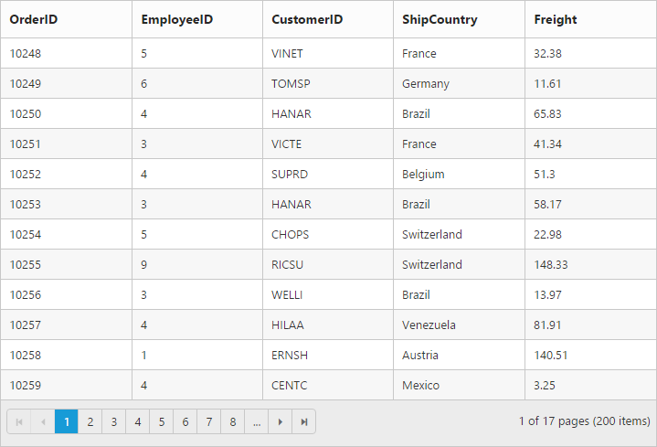
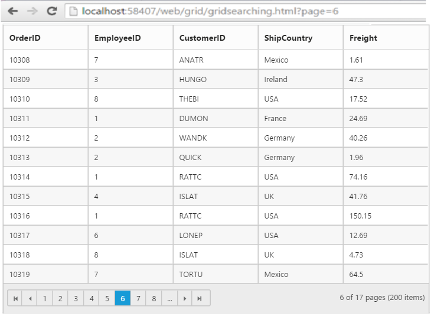

# Paging

 You can display the grid records in paged view, by setting `AllowPaging` property as `true`.

The code snippet to enable paging is follows.




       @{Html.EJ().Grid<Object>("Paging")
            .Datasource((IEnumerable<object>)ViewBag.datasource)
            .AllowPaging()
            .Columns(col =>
            {
                col.Field("OrderID").Add();
                col.Field("EmployeeID").Add();
                col.Field("CustomerID").Add();
                col.Field("ShipCountry").Add();
                col.Field("Freight").Format("{0:C}").Add();
            }).Render();
         }
 


      namespace MVCSampleBrowser.Controllers
      {
       public class GridController : Controller
       { 
         public IActionResult Paging()
          {
            var DataSource = new NorthwindDataContext().OrdersViews.ToList();
            ViewBag.datasource = DataSource;
            return View();
          }
       }
     }    
 
  
 
 The following output is displayed as a result of the above code example.
 
 

## Pager with query string

You can pass the current page information as a query string while navigating to other page. To enable query string, set the `EnableQueryString` property of `PageSettings` as `true`.

The following code example describes the above behavior.




     @{Html.EJ().Grid<Object>("Paging")
            .Datasource((IEnumerable<object>)ViewBag.datasource)
            .AllowPaging()
            .PageSettings(Page => { Page.EnableQueryString(true); })
            .Columns(col =>
            {
                col.Field("OrderID").Add();
                col.Field("EmployeeID").Add();
                col.Field("CustomerID").Add();
                col.Field("ShipCountry").Add();
                col.Field("Freight").Format("{0:C}").Add();
            }).Render();
        }            
  
  
        
          namespace MVCSampleBrowser.Controllers
           {
            public class GridController : Controller
              { 
               public IActionResult Paging()
                 {
                   var DataSource = new NorthwindDataContext().OrdersViews.ToList();
                   ViewBag.datasource = DataSource;
                   return View();
                 }
              }   
            } 

 
  

The following output is displayed as a result of the above code example.

 