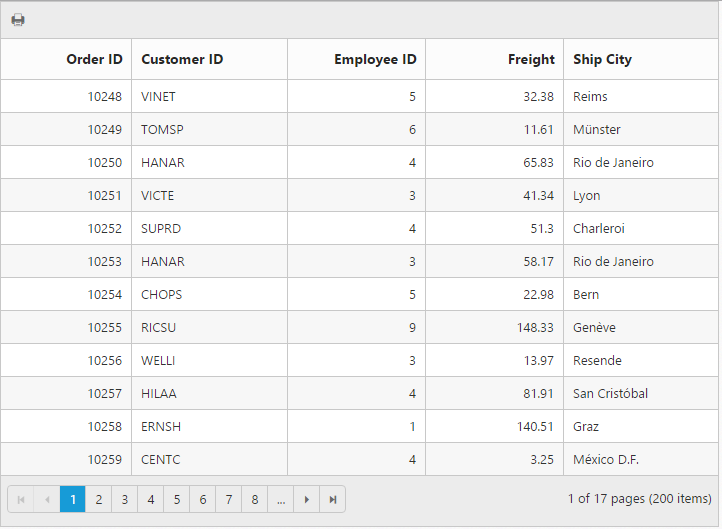
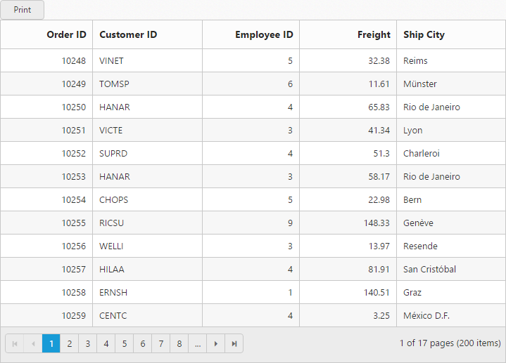
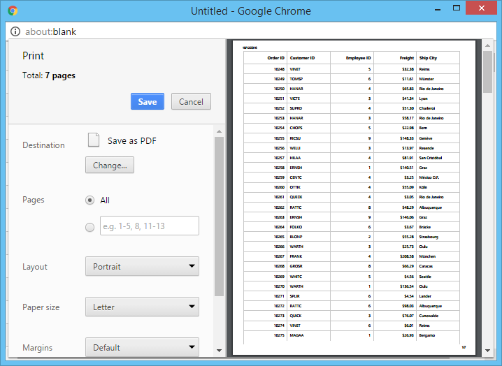

# Print

You need to use `print()` method from Grid instance to print the Grid. You can add Print option in Toolbar item by adding `PrintGrid` in `ToolbarItems`.


 


@{Html.EJ().Grid<OrdersView>("PrintGrid")

.Datasource((IEnumerable<object>)ViewBag.datasource)

.ToolbarSettings(toolbar =>
{

    toolbar.ShowToolbar().ToolbarItems(items =>
    {

        items.AddTool(ToolBarItems.PrintGrid);

    });

})

.AllowPaging()

.Columns(col =>
{

    col.Field("OrderID").HeaderText("Order ID").TextAlign(TextAlign.Right).Width(75).Add();

    col.Field("CustomerID").HeaderText("Customer ID").Width(90).Add();

    col.Field("EmployeeID").HeaderText("Employee ID").TextAlign(TextAlign.Right).Width(80).Add();

    col.Field("Freight").HeaderText("Freight").TextAlign(TextAlign.Right).Width(80).Add();

    col.Field("ShipCity").HeaderText("Ship City").Width(90).Add();

}).Render();

}




using System;
using System.Collections.Generic;
using System.Linq;
using System.Web;
using System.Web.Mvc;
using SyncfusionMvcApplication1;
using SyncfusionMvcApplication1.Models;
namespace SyncfusionMvcApplication1.Controllers
{
    public class GridController : Controller
    {
        //
        // GET: /Grid/
        public IActionResult GridFeatures()
        {
            var DataSource = new NorthwindDataContext().OrdersViews.ToList();
            ViewBag.datasource = DataSource;
            return View();
        }
    }
}


 

## Page Setup

Some of print options are not configurable through JavaScript code. You need to customize layout, paper size, margins options through browser's page setup dialog. Please find the following guidelines link to browser page setup.

* [Chrome](https://support.google.com/chrome/answer/1379552?hl=en)
* [Firefox](https://support.mozilla.org/en-US/kb/how-print-web-pages-firefox)
* [Safari](http://www.mintprintables.com/print-tips/adjust-margins-osx/)
* [IE](http://www.helpteaching.com/help/print/index.htm) 

## Print on external Button Click

By default, the Grid can be print from toolbar. To print from external button action, you need to call the grid's [`print()`](http://help.syncfusion.com/js/api/ejgrid#methods:print) method from required button event.


 

<button id="print">Print</button>

@{Html.EJ().Grid<OrdersView>("PrintGrid")

.Datasource((IEnumerable<object>)ViewBag.datasource)

.AllowPaging()

.EnableHeaderHover()

.Columns(col =>
{

    col.Field("OrderID").HeaderText("Order ID").TextAlign(TextAlign.Right).Width(75).Add();

    col.Field("CustomerID").HeaderText("Customer ID").Width(90).Add();

    col.Field("EmployeeID").HeaderText("Employee ID").TextAlign(TextAlign.Right).Width(80).Add();

    col.Field("Freight").HeaderText("Freight").TextAlign(TextAlign.Right).Width(80).Add();

    col.Field("ShipCity").HeaderText("Ship City").Width(90).Add();

}).Render();

}





using System;
using System.Collections.Generic;
using System.Linq;
using System.Web;
using System.Web.Mvc;
using SyncfusionMvcApplication1;
using SyncfusionMvcApplication1.Models;
namespace SyncfusionMvcApplication1.Controllers
{
    public class GridController : Controller
    {
        //
        // GET: /Grid/
        public IActionResult GridFeatures()
        {
            var DataSource = new NorthwindDataContext().OrdersViews.ToList();
            ViewBag.datasource = DataSource;
            return View();
        }
    }
}


 

{:caption}
Grid with external button for Print

{:caption}

Print dialog in Chrome browser

## Print Visible Page

By default, the Grid will print all records. To print current page, you need to set `PrintMode` as `CurrentPage` in `PageSettings` property.


 


@{Html.EJ().Grid<OrdersView>("PrintGrid")

.Datasource((IEnumerable<object>)ViewBag.datasource)

.AllowPaging()

.PageSettings(page=> page.PrintMode(PrintMode.CurrentPage))

.ToolbarSettings(toolbar =>
    {

        toolbar.ShowToolbar().ToolbarItems(items =>
        {

            items.AddTool(ToolBarItems.PrintGrid);

        });

})

.Columns(col =>
{

    col.Field("OrderID").HeaderText("Order ID").TextAlign(TextAlign.Right).Width(75).Add();

    col.Field("CustomerID").HeaderText("Customer ID").Width(90).Add();

    col.Field("EmployeeID").HeaderText("Employee ID").TextAlign(TextAlign.Right).Width(80).Add();

    col.Field("Freight").HeaderText("Freight").TextAlign(TextAlign.Right).Width(80).Add();

    col.Field("ShipCity").HeaderText("Ship City").Width(90).Add();

}).Render();

}




using System;
using System.Collections.Generic;
using System.Linq;
using System.Web;
using System.Web.Mvc;
using SyncfusionMvcApplication1;
using SyncfusionMvcApplication1.Models;
namespace SyncfusionMvcApplication1.Controllers
{
    public class GridController : Controller
    {
        //
        // GET: /Grid/
        public IActionResult GridFeatures()
        {
            var DataSource = new NorthwindDataContext().OrdersViews.ToList();
            ViewBag.datasource = DataSource;
            return View();
        }
    }
}


 