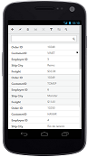

# Responsive

The grid control has support for responsive behavior based on client browser's width and height. To enable responsive, `IsResponsive` property should be true. There are three modes of responsive layout is available in grid based on client width. They are.

* Mobile(<321px)
* Tablet (321px to 800px)
* Desktop(>800px)

## Mobile Layout

If client width is less than 321px, the grid will render in mobile mode. In which, you can see that grid user interface is customized and redesigned for best view in small screens. The customized features includes responsive row rendering, filtering, sorting, searching and editing.

### Responsive Row

Enabling Responsive row makes the Grid to render the record values in vertical order which removes the need for horizontal scrolling to view complete record details. It can be enabled by defining `EnableResponsiveRow` property as `true`.





     @{Html.EJ().Grid<OrdersView>("Grid")
     	.Datasource((IEnumerable<object>)ViewBag.datasource)
	    .IsResponsive(true)
        .EnableResponsiveRow(true)
	    .AllowPaging()
	    .PageSettings(p => p.PageCount(3).PageSize(7))
     	.Columns(col =>
       	 {
		    col.Field("OrderID").HeaderText("Order ID").IsPrimaryKey(true).Add();
		    col.Field("CustomerID").HeaderText("Customer ID").Add();
		    col.Field("EmployeeID").HeaderText("Employee ID").Add();
		    col.Field("ShipCity").HeaderText("Ship City").Add();
		    col.Field("Freight").HeaderText("Freight").Format("{0:C}").Add();
     	}).Render();
     }




      namespace SyncfusionMvcApplication3.Controllers
     {
       public class HomeController : Controller
         {
          public IActionResult Index()
           {
            var DataSource = new NorthwindDataContext().OrdersViews.ToList();
            ViewBag.datasource = DataSource;
            return View();
           }
         }
      }


 

W> IE8 and IE9 does not support responsive row. `ejgrid.responsive.css` should be referred to display Responsive Row.

### Customized Features

The customized layout for filtering, sorting, searching and CRUD operations in mobile device can be seen following screen shots.

{:caption}
Responsive row with Filtering , Sorting and Searching

{:caption}
CRUD in mobile layout

{:caption}
Filtering in mobile layout

{:caption}

Filtering in mobile layout

{:caption}
Sorting in mobile layout

{:caption}

Searching in mobile layout





     @using Syncfusion.JavaScript.Models

       @{Html.EJ().Grid<OrdersView>("Grid")
	   .Datasource((IEnumerable<object>)ViewBag.datasource)
	   .IsResponsive(true)
       .EnableResponsiveRow(true)
	   .AllowPaging()
	   .EditSettings(d => d.AllowAdding(true).AllowDeleting(true).AllowEditing(true))
              .ToolbarSettings(toolbar =>
              {
                  toolbar.ShowToolbar().ToolbarItems(items =>
                  {
                      items.AddTool(ToolBarItems.Add);
                      items.AddTool(ToolBarItems.Edit);
                      items.AddTool(ToolBarItems.Delete);
                      items.AddTool(ToolBarItems.Update);
                      items.AddTool(ToolBarItems.Cancel);
                      items.AddTool(ToolBarItems.Search);
                  });
              })
	 .PageSettings(p => p.PageCount(3).PageSize(7))
	 .AllowFiltering()
	 .AllowSorting()
     .AllowMultiSorting()
	 .FilterSettings(fltr => fltr.FilterType(FilterType.Menu))
	 .Columns(col =>
	  {
	 	col.Field("OrderID").HeaderText("Order ID").Width("90").IsPrimaryKey(true).ValidationRules(v => v.AddRule("required", true).AddRule("number", true)).TextAlign(TextAlign.Right).Add();
        col.Field("CustomerID").HeaderText("Customer ID").Width("100").ValidationRules(v => v.AddRule("required", true)).Add();
        col.Field("EmployeeID").HeaderText("Employee ID").EditType(EditingType.Dropdown).TextAlign(TextAlign.Right).Width("90").Add();           
        col.Field("ShipCity").HeaderText("Ship City").Width("120").EditType(EditingType.Dropdown).Add();
	 	col.Field("Freight").HeaderText("Freight").Width("110").EditType(EditingType.Numeric).NumericEditOptions(new EditorProperties() { DecimalPlaces = 2 }).Format("{0:C}").Add();
	  }).Render();
    }
    



     namespace SyncfusionMvcApplication3.Controllers
     {
      public class HomeController : Controller
       {
       public IActionResult Index()
         {
            var DataSource = new NorthwindDataContext().OrdersViews.ToList();
            ViewBag.datasource = DataSource;
            return View();
          }
        }
      }


 

## Tablet Layout

If the client width is between 321px and 800px, then the grid will render in tablet mode. Also it has customized filtering design to match tablet screen size.





     @{Html.EJ().Grid<OrdersView>("Grid")
 	  .Datasource((IEnumerable<object>)ViewBag.datasource)
   	  .IsResponsive(true)
 	  .AllowFiltering()
 	  .FilterSettings(fltr => fltr.FilterType(FilterType.Menu))
 	  .AllowPaging()
 	  .PageSettings(p => p.PageCount(3).PageSize(8))
 	  .Columns(col =>
 	   {
 		col.Field("OrderID").HeaderText("Order ID").IsPrimaryKey(true).TextAlign(TextAlign.Right).Width("90").Add();
 		col.Field("CustomerID").HeaderText("Customer ID").Width("100").Add();
 		col.Field("EmployeeID").HeaderText("Employee ID").TextAlign(TextAlign.Right).Width("90").Add();
 		col.Field("ShipCity").HeaderText("Ship City").Width("120").Add();
 		col.Field("Freight").HeaderText("Freight").Width("80").Format("{0:C}").Add();
   	  }).Render();
     }




     namespace SyncfusionMvcApplication3.Controllers
     {
      public class HomeController : Controller
       {
       public IActionResult Index()
         {
           var DataSource = new NorthwindDataContext().OrdersViews.ToList();
           ViewBag.datasource = DataSource;
           return View();
        }
       }
      }


 

{:caption}

Default tab layout

{:caption}
Filtering design in tab layout.

## Width

By default, the grid is adaptable to its parent container. It can adjust its width of columns based on parent container width. You can also assign `Width` of `Columns` in percentage. 





     @{Html.EJ().Grid<OrdersView>("Grid")
   	   .Datasource((IEnumerable<object>)ViewBag.datasource)
 	   .Columns(col =>
 	    {
 		  col.Field("OrderID").HeaderText("Order ID").IsPrimaryKey(true).TextAlign(TextAlign.Right).Width("10%").Add();
 		  col.Field("CustomerID").HeaderText("Customer ID").Width("15%").Add();
 		   col.Field("EmployeeID").HeaderText("Employee ID").TextAlign(TextAlign.Right).Width("10%").Add();
	    }).Render();
     }




     namespace SyncfusionMvcApplication3.Controllers
      { 
       public class HomeController : Controller
       {
        public IActionResult Index()
        {
            var DataSource = new NorthwindDataContext().OrdersViews.ToList();
            ViewBag.datasource = DataSource;
            return View();
         }
        }
      }


 

I>  `AllowScrolling` should be false while defining Width in percentage.

## Min Width

Min Width is used to maintain minimum width for the Grid. To enable Min Width, `MinWidth` should be defined. If the grid width is less than `MinWidth` then the scrollbar will be displayed to maintain minimum width.





     @{Html.EJ().Grid<OrdersView>("Grid")
 	   .Datasource((IEnumerable<object>)ViewBag.datasource)
 	   .AllowPaging()
 	   .MinWidth(700)
 	   .Columns(col =>
	   {
	 	col.Field("OrderID").HeaderText("Order ID").IsPrimaryKey(true).TextAlign(TextAlign.Right).Width("90").Add();
	 	col.Field("CustomerID").HeaderText("Customer ID").Width("100").Add();
	 	col.Field("EmployeeID").HeaderText("Employee ID").TextAlign(TextAlign.Right).Width("90").Add();
	 	col.Field("ShipCity").HeaderText("Ship City").Width("120").Add();
	 	col.Field("Freight").HeaderText("Freight").Width("110").Format("{0:C}").Add();
	  }).Render();
   }




     namespace SyncfusionMvcApplication3.Controllers
      {
       public class HomeController : Controller
        {
          public IActionResult Index()
           {
            var DataSource = new NorthwindDataContext().OrdersViews.ToList();
            ViewBag.datasource = DataSource;
            return View();
           }
         }
        }


 

MinWidth set to Grid

## Priority for Columns

Priority makes column to be visible or hidden based on the `Priority` value and browser's width to best accommodate the possible columns. To enable `Priority` for `Columns`, `Priority` needs to be defined in columns collection. These Priority values are from one to six.





     @{Html.EJ().Grid<OrdersView>("Grid")
 	  .Datasource((IEnumerable<object>)ViewBag.datasource)
 	  .AllowPaging()
 	  .Columns(col =>
 	   {
 	   	col.Field("OrderID").HeaderText("Order ID").IsPrimaryKey(true).Priority(1).TextAlign(TextAlign.Right).Width("90").Add();
 		col.Field("CustomerID").HeaderText("Customer ID").Width("100").Priority(2).Add();
 		col.Field("EmployeeID").HeaderText("Employee ID").TextAlign(TextAlign.Right).Priority(1).Width("90").Add();
 		col.Field("ShipCity").HeaderText("Ship City").Width("120").Priority(3).Add();
 		col.Field("Freight").HeaderText("Freight").Width("110").Format("{0:C}").Priority(4).Add();
	  }).Render();
   }




     namespace SyncfusionMvcApplication3.Controllers
     {
      public class HomeController : Controller
      {
        public IActionResult Index()
        {
            var DataSource = new NorthwindDataContext().OrdersViews.ToList();
            ViewBag.datasource = DataSource;
            return View();
         }
      }
     }


 

I> `ejgrid.responsive.css` should be referred.